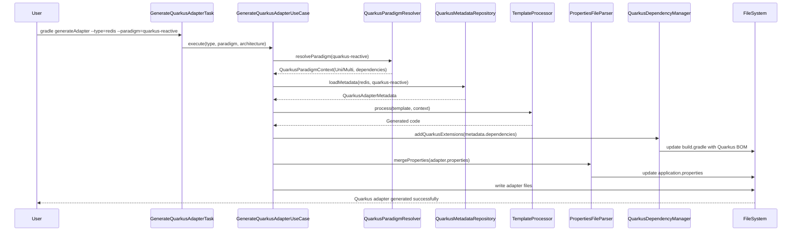
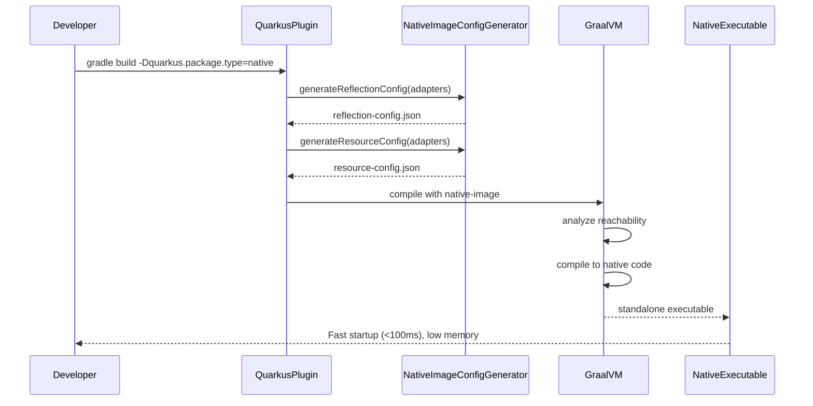
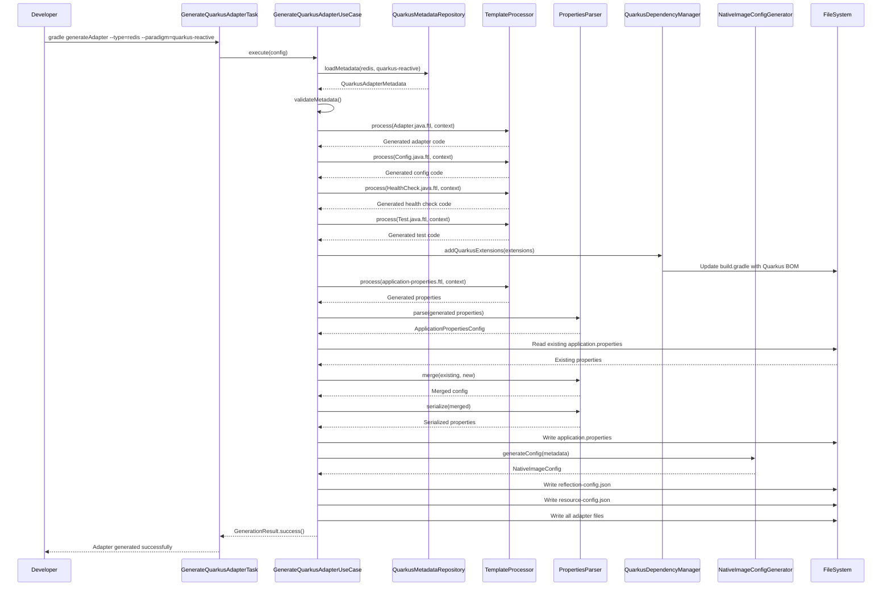
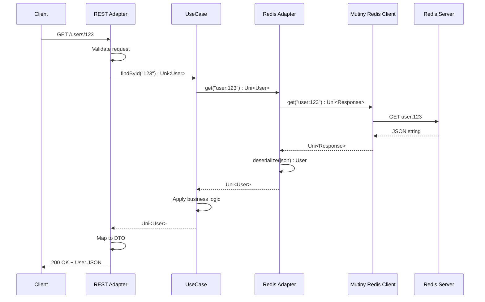
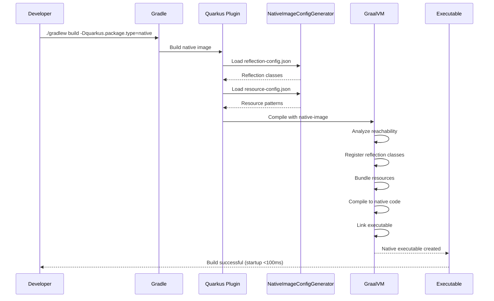

# Design Document: Add Quarkus Framework Support

## Overview

This design adds complete Quarkus framework support to the Clean Architecture Gradle Plugin by implementing Quarkus Reactive (Mutiny) and Quarkus Imperative paradigms with 16 adapters (8 adapter types × 2 paradigms). The plugin currently supports Spring Reactive (WebFlux) and Spring Imperative (MVC); this feature enables developers to build cloud-native, Kubernetes-optimized applications with Quarkus's fast startup times, low memory footprint, and native image compilation capabilities.

This design builds on:
- **Spec 1** (complete-architectures-and-template-system): Template system, multi-architecture support, path resolution
- **Spec 2** (complete-spring-framework-support): Adapter pattern, metadata system, configuration merging

The design addresses five major areas:

1. **Quarkus Paradigms**: Add Quarkus Reactive (Mutiny with Uni/Multi) and Quarkus Imperative (blocking I/O) paradigms
2. **Adapter Completeness**: Implement 16 adapters across 8 types (Redis, DynamoDB, SQS Producer/Consumer, HTTP Client, REST, GraphQL, gRPC)
3. **Quarkus-Specific Features**: CDI dependency injection, application.properties configuration, native image support, dev mode
4. **Code Generation**: Generate adapter code, configuration, tests with Quarkus-specific patterns
5. **Developer Experience**: Provide Spring-to-Quarkus migration guide, version compatibility matrix, comprehensive documentation

The plugin follows hexagonal architecture internally and uses FreeMarker for templating, custom properties parser for configuration, and AWS SDK v2 for cloud services.

### Key Technical Decisions

**Quarkus Reactive (Mutiny)**:
- Non-blocking I/O with reactive streams
- Return types: Uni<T> (single), Multi<T> (collection)
- HTTP: Mutiny REST Client (MicroProfile REST Client with Mutiny)
- Redis: Mutiny Redis Client (quarkus-redis-client with reactive API)
- AWS SDK: Async clients converted to Uni via Uni.createFrom().completionStage()
- Dependencies: quarkus-rest-client-reactive, quarkus-redis-client, quarkus-mutiny

**Quarkus Imperative**:
- Blocking I/O with synchronous execution
- Return types: T (single), List<T> (collection)
- HTTP: Blocking REST Client (MicroProfile REST Client)
- Redis: Blocking Redis Client (quarkus-redis-client with blocking API)
- AWS SDK: Sync clients (SqsClient, DynamoDbClient)
- Dependencies: quarkus-rest-client, quarkus-redis-client


**Quarkus vs Spring Comparison**:

| Aspect | Spring | Quarkus |
|--------|--------|---------|
| DI Annotations | @Component, @Autowired | @ApplicationScoped, @Inject |
| Config Format | application.yml | application.properties |
| Reactive Library | Project Reactor (Mono/Flux) | Mutiny (Uni/Multi) |
| REST Client | WebClient / RestTemplate | Mutiny REST Client / Blocking REST Client |
| GraphQL | Spring for GraphQL | SmallRye GraphQL |
| gRPC | grpc-spring-boot-starter | quarkus-grpc |
| Health Checks | Spring Actuator | SmallRye Health |
| Metrics | Micrometer | MicroProfile Metrics / Micrometer |
| Native Image | Spring Native (experimental) | GraalVM (first-class support) |
| Startup Time | 2-5 seconds | <1 second (JVM), <100ms (native) |
| Memory Footprint | Higher | 50% lower than Spring |

## Architecture

### High-Level Architecture

The plugin extends its existing hexagonal architecture with Quarkus-specific components:

```
Domain Layer (Core Business Logic)
├── Model: QuarkusParadigmType, AdapterType, AdapterMetadata, TemplateContext
├── Ports: AdapterGenerator, TemplateProcessor, PropertiesParser, MetadataValidator
└── Services: QuarkusParadigmResolver, QuarkusDependencyResolver, MutinyTypeMapper

Application Layer (Use Cases)
├── GenerateQuarkusAdapterUseCase: Generates Quarkus adapters with paradigm-specific logic
├── ValidateQuarkusMetadataUseCase: Validates Quarkus adapter metadata completeness
├── GenerateQuarkusSchemaUseCase: Generates GraphQL schemas and Protocol Buffer definitions
├── MergeApplicationPropertiesUseCase: Merges adapter properties into application.properties
└── ValidateNativeImageCompatibilityUseCase: Validates native image compatibility

Infrastructure Layer (Adapters)
├── In: Gradle tasks (GenerateQuarkusAdapterTask, ValidateQuarkusTemplatesTask)
├── Out:
    ├── FreemarkerTemplateProcessor: Processes Quarkus templates with paradigm context
    ├── QuarkusMetadataRepository: Reads Quarkus adapter metadata.yml files
    ├── PropertiesFileParser: Parses and merges application.properties files
    ├── QuarkusSchemaGenerator: Generates .graphqls and .proto files
    ├── QuarkusDependencyManager: Manages Quarkus BOM and extensions
    └── NativeImageConfigGenerator: Generates native image configuration
```

### Quarkus Paradigm Architecture

The plugin supports two Quarkus paradigms with distinct characteristics:

**Quarkus Reactive (Mutiny)**:
- Non-blocking I/O with Mutiny reactive types
- Return types: Uni<T> (single), Multi<T> (collection)
- HTTP: Mutiny REST Client (@RegisterRestClient with Uni/Multi)
- Redis: Mutiny Redis Client (reactive API)
- AWS SDK: Async clients (SqsAsyncClient, DynamoDbAsyncClient) converted to Uni
- GraphQL: SmallRye GraphQL with Uni/Multi return types
- gRPC: Mutiny gRPC stubs
- Dependencies: quarkus-rest-client-reactive, quarkus-redis-client, quarkus-smallrye-graphql

**Quarkus Imperative**:
- Blocking I/O with synchronous execution
- Return types: T (single), List<T> (collection)
- HTTP: Blocking REST Client (@RegisterRestClient with POJO)
- Redis: Blocking Redis Client (blocking API)
- AWS SDK: Sync clients (SqsClient, DynamoDbClient)
- GraphQL: SmallRye GraphQL with POJO return types
- gRPC: Blocking gRPC stubs
- Dependencies: quarkus-rest-client, quarkus-redis-client, quarkus-smallrye-graphql


### Adapter Type Matrix

The plugin generates 16 Quarkus adapters organized by type and paradigm:

| Adapter Type | Direction | Reactive Implementation | Imperative Implementation |
|--------------|-----------|------------------------|---------------------------|
| Redis | Driven | Mutiny Redis Client | Blocking Redis Client |
| DynamoDB | Driven | DynamoDbAsyncClient + Uni | DynamoDbClient |
| SQS Producer | Driven | SqsAsyncClient + Uni | SqsClient |
| HTTP Client | Driven | Mutiny REST Client | Blocking REST Client |
| REST | Driving | @Path + Uni/Multi | @Path + POJO |
| GraphQL | Driving | @Query/@Mutation + Uni/Multi | @Query/@Mutation + POJO |
| gRPC | Driving | Mutiny gRPC | Blocking gRPC |
| SQS Consumer | Driving | @Scheduled + Multi | @Scheduled + POJO |

### Component Interaction Flow



### Native Image Compilation Flow



## Components and Interfaces

### Domain Layer

#### Models

**QuarkusParadigmType** (new enum):
```java
enum QuarkusParadigmType {
    QUARKUS_REACTIVE("quarkus-reactive", "Uni", "Multi", "Mutiny REST Client", "Mutiny Redis"),
    QUARKUS_IMPERATIVE("quarkus-imperative", "Object", "List", "Blocking REST Client", "Blocking Redis");
    
    String name;
    String singleReturnType;
    String collectionReturnType;
    String httpClient;
    String redisClient;
    
    boolean isReactive();
    boolean isImperative();
    String getDIAnnotation(); // Returns "@ApplicationScoped"
    String getInjectAnnotation(); // Returns "@Inject"
    String getConfigFormat(); // Returns "properties"
}
```

**AdapterType** (enhanced enum):
```java
enum AdapterType {
    REDIS("redis", Direction.DRIVEN),
    DYNAMODB("dynamodb", Direction.DRIVEN),
    SQS_PRODUCER("sqs-producer", Direction.DRIVEN),
    SQS_CONSUMER("sqs-consumer", Direction.DRIVING),
    HTTP_CLIENT("http-client", Direction.DRIVEN),
    REST("rest", Direction.DRIVING),
    GRAPHQL("graphql", Direction.DRIVING),
    GRPC("grpc", Direction.DRIVING);
    
    String identifier;
    Direction direction;
    
    boolean isDriven();
    boolean isDriving();
    String getQuarkusMetadataPath(QuarkusParadigmType paradigm);
    boolean requiresNativeImageConfig();
}
```


**QuarkusAdapterMetadata** (new):
```java
class QuarkusAdapterMetadata {
    String name;
    AdapterType type;
    QuarkusParadigmType paradigm;
    String description;
    List<QuarkusExtension> extensions;
    List<QuarkusExtension> testExtensions;
    String applicationPropertiesTemplate;
    List<ConfigurationClass> configurationClasses;
    NativeImageConfig nativeImageConfig;
    Map<String, String> examples;
    
    boolean hasApplicationProperties();
    boolean hasConfigurationClasses();
    boolean requiresTestcontainers();
    boolean requiresNativeImageConfig();
    List<QuarkusExtension> getParadigmSpecificExtensions();
}
```

**QuarkusExtension** (new):
```java
class QuarkusExtension {
    String groupId;  // Usually "io.quarkus"
    String artifactId;  // e.g., "quarkus-redis-client"
    String version;  // null if managed by BOM
    DependencyScope scope;
    List<QuarkusParadigmType> paradigms;
    
    boolean isApplicableFor(QuarkusParadigmType paradigm);
    String toGradleNotation();
    String toMavenNotation();
}
```

**NativeImageConfig** (new):
```java
class NativeImageConfig {
    List<String> reflectionClasses;
    List<String> resourcePatterns;
    List<String> additionalBuildArgs;
    boolean enableHttpsSupport;
    boolean enableAllSecurityServices;
    
    String generateReflectionConfigJson();
    String generateResourceConfigJson();
}
```

**QuarkusTemplateContext** (new):
```java
class QuarkusTemplateContext {
    QuarkusParadigmType paradigm;
    AdapterType adapterType;
    String packageName;
    String adapterName;
    MutinyTypeMappings typeMappings;
    Map<String, Object> customVariables;
    
    String getSingleReturnType();  // "Uni" or "Object"
    String getCollectionReturnType();  // "Multi" or "List"
    String getHttpClientType();  // "Mutiny REST Client" or "Blocking REST Client"
    String getRedisClientType();  // "Mutiny Redis" or "Blocking Redis"
    boolean isReactive();
    String getDIAnnotation();  // "@ApplicationScoped"
    String getInjectAnnotation();  // "@Inject"
}
```

**MutinyTypeMappings** (new):
```java
class MutinyTypeMappings {
    Map<String, String> javaToGraphQL;
    Map<String, String> javaToProtobuf;
    Map<String, String> completableFutureToUni;
    
    String mapToGraphQL(String javaType);
    String mapToProtobuf(String javaType);
    String wrapInUni(String javaType);  // "User" -> "Uni<User>"
    String wrapInMulti(String javaType);  // "User" -> "Multi<User>"
    boolean isCollection(String javaType);
}
```

**ApplicationPropertiesConfig** (new):
```java
class ApplicationPropertiesConfig {
    Map<String, String> properties;
    Map<String, Map<String, String>> profileProperties;  // %dev, %test, %prod
    
    void addProperty(String key, String value);
    void addProfileProperty(String profile, String key, String value);
    String getProperty(String key);
    String getProfileProperty(String profile, String key);
    boolean hasProperty(String key);
    String serialize();  // Convert to .properties format
}
```

#### Ports

**AdapterGenerator** (port interface):
```java
interface AdapterGenerator {
    GenerationResult generateQuarkusAdapter(QuarkusAdapterConfig config);
    ValidationResult validateQuarkusAdapter(QuarkusAdapterConfig config);
    List<AdapterType> getSupportedQuarkusTypes();
}
```

**PropertiesParser** (port interface):
```java
interface PropertiesParser {
    ApplicationPropertiesConfig parse(String propertiesContent);
    String serialize(ApplicationPropertiesConfig config);
    ValidationResult validate(String propertiesContent);
    ApplicationPropertiesConfig merge(
        ApplicationPropertiesConfig existing,
        ApplicationPropertiesConfig newConfig
    );
}
```

**NativeImageConfigGenerator** (port interface):
```java
interface NativeImageConfigGenerator {
    NativeImageConfig generateConfig(List<QuarkusAdapterMetadata> adapters);
    String generateReflectionConfig(List<String> classes);
    String generateResourceConfig(List<String> patterns);
    ValidationResult validateConfig(NativeImageConfig config);
}
```


### Application Layer

#### Use Cases

**GenerateQuarkusAdapterUseCase**:
```java
class GenerateQuarkusAdapterUseCase {
    private AdapterGenerator adapterGenerator;
    private QuarkusMetadataRepository metadataRepository;
    private TemplateProcessor templateProcessor;
    private QuarkusDependencyManager dependencyManager;
    private PropertiesParser propertiesParser;
    private PathResolver pathResolver;
    private NativeImageConfigGenerator nativeImageConfigGenerator;
    
    GenerationResult execute(GenerateQuarkusAdapterCommand command) {
        // 1. Load Quarkus adapter metadata for paradigm
        QuarkusAdapterMetadata metadata = metadataRepository.load(
            command.adapterType,
            command.paradigm
        );
        
        // 2. Validate metadata completeness
        ValidationResult validation = validateMetadata(metadata);
        if (!validation.isValid()) {
            return GenerationResult.failure(validation.errors);
        }
        
        // 3. Resolve adapter path based on architecture
        String adapterPath = pathResolver.resolveAdapterPath(
            command.architecture,
            metadata.type,
            command.adapterName
        );
        
        // 4. Create Quarkus template context
        QuarkusTemplateContext context = createQuarkusTemplateContext(
            metadata,
            command.paradigm,
            command.packageName,
            command.adapterName
        );
        
        // 5. Generate adapter files
        List<GeneratedFile> files = generateFiles(metadata, context, adapterPath);
        
        // 6. Add Quarkus extensions to build.gradle
        dependencyManager.addQuarkusExtensions(
            metadata.getParadigmSpecificExtensions()
        );
        
        // 7. Merge application.properties
        if (metadata.hasApplicationProperties()) {
            mergeApplicationProperties(metadata, context);
        }
        
        // 8. Generate native image configuration if needed
        if (metadata.requiresNativeImageConfig()) {
            generateNativeImageConfig(metadata);
        }
        
        return GenerationResult.success(files);
    }
    
    private List<GeneratedFile> generateFiles(
        QuarkusAdapterMetadata metadata,
        QuarkusTemplateContext context,
        String basePath
    ) {
        List<GeneratedFile> files = new ArrayList<>();
        
        // Generate main adapter class
        String adapterCode = templateProcessor.process(
            metadata.getTemplatePath("Adapter.java.ftl"),
            context
        );
        files.add(new GeneratedFile(
            basePath + "/" + context.adapterName + "Adapter.java",
            adapterCode
        ));
        
        // Generate configuration class with CDI producers
        String configCode = templateProcessor.process(
            metadata.getTemplatePath("Config.java.ftl"),
            context
        );
        files.add(new GeneratedFile(
            basePath + "/" + context.adapterName + "Config.java",
            configCode
        ));
        
        // Generate test class with @QuarkusTest
        String testCode = templateProcessor.process(
            metadata.getTemplatePath("Test.java.ftl"),
            context
        );
        files.add(new GeneratedFile(
            basePath.replace("main", "test") + "/" + context.adapterName + "AdapterTest.java",
            testCode
        ));
        
        // Generate integration test with Testcontainers
        if (metadata.requiresTestcontainers()) {
            String integrationTestCode = templateProcessor.process(
                metadata.getTemplatePath("IntegrationTest.java.ftl"),
                context
            );
            files.add(new GeneratedFile(
                basePath.replace("main", "test") + "/" + 
                    context.adapterName + "IntegrationTest.java",
                integrationTestCode
            ));
        }
        
        // Generate health check
        if (metadata.type.isDriven()) {
            String healthCheckCode = templateProcessor.process(
                metadata.getTemplatePath("HealthCheck.java.ftl"),
                context
            );
            files.add(new GeneratedFile(
                basePath + "/" + context.adapterName + "HealthCheck.java",
                healthCheckCode
            ));
        }
        
        return files;
    }
    
    private void mergeApplicationProperties(
        QuarkusAdapterMetadata metadata,
        QuarkusTemplateContext context
    ) {
        // Generate adapter-specific properties from template
        String propertiesTemplate = metadata.applicationPropertiesTemplate;
        String generatedProperties = templateProcessor.process(
            propertiesTemplate,
            context
        );
        
        // Parse generated properties
        ApplicationPropertiesConfig newConfig = 
            propertiesParser.parse(generatedProperties);
        
        // Read existing application.properties
        String existingPath = "src/main/resources/application.properties";
        ApplicationPropertiesConfig existingConfig;
        if (fileExists(existingPath)) {
            String existingContent = readFile(existingPath);
            existingConfig = propertiesParser.parse(existingContent);
        } else {
            existingConfig = new ApplicationPropertiesConfig();
        }
        
        // Merge configurations
        ApplicationPropertiesConfig mergedConfig = 
            propertiesParser.merge(existingConfig, newConfig);
        
        // Write merged configuration
        String serialized = propertiesParser.serialize(mergedConfig);
        writeFile(existingPath, serialized);
    }
    
    private void generateNativeImageConfig(QuarkusAdapterMetadata metadata) {
        NativeImageConfig config = 
            nativeImageConfigGenerator.generateConfig(List.of(metadata));
        
        String reflectionConfig = config.generateReflectionConfigJson();
        String resourceConfig = config.generateResourceConfigJson();
        
        writeFile(
            "src/main/resources/META-INF/native-image/reflect-config.json",
            reflectionConfig
        );
        writeFile(
            "src/main/resources/META-INF/native-image/resource-config.json",
            resourceConfig
        );
    }
}
```


**MergeApplicationPropertiesUseCase**:
```java
class MergeApplicationPropertiesUseCase {
    private PropertiesParser propertiesParser;
    
    MergeResult execute(MergePropertiesCommand command) {
        // 1. Parse existing application.properties
        ApplicationPropertiesConfig existingConfig = 
            propertiesParser.parse(command.existingContent);
        
        // 2. Parse new properties to merge
        ApplicationPropertiesConfig newConfig = 
            propertiesParser.parse(command.newContent);
        
        // 3. Merge configurations preserving existing values
        ApplicationPropertiesConfig mergedConfig = 
            propertiesParser.merge(existingConfig, newConfig);
        
        // 4. Validate merged configuration
        String serialized = propertiesParser.serialize(mergedConfig);
        ValidationResult validation = propertiesParser.validate(serialized);
        
        if (!validation.isValid()) {
            return MergeResult.failure(validation.errors);
        }
        
        return MergeResult.success(serialized);
    }
}
```

**ValidateNativeImageCompatibilityUseCase**:
```java
class ValidateNativeImageCompatibilityUseCase {
    private NativeImageConfigGenerator configGenerator;
    private QuarkusMetadataRepository metadataRepository;
    
    ValidationResult execute(ValidateNativeImageCommand command) {
        List<ValidationResult> results = new ArrayList<>();
        
        // Load all adapter metadata
        List<QuarkusAdapterMetadata> adapters = 
            metadataRepository.loadAllForProject(command.projectPath);
        
        // Validate each adapter for native image compatibility
        for (QuarkusAdapterMetadata adapter : adapters) {
            if (adapter.requiresNativeImageConfig()) {
                NativeImageConfig config = adapter.nativeImageConfig;
                ValidationResult result = configGenerator.validateConfig(config);
                results.add(result);
            }
        }
        
        return ValidationResult.merge(results);
    }
}
```

### Infrastructure Layer

#### Adapters

**PropertiesFileParser**:
```java
class PropertiesFileParser implements PropertiesParser {
    
    @Override
    public ApplicationPropertiesConfig parse(String propertiesContent) {
        ApplicationPropertiesConfig config = new ApplicationPropertiesConfig();
        
        String[] lines = propertiesContent.split("\n");
        String currentProfile = null;
        
        for (String line : lines) {
            line = line.trim();
            
            // Skip comments and empty lines
            if (line.isEmpty() || line.startsWith("#")) {
                continue;
            }
            
            // Check for profile prefix
            if (line.startsWith("%")) {
                int dotIndex = line.indexOf('.');
                if (dotIndex > 0) {
                    currentProfile = line.substring(1, dotIndex);
                    line = line.substring(dotIndex + 1);
                }
            }
            
            // Parse key=value
            int equalsIndex = line.indexOf('=');
            if (equalsIndex > 0) {
                String key = line.substring(0, equalsIndex).trim();
                String value = line.substring(equalsIndex + 1).trim();
                
                if (currentProfile != null) {
                    config.addProfileProperty(currentProfile, key, value);
                } else {
                    config.addProperty(key, value);
                }
            }
        }
        
        return config;
    }
    
    @Override
    public String serialize(ApplicationPropertiesConfig config) {
        StringBuilder sb = new StringBuilder();
        
        // Write base properties
        for (Map.Entry<String, String> entry : config.properties.entrySet()) {
            sb.append(entry.getKey()).append("=").append(entry.getValue()).append("\n");
        }
        
        // Write profile-specific properties
        for (Map.Entry<String, Map<String, String>> profileEntry : 
                config.profileProperties.entrySet()) {
            String profile = profileEntry.getKey();
            sb.append("\n# ").append(profile).append(" profile\n");
            
            for (Map.Entry<String, String> entry : profileEntry.getValue().entrySet()) {
                sb.append("%").append(profile).append(".")
                  .append(entry.getKey()).append("=")
                  .append(entry.getValue()).append("\n");
            }
        }
        
        return sb.toString();
    }
    
    @Override
    public ApplicationPropertiesConfig merge(
        ApplicationPropertiesConfig existing,
        ApplicationPropertiesConfig newConfig
    ) {
        ApplicationPropertiesConfig merged = new ApplicationPropertiesConfig();
        
        // Copy existing properties
        merged.properties.putAll(existing.properties);
        merged.profileProperties.putAll(existing.profileProperties);
        
        // Add new properties only if they don't exist
        for (Map.Entry<String, String> entry : newConfig.properties.entrySet()) {
            if (!merged.hasProperty(entry.getKey())) {
                merged.addProperty(entry.getKey(), entry.getValue());
            }
        }
        
        // Merge profile properties
        for (Map.Entry<String, Map<String, String>> profileEntry : 
                newConfig.profileProperties.entrySet()) {
            String profile = profileEntry.getKey();
            
            for (Map.Entry<String, String> entry : profileEntry.getValue().entrySet()) {
                if (merged.getProfileProperty(profile, entry.getKey()) == null) {
                    merged.addProfileProperty(profile, entry.getKey(), entry.getValue());
                }
            }
        }
        
        return merged;
    }
    
    @Override
    public ValidationResult validate(String propertiesContent) {
        try {
            parse(propertiesContent);
            return ValidationResult.success();
        } catch (Exception e) {
            return ValidationResult.failure(
                "Invalid properties format: " + e.getMessage()
            );
        }
    }
}
```


**NativeImageConfigGeneratorImpl**:
```java
class NativeImageConfigGeneratorImpl implements NativeImageConfigGenerator {
    
    @Override
    public NativeImageConfig generateConfig(List<QuarkusAdapterMetadata> adapters) {
        NativeImageConfig config = new NativeImageConfig();
        
        for (QuarkusAdapterMetadata adapter : adapters) {
            if (adapter.nativeImageConfig != null) {
                config.reflectionClasses.addAll(
                    adapter.nativeImageConfig.reflectionClasses
                );
                config.resourcePatterns.addAll(
                    adapter.nativeImageConfig.resourcePatterns
                );
                config.additionalBuildArgs.addAll(
                    adapter.nativeImageConfig.additionalBuildArgs
                );
            }
        }
        
        return config;
    }
    
    @Override
    public String generateReflectionConfig(List<String> classes) {
        JsonArray array = new JsonArray();
        
        for (String className : classes) {
            JsonObject classConfig = new JsonObject();
            classConfig.addProperty("name", className);
            classConfig.addProperty("allDeclaredConstructors", true);
            classConfig.addProperty("allDeclaredMethods", true);
            classConfig.addProperty("allDeclaredFields", true);
            array.add(classConfig);
        }
        
        return new GsonBuilder().setPrettyPrinting().create().toJson(array);
    }
    
    @Override
    public String generateResourceConfig(List<String> patterns) {
        JsonObject config = new JsonObject();
        JsonArray resources = new JsonArray();
        
        for (String pattern : patterns) {
            JsonObject resource = new JsonObject();
            resource.addProperty("pattern", pattern);
            resources.add(resource);
        }
        
        config.add("resources", resources);
        
        return new GsonBuilder().setPrettyPrinting().create().toJson(config);
    }
    
    @Override
    public ValidationResult validateConfig(NativeImageConfig config) {
        List<String> errors = new ArrayList<>();
        
        // Validate reflection classes exist
        for (String className : config.reflectionClasses) {
            try {
                Class.forName(className);
            } catch (ClassNotFoundException e) {
                errors.add("Reflection class not found: " + className);
            }
        }
        
        if (errors.isEmpty()) {
            return ValidationResult.success();
        } else {
            return ValidationResult.failure(errors);
        }
    }
}
```

**QuarkusDependencyManager**:
```java
class QuarkusDependencyManager {
    private static final String QUARKUS_BOM_GROUP = "io.quarkus.platform";
    private static final String QUARKUS_BOM_ARTIFACT = "quarkus-bom";
    private static final String QUARKUS_VERSION = "3.6.0";
    
    public void addQuarkusExtensions(List<QuarkusExtension> extensions) {
        // 1. Ensure Quarkus BOM is in dependency management
        ensureQuarkusBOM();
        
        // 2. Add each extension
        for (QuarkusExtension extension : extensions) {
            addExtension(extension);
        }
        
        // 3. Ensure quarkus-arc (CDI) is present
        ensureQuarkusArc();
    }
    
    private void ensureQuarkusBOM() {
        String buildFile = readFile("build.gradle");
        
        if (!buildFile.contains(QUARKUS_BOM_ARTIFACT)) {
            String bomDeclaration = String.format(
                "    implementation platform('%s:%s:%s')\n",
                QUARKUS_BOM_GROUP,
                QUARKUS_BOM_ARTIFACT,
                QUARKUS_VERSION
            );
            
            // Insert BOM in dependencies block
            buildFile = buildFile.replace(
                "dependencies {",
                "dependencies {\n" + bomDeclaration
            );
            
            writeFile("build.gradle", buildFile);
        }
    }
    
    private void addExtension(QuarkusExtension extension) {
        String buildFile = readFile("build.gradle");
        String extensionNotation = extension.toGradleNotation();
        
        if (!buildFile.contains(extension.artifactId)) {
            String dependencyLine = String.format(
                "    implementation '%s'\n",
                extensionNotation
            );
            
            // Insert in dependencies block
            buildFile = buildFile.replace(
                "dependencies {",
                "dependencies {\n" + dependencyLine
            );
            
            writeFile("build.gradle", buildFile);
        }
    }
    
    private void ensureQuarkusArc() {
        String buildFile = readFile("build.gradle");
        
        if (!buildFile.contains("quarkus-arc")) {
            addExtension(new QuarkusExtension(
                "io.quarkus",
                "quarkus-arc",
                null,
                DependencyScope.IMPLEMENTATION,
                List.of(QuarkusParadigmType.values())
            ));
        }
    }
}
```

## Data Models

### Adapter Metadata Schema

Each Quarkus adapter has a metadata.yml file defining its properties:

#### Redis Adapter - Quarkus Reactive (metadata.yml)

```yaml
name: "Redis"
type: "driven"
paradigm: "quarkus-reactive"
description: "Non-blocking Redis adapter using Quarkus Redis Client with Mutiny"

extensions:
  - groupId: "io.quarkus"
    artifactId: "quarkus-redis-client"
    version: null  # Managed by Quarkus BOM
  - groupId: "io.quarkus"
    artifactId: "quarkus-arc"
    version: null

testExtensions:
  - groupId: "io.quarkus"
    artifactId: "quarkus-junit5"
    version: null
  - groupId: "org.testcontainers"
    artifactId: "testcontainers"
    version: "1.19.0"
  - groupId: "org.testcontainers"
    artifactId: "junit-jupiter"
    version: "1.19.0"

applicationProperties: "application-properties.ftl"

configurationClasses:
  - name: "RedisConfig"
    template: "Config.java.ftl"

nativeImageConfig:
  reflectionClasses:
    - "io.quarkus.redis.client.RedisClient"
  resourcePatterns:
    - "META-INF/services/*"
  additionalBuildArgs:
    - "--initialize-at-build-time=io.lettuce.core"

examples:
  basic: |
    @Inject
    RedisAdapter redisAdapter;
    
    Uni<String> value = redisAdapter.get("key");
    Uni<Void> result = redisAdapter.set("key", "value");

templates:
  adapter: "Adapter.java.ftl"
  config: "Config.java.ftl"
  healthCheck: "HealthCheck.java.ftl"
  test: "Test.java.ftl"
  integrationTest: "IntegrationTest.java.ftl"
```


#### Redis Adapter - Quarkus Imperative (metadata.yml)

```yaml
name: "Redis"
type: "driven"
paradigm: "quarkus-imperative"
description: "Blocking Redis adapter using Quarkus Redis Client with blocking API"

extensions:
  - groupId: "io.quarkus"
    artifactId: "quarkus-redis-client"
    version: null
  - groupId: "io.quarkus"
    artifactId: "quarkus-arc"
    version: null

testExtensions:
  - groupId: "io.quarkus"
    artifactId: "quarkus-junit5"
    version: null
  - groupId: "org.testcontainers"
    artifactId: "testcontainers"
    version: "1.19.0"

applicationProperties: "application-properties.ftl"

configurationClasses:
  - name: "RedisConfig"
    template: "Config.java.ftl"

nativeImageConfig:
  reflectionClasses:
    - "io.quarkus.redis.client.RedisClient"
  resourcePatterns:
    - "META-INF/services/*"

examples:
  basic: |
    @Inject
    RedisAdapter redisAdapter;
    
    String value = redisAdapter.get("key");
    void result = redisAdapter.set("key", "value");

templates:
  adapter: "Adapter.java.ftl"
  config: "Config.java.ftl"
  healthCheck: "HealthCheck.java.ftl"
  test: "Test.java.ftl"
  integrationTest: "IntegrationTest.java.ftl"
```

#### DynamoDB Adapter - Quarkus Reactive (metadata.yml)

```yaml
name: "DynamoDB"
type: "driven"
paradigm: "quarkus-reactive"
description: "Non-blocking DynamoDB adapter using AWS SDK v2 async client with Mutiny"

extensions:
  - groupId: "io.quarkus"
    artifactId: "quarkus-amazon-dynamodb"
    version: null
  - groupId: "software.amazon.awssdk"
    artifactId: "dynamodb-enhanced"
    version: "2.20.0"
  - groupId: "io.quarkus"
    artifactId: "quarkus-arc"
    version: null

testExtensions:
  - groupId: "io.quarkus"
    artifactId: "quarkus-junit5"
    version: null
  - groupId: "org.testcontainers"
    artifactId: "localstack"
    version: "1.19.0"

applicationProperties: "application-properties.ftl"

configurationClasses:
  - name: "DynamoDbConfig"
    template: "Config.java.ftl"

nativeImageConfig:
  reflectionClasses:
    - "software.amazon.awssdk.services.dynamodb.model.*"
    - "software.amazon.awssdk.enhanced.dynamodb.mapper.*"
  resourcePatterns:
    - "software/amazon/awssdk/**"
  additionalBuildArgs:
    - "--initialize-at-build-time=software.amazon.awssdk"

examples:
  basic: |
    @Inject
    DynamoDbAdapter dynamoDb;
    
    Uni<User> user = dynamoDb.save(new User("John", "john@example.com"));
    Uni<User> retrieved = dynamoDb.findById("user-123");
    Multi<User> users = dynamoDb.findAll();

templates:
  adapter: "Adapter.java.ftl"
  config: "Config.java.ftl"
  healthCheck: "HealthCheck.java.ftl"
  test: "Test.java.ftl"
  integrationTest: "IntegrationTest.java.ftl"
```

#### HTTP Client Adapter - Quarkus Reactive (metadata.yml)

```yaml
name: "HTTP Client"
type: "driven"
paradigm: "quarkus-reactive"
description: "Non-blocking HTTP client using Quarkus REST Client with Mutiny"

extensions:
  - groupId: "io.quarkus"
    artifactId: "quarkus-rest-client-reactive"
    version: null
  - groupId: "io.quarkus"
    artifactId: "quarkus-rest-client-reactive-jackson"
    version: null
  - groupId: "io.quarkus"
    artifactId: "quarkus-arc"
    version: null

testExtensions:
  - groupId: "io.quarkus"
    artifactId: "quarkus-junit5"
    version: null
  - groupId: "com.github.tomakehurst"
    artifactId: "wiremock-jre8"
    version: "2.35.0"

applicationProperties: "application-properties.ftl"

configurationClasses:
  - name: "HttpClientConfig"
    template: "Config.java.ftl"

nativeImageConfig:
  reflectionClasses:
    - "org.eclipse.microprofile.rest.client.*"
  resourcePatterns:
    - "META-INF/services/org.eclipse.microprofile.rest.client.*"

examples:
  basic: |
    @RegisterRestClient(configKey = "api")
    public interface ApiClient {
        @GET
        @Path("/users/{id}")
        Uni<User> getUser(@PathParam("id") String id);
        
        @POST
        @Path("/users")
        Uni<User> createUser(User user);
    }

templates:
  adapter: "Adapter.java.ftl"
  restClient: "RestClient.java.ftl"
  config: "Config.java.ftl"
  test: "Test.java.ftl"
  integrationTest: "IntegrationTest.java.ftl"
```

#### REST Adapter - Quarkus Reactive (metadata.yml)

```yaml
name: "REST"
type: "driving"
paradigm: "quarkus-reactive"
description: "REST API adapter using Quarkus REST with Mutiny reactive responses"

extensions:
  - groupId: "io.quarkus"
    artifactId: "quarkus-rest"
    version: null
  - groupId: "io.quarkus"
    artifactId: "quarkus-rest-jackson"
    version: null
  - groupId: "io.quarkus"
    artifactId: "quarkus-hibernate-validator"
    version: null
  - groupId: "io.quarkus"
    artifactId: "quarkus-arc"
    version: null

testExtensions:
  - groupId: "io.quarkus"
    artifactId: "quarkus-junit5"
    version: null
  - groupId: "io.rest-assured"
    artifactId: "rest-assured"
    version: null

applicationProperties: "application-properties.ftl"

configurationClasses:
  - name: "RestConfig"
    template: "Config.java.ftl"

examples:
  basic: |
    @Path("/users")
    @ApplicationScoped
    public class UserResource {
        @Inject
        UserService userService;
        
        @GET
        @Path("/{id}")
        public Uni<Response> getUser(@PathParam("id") String id) {
            return userService.findById(id)
                .map(user -> Response.ok(user).build());
        }
        
        @POST
        public Uni<Response> createUser(@Valid User user) {
            return userService.create(user)
                .map(created -> Response.status(201).entity(created).build());
        }
    }

templates:
  adapter: "Adapter.java.ftl"
  exceptionMapper: "ExceptionMapper.java.ftl"
  config: "Config.java.ftl"
  test: "Test.java.ftl"
```


#### GraphQL Adapter - Quarkus Reactive (metadata.yml)

```yaml
name: "GraphQL"
type: "driving"
paradigm: "quarkus-reactive"
description: "GraphQL API adapter using SmallRye GraphQL with Mutiny reactive resolvers"

extensions:
  - groupId: "io.quarkus"
    artifactId: "quarkus-smallrye-graphql"
    version: null
  - groupId: "io.quarkus"
    artifactId: "quarkus-arc"
    version: null

testExtensions:
  - groupId: "io.quarkus"
    artifactId: "quarkus-junit5"
    version: null
  - groupId: "io.smallrye"
    artifactId: "smallrye-graphql-client"
    version: "2.0.0"

applicationProperties: "application-properties.ftl"

configurationClasses:
  - name: "GraphQLConfig"
    template: "Config.java.ftl"

schemaGeneration:
  enabled: true
  outputPath: "src/main/resources/META-INF/schema.graphqls"

examples:
  query: |
    @GraphQLApi
    @ApplicationScoped
    public class UserGraphQLApi {
        @Inject
        UserService userService;
        
        @Query
        public Uni<User> user(@Name("id") String id) {
            return userService.findById(id);
        }
        
        @Query
        public Multi<User> users() {
            return userService.findAll();
        }
        
        @Mutation
        public Uni<User> createUser(@Name("input") UserInput input) {
            return userService.create(input);
        }
    }

templates:
  adapter: "Adapter.java.ftl"
  schema: "schema.graphqls.ftl"
  config: "Config.java.ftl"
  test: "Test.java.ftl"
```

#### gRPC Adapter - Quarkus Reactive (metadata.yml)

```yaml
name: "gRPC"
type: "driving"
paradigm: "quarkus-reactive"
description: "gRPC server adapter using Quarkus gRPC with Mutiny reactive streaming"

extensions:
  - groupId: "io.quarkus"
    artifactId: "quarkus-grpc"
    version: null
  - groupId: "io.quarkus"
    artifactId: "quarkus-arc"
    version: null

testExtensions:
  - groupId: "io.quarkus"
    artifactId: "quarkus-junit5"
    version: null
  - groupId: "io.grpc"
    artifactId: "grpc-testing"
    version: "1.58.0"

buildPlugins:
  - id: "com.google.protobuf"
    version: "0.9.4"

applicationProperties: "application-properties.ftl"

configurationClasses:
  - name: "GrpcConfig"
    template: "Config.java.ftl"

protoGeneration:
  enabled: true
  outputPath: "src/main/proto/service.proto"

nativeImageConfig:
  reflectionClasses:
    - "io.grpc.internal.*"
  resourcePatterns:
    - "*.proto"
  additionalBuildArgs:
    - "--initialize-at-build-time=io.grpc"

examples:
  service: |
    @GrpcService
    public class UserService implements UserGrpc.UserImplBase {
        @Inject
        UserUseCase userUseCase;
        
        @Override
        public Uni<UserResponse> getUser(UserRequest request) {
            return userUseCase.findById(request.getId())
                .map(user -> UserResponse.newBuilder()
                    .setId(user.getId())
                    .setName(user.getName())
                    .build());
        }
        
        @Override
        public Multi<UserResponse> listUsers(Empty request) {
            return userUseCase.findAll()
                .map(user -> UserResponse.newBuilder()
                    .setId(user.getId())
                    .setName(user.getName())
                    .build());
        }
    }

templates:
  adapter: "Adapter.java.ftl"
  proto: "service.proto.ftl"
  config: "Config.java.ftl"
  test: "Test.java.ftl"
```

#### SQS Producer Adapter - Quarkus Reactive (metadata.yml)

```yaml
name: "SQS Producer"
type: "driven"
paradigm: "quarkus-reactive"
description: "Non-blocking SQS producer using AWS SDK v2 async client with Mutiny"

extensions:
  - groupId: "io.quarkus"
    artifactId: "quarkus-amazon-sqs"
    version: null
  - groupId: "io.quarkus"
    artifactId: "quarkus-arc"
    version: null

testExtensions:
  - groupId: "io.quarkus"
    artifactId: "quarkus-junit5"
    version: null
  - groupId: "org.testcontainers"
    artifactId: "localstack"
    version: "1.19.0"

applicationProperties: "application-properties.ftl"

configurationClasses:
  - name: "SqsProducerConfig"
    template: "Config.java.ftl"

nativeImageConfig:
  reflectionClasses:
    - "software.amazon.awssdk.services.sqs.model.*"
  resourcePatterns:
    - "software/amazon/awssdk/**"
  additionalBuildArgs:
    - "--initialize-at-build-time=software.amazon.awssdk"

examples:
  basic: |
    @Inject
    SqsProducerAdapter sqsProducer;
    
    Uni<String> messageId = sqsProducer.send(new Message("Hello"));

templates:
  adapter: "Adapter.java.ftl"
  config: "Config.java.ftl"
  healthCheck: "HealthCheck.java.ftl"
  test: "Test.java.ftl"
  integrationTest: "IntegrationTest.java.ftl"
```

#### SQS Consumer Adapter - Quarkus Reactive (metadata.yml)

```yaml
name: "SQS Consumer"
type: "driving"
paradigm: "quarkus-reactive"
description: "Non-blocking SQS consumer using AWS SDK v2 async client with Mutiny"

extensions:
  - groupId: "io.quarkus"
    artifactId: "quarkus-amazon-sqs"
    version: null
  - groupId: "io.quarkus"
    artifactId: "quarkus-scheduler"
    version: null
  - groupId: "io.quarkus"
    artifactId: "quarkus-arc"
    version: null

testExtensions:
  - groupId: "io.quarkus"
    artifactId: "quarkus-junit5"
    version: null
  - groupId: "org.testcontainers"
    artifactId: "localstack"
    version: "1.19.0"

applicationProperties: "application-properties.ftl"

configurationClasses:
  - name: "SqsConsumerConfig"
    template: "Config.java.ftl"

nativeImageConfig:
  reflectionClasses:
    - "software.amazon.awssdk.services.sqs.model.*"
  resourcePatterns:
    - "software/amazon/awssdk/**"

examples:
  basic: |
    @ApplicationScoped
    public class MessageConsumer {
        @Inject
        MessageProcessor messageProcessor;
        
        @Scheduled(every = "5s")
        public Uni<Void> pollMessages() {
            return sqsClient.receiveMessages()
                .onItem().transformToMulti(messages -> Multi.createFrom().iterable(messages))
                .onItem().transformToUniAndMerge(message -> 
                    messageProcessor.process(message)
                        .onItem().transformToUni(result -> deleteMessage(message))
                )
                .collect().asList()
                .replaceWithVoid();
        }
    }

templates:
  adapter: "Adapter.java.ftl"
  config: "Config.java.ftl"
  test: "Test.java.ftl"
  integrationTest: "IntegrationTest.java.ftl"
```

### Application Properties Template

Each adapter includes an application.properties template with profile-specific configuration:

```properties
# Redis Configuration
quarkus.redis.hosts=redis://localhost:6379
quarkus.redis.password=${REDIS_PASSWORD:}
quarkus.redis.database=0

# Dev profile - local development
%dev.quarkus.redis.hosts=redis://localhost:6379
%dev.quarkus.redis.password=

# Test profile - Testcontainers
%test.quarkus.redis.hosts=redis://localhost:6379

# Prod profile - production settings
%prod.quarkus.redis.hosts=${REDIS_HOSTS}
%prod.quarkus.redis.password=${REDIS_PASSWORD}
%prod.quarkus.redis.ssl=true
```


## Correctness Properties

A property is a characteristic or behavior that should hold true across all valid executions of a system—essentially, a formal statement about what the system should do. Properties serve as the bridge between human-readable specifications and machine-verifiable correctness guarantees.

### Property 1: Quarkus Reactive Type Mapping

For any generated Quarkus Reactive adapter, all single asynchronous return types shall use Uni<T> and all stream return types shall use Multi<T>, with no Mono<T> or Flux<T> types present.

**Validates: Requirements 1.2, 1.3**

### Property 2: Quarkus Imperative Type Mapping

For any generated Quarkus Imperative adapter, all return types shall be synchronous (T for single values, List<T> for collections), with no Uni<T> or Multi<T> types present.

**Validates: Requirements 2.2, 2.3, 2.10**

### Property 3: CDI Annotation Mapping

For any generated Quarkus adapter class, all singleton beans shall use @ApplicationScoped annotation and all dependency injection points shall use @Inject annotation, with no Spring annotations (@Component, @Autowired) present.

**Validates: Requirements 1.5, 1.6, 2.4, 2.5, 22.1, 22.2**

### Property 4: Configuration File Format

For any generated Quarkus project, the configuration file shall be application.properties format (not application.yml), and parsing the file shall succeed without errors.

**Validates: Requirements 1.7, 2.6, 19.1, 19.10**

### Property 5: Quarkus Extension Dependencies

For any generated Quarkus project, the build file shall include Quarkus BOM for dependency management and quarkus-arc extension for CDI support.

**Validates: Requirements 1.10, 2.9, 26.2, 26.7, 26.10**

### Property 6: Use Case Interface Type Consistency

For any generated use case interface, if the paradigm is Quarkus Reactive then all return types shall use Uni/Multi, and if the paradigm is Quarkus Imperative then all return types shall be synchronous.

**Validates: Requirements 1.11, 2.10**

### Property 7: Redis Serialization Round Trip

For any domain object and Redis adapter (reactive or imperative), serializing the object to string then deserializing back shall produce an equivalent object.

**Validates: Requirements 3.10, 4.10**

### Property 8: DynamoDB Serialization Round Trip

For any domain entity and DynamoDB adapter (reactive or imperative), serializing the entity to DynamoDB item then deserializing back shall produce an equivalent entity.

**Validates: Requirements 5.12, 6.11**

### Property 9: HTTP Serialization Round Trip

For any request/response object and HTTP client adapter (reactive or imperative), serializing the object to JSON then deserializing back shall produce an equivalent object.

**Validates: Requirements 9.11, 10.11**

### Property 10: REST Serialization Round Trip

For any request/response object and REST adapter (reactive or imperative), deserializing request JSON then serializing response shall maintain data integrity.

**Validates: Requirements 11.11, 12.11**

### Property 11: gRPC Protobuf Round Trip

For any domain entity and gRPC adapter (reactive or imperative), converting entity to Protocol Buffer message then converting back shall produce an equivalent entity.

**Validates: Requirements 15.12, 16.12**

### Property 12: SQS Message Acknowledgment

For any SQS consumer adapter (reactive or imperative) and successfully processed message, the message shall be deleted from the queue (acknowledged).

**Validates: Requirements 17.12, 18.12**

### Property 13: Application Properties Round Trip

For any valid application.properties file, parsing the file then serializing then parsing again shall produce an equivalent configuration.

**Validates: Requirements 27.10**

### Property 14: Native Image Compilation Success

For any generated Quarkus adapter with native image support enabled, compiling to native image shall succeed without errors.

**Validates: Requirements 20.10**

### Property 15: Template Generation Produces Compilable Code

For any valid Quarkus adapter configuration, generating code from templates shall produce Java code that compiles successfully without errors.

**Validates: Requirements 35.9**

### Property 16: Application Properties Parsing Success

For any generated application.properties file, parsing the properties shall succeed without syntax errors.

**Validates: Requirements 35.10**

### Property 17: Health Check Generation

For any generated driven adapter (Redis, DynamoDB, SQS, HTTP Client), a health check class implementing HealthCheck shall be generated automatically.

**Validates: Requirements 25.10**

### Property 18: Quarkus Build Task Support

For any generated Quarkus project, the build configuration shall support all standard Quarkus tasks (quarkusDev, build, buildNative, test).

**Validates: Requirements 31.10**

### Property 19: Exception Context Completeness

For any adapter operation that throws an exception, the exception shall include sufficient context (error message, request details, timestamp) for debugging.

**Validates: Requirements 33.10**

### Property 20: Spring-Quarkus Functional Equivalence

For any adapter type, the functionality provided by the Quarkus implementation shall be equivalent to the Spring implementation (same operations, same behavior).

**Validates: Requirements 40.10**


## Error Handling

### Error Handling Strategy

The plugin implements a comprehensive error handling strategy for Quarkus adapter generation:

**Generation-Time Errors**:
- Template processing errors: Invalid FreeMarker syntax, missing variables
- Metadata validation errors: Missing required fields, invalid extension names
- Configuration parsing errors: Invalid application.properties syntax
- Dependency resolution errors: Incompatible Quarkus versions, missing extensions

**Runtime Errors (Generated Code)**:
- Connection errors: Redis, DynamoDB, SQS connection failures
- Serialization errors: JSON parsing failures, Protocol Buffer conversion errors
- AWS SDK errors: Authentication failures, service unavailable
- HTTP client errors: Timeout, connection refused, 4xx/5xx responses
- gRPC errors: StatusException with appropriate status codes

### Error Mapping

**Adapter Exception Hierarchy**:
```java
AdapterException (base)
├── ConnectionException (connection failures)
├── SerializationException (JSON/Protobuf errors)
├── TimeoutException (operation timeouts)
├── AuthenticationException (AWS credentials, API keys)
└── ValidationException (input validation failures)
```

**Quarkus-Specific Error Handling**:

1. **Mutiny Error Handling** (Reactive):
```java
public Uni<User> getUser(String id) {
    return redisClient.get(id)
        .onFailure(RedisException.class)
        .transform(e -> new ConnectionException("Redis connection failed", e))
        .onFailure()
        .retry().atMost(3)
        .onFailure()
        .recoverWithItem(User.empty());
}
```

2. **SmallRye Fault Tolerance**:
```java
@ApplicationScoped
public class DynamoDbAdapter {
    
    @Retry(maxRetries = 3, delay = 1000)
    @Timeout(value = 5, unit = ChronoUnit.SECONDS)
    @CircuitBreaker(requestVolumeThreshold = 10, failureRatio = 0.5)
    public Uni<User> findById(String id) {
        return Uni.createFrom().completionStage(
            dynamoDbAsyncClient.getItem(request)
        ).onFailure(DynamoDbException.class)
          .transform(e -> new AdapterException("DynamoDB error", e));
    }
}
```

3. **REST Exception Mapping**:
```java
@Provider
public class DomainExceptionMapper implements ExceptionMapper<DomainException> {
    
    @Override
    public Response toResponse(DomainException exception) {
        ErrorResponse error = new ErrorResponse(
            exception.getMessage(),
            exception.getErrorCode(),
            Instant.now()
        );
        
        int status = mapToHttpStatus(exception);
        return Response.status(status).entity(error).build();
    }
    
    private int mapToHttpStatus(DomainException exception) {
        if (exception instanceof NotFoundException) return 404;
        if (exception instanceof ValidationException) return 400;
        if (exception instanceof AuthenticationException) return 401;
        return 500;
    }
}
```

4. **GraphQL Error Handling**:
```java
@GraphQLApi
public class UserGraphQLApi {
    
    @Query
    public Uni<User> user(@Name("id") String id) {
        return userService.findById(id)
            .onFailure(NotFoundException.class)
            .transform(e -> new GraphQLException(
                "User not found",
                Map.of("id", id, "timestamp", Instant.now())
            ));
    }
}
```

5. **gRPC Error Handling**:
```java
@GrpcService
public class UserGrpcService implements UserGrpc.UserImplBase {
    
    @Override
    public Uni<UserResponse> getUser(UserRequest request) {
        return userUseCase.findById(request.getId())
            .onFailure(NotFoundException.class)
            .transform(e -> Status.NOT_FOUND
                .withDescription("User not found: " + request.getId())
                .asException())
            .onFailure()
            .transform(e -> Status.INTERNAL
                .withDescription("Internal error: " + e.getMessage())
                .asException());
    }
}
```

### Logging Strategy

All generated adapters use JBoss Logging (Quarkus default):

```java
@ApplicationScoped
public class RedisAdapter {
    private static final Logger LOG = Logger.getLogger(RedisAdapter.class);
    
    public Uni<String> get(String key) {
        LOG.debugf("Getting value for key: %s", key);
        
        return redisClient.get(key)
            .onItem().invoke(value -> LOG.debugf("Retrieved value for key %s", key))
            .onFailure().invoke(e -> LOG.errorf(e, "Failed to get value for key %s", key));
    }
}
```

### Configuration Validation

The plugin validates configuration at generation time:

```java
class QuarkusConfigValidator {
    
    ValidationResult validate(ApplicationPropertiesConfig config) {
        List<String> errors = new ArrayList<>();
        
        // Validate required properties
        if (!config.hasProperty("quarkus.application.name")) {
            errors.add("Missing required property: quarkus.application.name");
        }
        
        // Validate property format
        for (String key : config.properties.keySet()) {
            if (!key.matches("^[a-z0-9.-]+$")) {
                errors.add("Invalid property key format: " + key);
            }
        }
        
        // Validate profile properties
        for (String profile : config.profileProperties.keySet()) {
            if (!List.of("dev", "test", "prod").contains(profile)) {
                errors.add("Invalid profile: " + profile);
            }
        }
        
        return errors.isEmpty() 
            ? ValidationResult.success() 
            : ValidationResult.failure(errors);
    }
}
```

## Testing Strategy

### Dual Testing Approach

The plugin uses both unit tests and property-based tests for comprehensive coverage:

**Unit Tests**: Verify specific examples, edge cases, and error conditions
**Property Tests**: Verify universal properties across all inputs

Together, unit tests catch concrete bugs while property tests verify general correctness.

### Unit Testing

**Template Generation Tests**:
```java
@Test
void shouldGenerateQuarkusReactiveRedisAdapter() {
    // Given
    QuarkusAdapterConfig config = QuarkusAdapterConfig.builder()
        .adapterType(AdapterType.REDIS)
        .paradigm(QuarkusParadigmType.QUARKUS_REACTIVE)
        .adapterName("UserCache")
        .packageName("com.example.adapter")
        .build();
    
    // When
    GenerationResult result = generateQuarkusAdapterUseCase.execute(config);
    
    // Then
    assertThat(result.isSuccess()).isTrue();
    assertThat(result.getFiles()).hasSize(5); // Adapter, Config, HealthCheck, Test, IntegrationTest
    
    String adapterCode = result.getFileContent("UserCacheAdapter.java");
    assertThat(adapterCode).contains("@ApplicationScoped");
    assertThat(adapterCode).contains("Uni<String>");
    assertThat(adapterCode).contains("@Inject");
    assertThat(adapterCode).doesNotContain("Mono<");
    assertThat(adapterCode).doesNotContain("@Component");
}
```

**Properties Parsing Tests**:
```java
@Test
void shouldParseApplicationPropertiesWithProfiles() {
    // Given
    String properties = """
        quarkus.application.name=my-app
        quarkus.http.port=8080
        
        %dev.quarkus.http.port=8081
        %test.quarkus.http.port=8082
        """;
    
    // When
    ApplicationPropertiesConfig config = propertiesParser.parse(properties);
    
    // Then
    assertThat(config.getProperty("quarkus.application.name")).isEqualTo("my-app");
    assertThat(config.getProperty("quarkus.http.port")).isEqualTo("8080");
    assertThat(config.getProfileProperty("dev", "quarkus.http.port")).isEqualTo("8081");
    assertThat(config.getProfileProperty("test", "quarkus.http.port")).isEqualTo("8082");
}
```

**Error Handling Tests**:
```java
@Test
void shouldMapRedisExceptionToAdapterException() {
    // Given
    RedisAdapter adapter = new RedisAdapter(redisClient);
    when(redisClient.get("key")).thenReturn(
        Uni.createFrom().failure(new RedisException("Connection failed"))
    );
    
    // When
    Uni<String> result = adapter.get("key");
    
    // Then
    result.subscribe().withSubscriber(UniAssertSubscriber.create())
        .assertFailedWith(ConnectionException.class)
        .assertFailedWith(e -> e.getMessage().contains("Redis connection failed"));
}
```


### Property-Based Testing

The plugin uses property-based testing to verify correctness across many input combinations. Each property test runs a minimum of 100 iterations.

**Property Test Library**: Kotest Property Testing or JUnit QuickCheck

**Property Test Configuration**:
```kotlin
class QuarkusAdapterGenerationPropertyTest : StringSpec({
    
    "Property 1: Quarkus Reactive adapters use Uni/Multi types" {
        checkAll(100, Arb.quarkusReactiveAdapterConfig()) { config ->
            val result = generateQuarkusAdapterUseCase.execute(config)
            val adapterCode = result.getFileContent("${config.adapterName}Adapter.java")
            
            // Verify Uni/Multi are used
            adapterCode shouldContain "Uni<"
            adapterCode shouldNotContain "Mono<"
            adapterCode shouldNotContain "Flux<"
        }
    }
    
    "Property 7: Redis serialization round trip" {
        checkAll(100, Arb.domainObject()) { obj ->
            val adapter = RedisAdapter(redisClient)
            val serialized = adapter.serialize(obj)
            val deserialized = adapter.deserialize(serialized, obj.javaClass)
            
            deserialized shouldBe obj
        }
    }
    
    "Property 13: Application properties round trip" {
        checkAll(100, Arb.applicationPropertiesConfig()) { config ->
            val serialized = propertiesParser.serialize(config)
            val parsed = propertiesParser.parse(serialized)
            val reSerialized = propertiesParser.serialize(parsed)
            
            reSerialized shouldBe serialized
        }
    }
    
    "Property 15: Generated code compiles successfully" {
        checkAll(100, Arb.quarkusAdapterConfig()) { config ->
            val result = generateQuarkusAdapterUseCase.execute(config)
            
            result.isSuccess shouldBe true
            
            // Compile generated code
            val compilationResult = compileJavaCode(result.getFiles())
            compilationResult.isSuccess shouldBe true
        }
    }
})
```

**Custom Generators**:
```kotlin
fun Arb.Companion.quarkusReactiveAdapterConfig(): Arb<QuarkusAdapterConfig> = arbitrary {
    QuarkusAdapterConfig(
        adapterType = Arb.enum<AdapterType>().bind(),
        paradigm = QuarkusParadigmType.QUARKUS_REACTIVE,
        adapterName = Arb.string(5..20, Codepoint.alphanumeric()).bind(),
        packageName = Arb.packageName().bind(),
        architecture = Arb.enum<ArchitectureType>().bind()
    )
}

fun Arb.Companion.domainObject(): Arb<Any> = arbitrary {
    when (Arb.int(0..2).bind()) {
        0 -> User(
            id = Arb.uuid().bind().toString(),
            name = Arb.string(5..50).bind(),
            email = Arb.email().bind()
        )
        1 -> Product(
            id = Arb.uuid().bind().toString(),
            name = Arb.string(5..100).bind(),
            price = Arb.double(0.01..10000.0).bind()
        )
        else -> Order(
            id = Arb.uuid().bind().toString(),
            items = Arb.list(Arb.string(), 1..10).bind(),
            total = Arb.double(0.01..10000.0).bind()
        )
    }
}

fun Arb.Companion.applicationPropertiesConfig(): Arb<ApplicationPropertiesConfig> = arbitrary {
    ApplicationPropertiesConfig().apply {
        // Add random properties
        repeat(Arb.int(1..20).bind()) {
            addProperty(
                Arb.propertyKey().bind(),
                Arb.propertyValue().bind()
            )
        }
        
        // Add random profile properties
        listOf("dev", "test", "prod").forEach { profile ->
            repeat(Arb.int(1..10).bind()) {
                addProfileProperty(
                    profile,
                    Arb.propertyKey().bind(),
                    Arb.propertyValue().bind()
                )
            }
        }
    }
}
```

**Test Tagging**:
Each property test includes a comment referencing the design property:
```kotlin
// Feature: add-quarkus-framework-support, Property 1: Quarkus Reactive Type Mapping
"Property 1: Quarkus Reactive adapters use Uni/Multi types" { ... }

// Feature: add-quarkus-framework-support, Property 7: Redis Serialization Round Trip
"Property 7: Redis serialization round trip" { ... }
```

### Integration Testing

**Quarkus Test Framework**:
```java
@QuarkusTest
@TestProfile(RedisTestProfile.class)
class RedisAdapterIntegrationTest {
    
    @Inject
    RedisAdapter redisAdapter;
    
    @Test
    void shouldStoreAndRetrieveUser() {
        // Given
        User user = new User("123", "John", "john@example.com");
        
        // When
        redisAdapter.set("user:123", user).await().indefinitely();
        User retrieved = redisAdapter.get("user:123", User.class).await().indefinitely();
        
        // Then
        assertThat(retrieved).isEqualTo(user);
    }
}

class RedisTestProfile implements QuarkusTestProfile {
    @Override
    public Map<String, String> getConfigOverrides() {
        return Map.of(
            "quarkus.redis.hosts", "redis://localhost:6379"
        );
    }
    
    @Override
    public List<TestResourceEntry> testResources() {
        return List.of(
            new TestResourceEntry(RedisTestResource.class)
        );
    }
}
```

**Testcontainers Integration**:
```java
public class RedisTestResource implements QuarkusTestResourceLifecycleManager {
    private GenericContainer<?> redis;
    
    @Override
    public Map<String, String> start() {
        redis = new GenericContainer<>("redis:7-alpine")
            .withExposedPorts(6379);
        redis.start();
        
        return Map.of(
            "quarkus.redis.hosts", 
            "redis://" + redis.getHost() + ":" + redis.getFirstMappedPort()
        );
    }
    
    @Override
    public void stop() {
        if (redis != null) {
            redis.stop();
        }
    }
}
```

**Native Image Testing**:
```java
@NativeImageTest
class RedisAdapterNativeIT extends RedisAdapterIntegrationTest {
    // Inherits all tests from RedisAdapterIntegrationTest
    // Runs them against native image
}
```

### Test Coverage Goals

- Unit test coverage: ≥80% for adapter generation code
- Property test coverage: All 20 correctness properties
- Integration test coverage: All 16 adapters (8 types × 2 paradigms)
- Native image test coverage: All adapters with native image support

## Spring-to-Quarkus Migration Guide Structure

The documentation site includes a comprehensive migration guide:

### Guide Sections

1. **Introduction**
   - When to migrate from Spring to Quarkus
   - Benefits of Quarkus (startup time, memory, native image)
   - Migration effort estimation

2. **Annotation Mapping**
   - Dependency Injection: @Component → @ApplicationScoped, @Autowired → @Inject
   - Configuration: @Value → @ConfigProperty
   - REST: @RestController → @Path, @RequestMapping → @GET/@POST
   - Validation: Same annotations (@Valid, @NotNull)

3. **Type Conversions**
   - Reactive types: Mono<T> → Uni<T>, Flux<T> → Multi<T>
   - Imperative types: Same (T, List<T>)
   - CompletableFuture → Uni via Uni.createFrom().completionStage()

4. **Configuration Migration**
   - application.yml → application.properties
   - Property naming: server.port → quarkus.http.port
   - Profile syntax: spring.profiles.active → %dev, %test, %prod prefixes

5. **Dependency Migration**
   - Spring Boot starters → Quarkus extensions
   - spring-boot-starter-webflux → quarkus-rest-client-reactive
   - spring-boot-starter-data-redis → quarkus-redis-client
   - AWS SDK: Same (AWS SDK v2)

6. **Adapter-by-Adapter Migration**
   - Redis: ReactiveRedisTemplate → Mutiny Redis Client
   - DynamoDB: Same AWS SDK, different reactive wrapper
   - HTTP Client: WebClient → Mutiny REST Client
   - REST: @RestController → @Path with Uni/Multi
   - GraphQL: Spring for GraphQL → SmallRye GraphQL
   - gRPC: grpc-spring-boot-starter → quarkus-grpc

7. **Testing Migration**
   - @SpringBootTest → @QuarkusTest
   - @MockBean → @InjectMock
   - WebTestClient → RestAssured
   - Testcontainers: Same

8. **Build Configuration**
   - Spring Boot Gradle Plugin → Quarkus Gradle Plugin
   - Native image: Spring Native → GraalVM (first-class)
   - Dev mode: bootRun → quarkusDev

9. **Migration Checklist**
   - [ ] Update dependencies (Spring → Quarkus)
   - [ ] Convert annotations (@Component → @ApplicationScoped)
   - [ ] Convert reactive types (Mono → Uni, Flux → Multi)
   - [ ] Migrate configuration (application.yml → application.properties)
   - [ ] Update tests (@SpringBootTest → @QuarkusTest)
   - [ ] Test native image compilation
   - [ ] Verify startup time and memory improvements

### Code Examples

Each section includes side-by-side Spring and Quarkus code examples:

**Spring Reactive Redis**:
```java
@Component
public class UserCacheAdapter {
    @Autowired
    private ReactiveRedisTemplate<String, User> redisTemplate;
    
    public Mono<User> get(String key) {
        return redisTemplate.opsForValue().get(key);
    }
}
```

**Quarkus Reactive Redis**:
```java
@ApplicationScoped
public class UserCacheAdapter {
    @Inject
    RedisClient redisClient;
    
    public Uni<User> get(String key) {
        return redisClient.get(key)
            .map(response -> deserialize(response, User.class));
    }
}
```


## Documentation Plan

### Docusaurus Site Structure

The documentation site is organized as follows:

```
docs/
├── index.md (Home)
├── getting-started/
│   ├── installation.md
│   ├── quick-start.md
│   └── first-adapter.md
├── guides/
│   ├── spring-to-quarkus-migration.md (NEW)
│   ├── native-image-compilation.md (NEW)
│   ├── quarkus-dev-mode.md (NEW)
│   ├── choosing-paradigm.md (NEW)
│   └── performance-tuning.md (NEW)
├── adapters/
│   ├── index.md (Adapter overview)
│   ├── spring/
│   │   ├── reactive/
│   │   │   ├── redis.md
│   │   │   ├── dynamodb.md
│   │   │   ├── http-client.md
│   │   │   ├── rest.md
│   │   │   ├── graphql.md
│   │   │   ├── grpc.md
│   │   │   └── sqs.md
│   │   └── imperative/
│   │       └── (same structure)
│   └── quarkus/ (NEW)
│       ├── reactive/
│       │   ├── redis.md
│       │   ├── dynamodb.md
│       │   ├── http-client.md
│       │   ├── rest.md
│       │   ├── graphql.md
│       │   ├── grpc.md
│       │   └── sqs.md
│       └── imperative/
│           └── (same structure)
├── architecture/
│   ├── hexagonal.md
│   ├── onion.md
│   ├── paradigms.md (NEW)
│   └── framework-comparison.md (NEW)
├── reference/
│   ├── metadata-schema.md
│   ├── template-variables.md
│   ├── spring-version-compatibility.md
│   ├── quarkus-version-compatibility.md (NEW)
│   └── cli-reference.md
└── contributing/
    ├── development-setup.md
    ├── adding-adapters.md
    └── testing-guidelines.md
```

### New Documentation Pages

#### guides/spring-to-quarkus-migration.md

Comprehensive migration guide with:
- When to migrate and why
- Step-by-step migration process
- Annotation mapping table
- Type conversion guide
- Configuration migration
- Code examples (Spring vs Quarkus side-by-side)
- Migration checklist
- Troubleshooting common issues

#### guides/native-image-compilation.md

Native image guide with:
- Benefits of native images
- Prerequisites (GraalVM installation)
- Building native images (./gradlew build -Dquarkus.package.type=native)
- Reflection configuration
- Resource configuration
- Testing native images (@NativeImageTest)
- Troubleshooting compilation issues
- Performance benchmarks

#### guides/quarkus-dev-mode.md

Dev mode guide with:
- Starting dev mode (./gradlew quarkusDev)
- Live reload functionality
- Continuous testing
- Dev services (automatic Testcontainers)
- Dev UI (/q/dev)
- Debugging in dev mode
- Configuration for dev profile

#### guides/choosing-paradigm.md

Paradigm selection guide with:
- Reactive vs Imperative comparison
- When to use Quarkus Reactive (high concurrency, I/O-bound)
- When to use Quarkus Imperative (CPU-bound, simpler code)
- Performance characteristics
- Learning curve considerations
- Migration path between paradigms

#### architecture/paradigms.md

Technical paradigm documentation with:
- Paradigm architecture overview
- Type system (Uni/Multi vs T/List)
- Reactive programming with Mutiny
- Backpressure handling
- Error handling patterns
- Testing reactive code

#### architecture/framework-comparison.md

Framework comparison with:
- Spring vs Quarkus feature matrix
- Performance comparison (startup time, memory, throughput)
- Ecosystem comparison
- Native image support comparison
- When to choose Spring vs Quarkus
- Migration considerations

#### reference/quarkus-version-compatibility.md

Version compatibility matrix with:

| Quarkus Version | Java Version | GraalVM Version | AWS SDK v2 | gRPC | Redis Client | Tested |
|-----------------|--------------|-----------------|------------|------|--------------|--------|
| 3.6.0 | 11, 17, 21 | 22.3+ | 2.20.0 | 1.58.0 | 6.2.0 | ✓ |
| 3.5.0 | 11, 17, 21 | 22.3+ | 2.20.0 | 1.58.0 | 6.2.0 | ✓ |
| 3.4.0 | 11, 17 | 22.3+ | 2.19.0 | 1.57.0 | 6.1.0 | ✓ |

Notes:
- Minimum Java version: 11
- Recommended Java version: 17 or 21
- GraalVM required for native images
- AWS SDK v2 async clients for reactive adapters
- Compatibility verified through integration tests

### Adapter Documentation Template

Each Quarkus adapter page follows this structure:

```markdown
# [Adapter Name] - Quarkus [Reactive/Imperative]

## Overview

Brief description of the adapter, its purpose, and when to use it.

## Use Cases

- Use case 1
- Use case 2
- Use case 3

## Configuration

### Dependencies

```gradle
implementation 'io.quarkus:quarkus-[extension]'
```

### Application Properties

```properties
quarkus.[adapter].property=value
%dev.quarkus.[adapter].property=dev-value
%prod.quarkus.[adapter].property=${ENV_VAR}
```

### Configuration Class

```java
@ApplicationScoped
public class [Adapter]Config {
    @Produces
    public [Client] create[Client]() {
        // Configuration
    }
}
```

## Usage Examples

### Basic Usage

```java
@ApplicationScoped
public class [Adapter]Adapter {
    @Inject
    [Client] client;
    
    public Uni<Result> operation() {
        // Implementation
    }
}
```

### Advanced Usage

More complex examples with error handling, retries, etc.

## Testing

### Unit Testing

```java
@QuarkusTest
class [Adapter]AdapterTest {
    @InjectMock
    [Client] client;
    
    @Test
    void shouldPerformOperation() {
        // Test
    }
}
```

### Integration Testing

```java
@QuarkusTest
@QuarkusTestResource(TestcontainersResource.class)
class [Adapter]IntegrationTest {
    // Integration tests
}
```

## Native Image Support

- Reflection configuration required: [Yes/No]
- Resource configuration required: [Yes/No]
- Additional build args: [List]

## Reactive vs Imperative

Comparison table showing differences between reactive and imperative versions.

## Troubleshooting

Common issues and solutions:

### Issue 1
Problem description and solution.

### Issue 2
Problem description and solution.

## Related Documentation

- [Link to related adapter]
- [Link to framework docs]
- [Link to library docs]
```

### Documentation Language

- User-facing documentation: Spanish
- Contributor documentation: English
- Code comments: English
- API documentation: English

### Documentation Maintenance

- Update documentation before features are production-ready
- Keep version compatibility matrix current
- Update migration guide with new patterns
- Add troubleshooting entries from user feedback
- Review documentation quarterly for accuracy

## Sequence Diagrams

### Quarkus Adapter Generation Flow



### Quarkus Reactive Request Flow



### Native Image Compilation Flow



## Summary

This design adds comprehensive Quarkus framework support to the Clean Architecture Gradle Plugin, enabling developers to build cloud-native applications with fast startup times, low memory footprint, and native image compilation. The implementation provides 16 adapters (8 types × 2 paradigms) with Quarkus-specific features including CDI dependency injection, application.properties configuration, Mutiny reactive programming, SmallRye integrations, and GraalVM native image support.

Key deliverables:
- Quarkus Reactive and Imperative paradigm support
- 16 adapters with complete metadata, templates, and tests
- Application.properties parser and merger
- Native image configuration generator
- Spring-to-Quarkus migration guide
- Comprehensive documentation with version compatibility matrix
- Property-based tests for correctness verification

The design maintains consistency with Spring adapters while leveraging Quarkus-specific optimizations, providing developers with a smooth migration path and excellent developer experience through dev mode, live reload, and comprehensive testing support.
