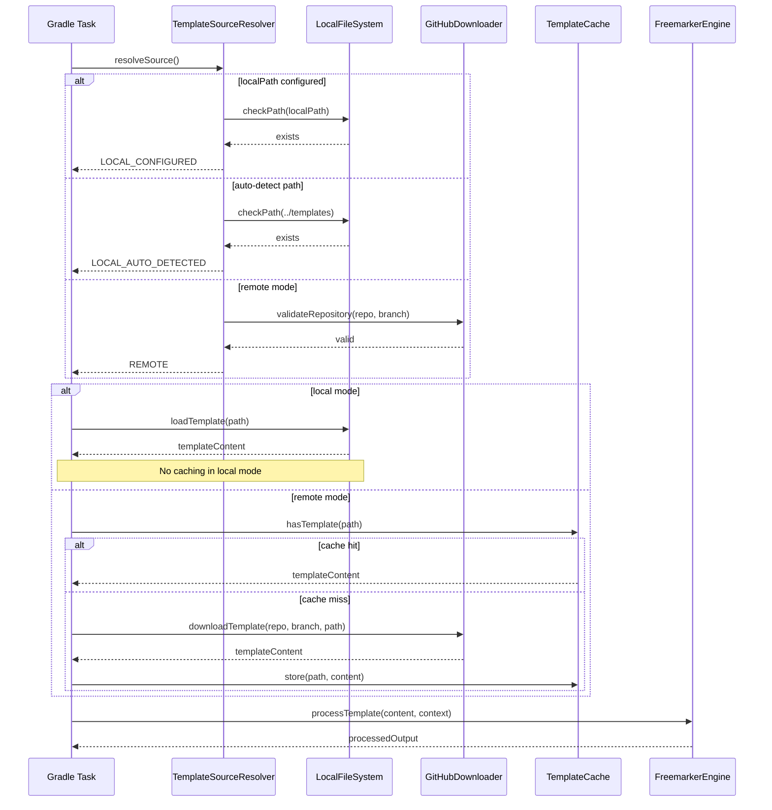
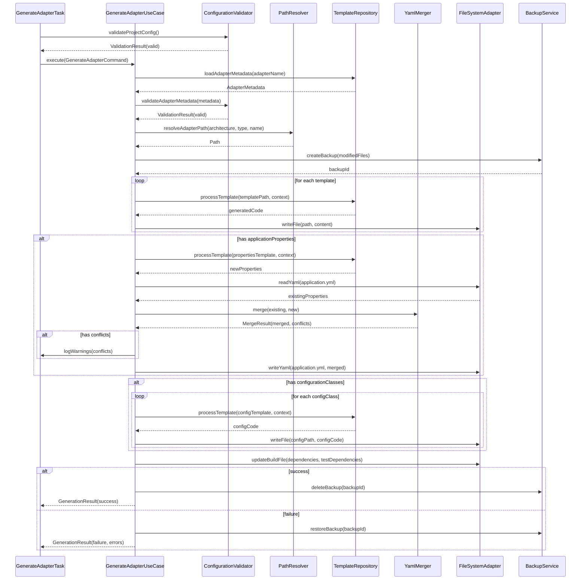
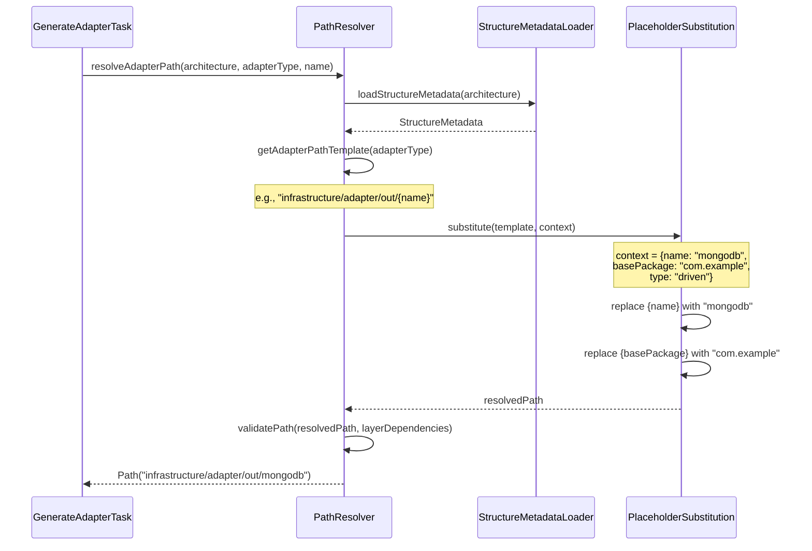
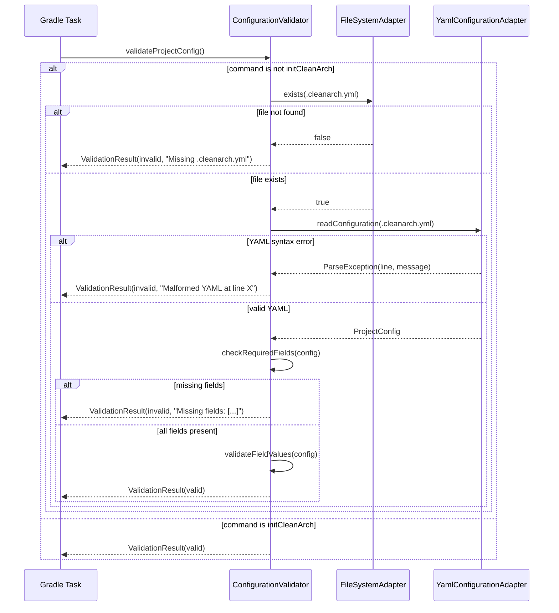
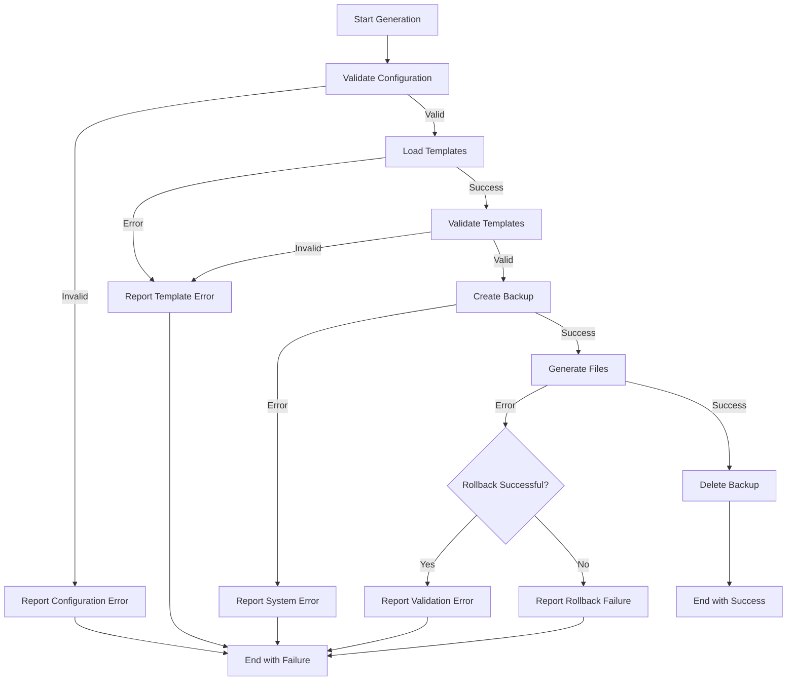

# Design Document: Complete Architectures and Template System

## Overview

This design extends the Clean Architecture Gradle Plugin to support Onion architecture, enhance the template development workflow, implement intelligent configuration merging, and restructure documentation for production readiness. The plugin currently supports Hexagonal architecture variants with Spring Reactive; this feature completes the architecture support matrix and improves the contributor experience.

The design addresses three major areas:

1. **Architecture Completeness**: Add Onion single-module architecture with proper adapter path resolution that works across all architectures
2. **Template Development Workflow**: Enable local template development mode with hot reload and remote branch testing for contributors
3. **Configuration Intelligence**: Implement YAML merging for application.yml, enhanced metadata system for adapters, and comprehensive validation

The plugin follows hexagonal architecture internally and uses FreeMarker for templating, SnakeYAML for configuration parsing, and Git for remote template distribution.

## Architecture

### High-Level Architecture

The plugin maintains its existing hexagonal architecture structure:

```
Domain Layer (Core Business Logic)
├── Model: ProjectConfig, ArchitectureType, TemplateConfig, AdapterMetadata, StructureMetadata
├── Ports: Use case interfaces and repository interfaces
└── Services: Validators for configuration and templates

Application Layer (Use Cases)
├── InitializeProjectUseCase: Creates new projects with architecture selection
├── GenerateAdapterUseCase: Generates adapters with metadata processing
├── ValidateTemplateUseCase: Validates template structure and variables
└── MergeConfigurationUseCase: Merges YAML configurations intelligently

Infrastructure Layer (Adapters)
├── In: Gradle tasks (InitCleanArchTask, GenerateOutputAdapterTask, etc.)
├── Out: 
    ├── FreemarkerTemplateRepository: Template processing
    ├── YamlConfigurationAdapter: Configuration read/write with merging
    ├── GitHubTemplateDownloader: Remote template fetching
    └── LocalFileSystemAdapter: File operations
```

### New Components

#### 1. Onion Architecture Support

**OnionStructureResolver**: Resolves paths for Onion architecture
- Maps adapter types to infrastructure/adapter/in or infrastructure/adapter/out
- Applies naming conventions from structure.yml
- Validates layer dependencies

**StructureMetadata** (enhanced domain model):
```java
class StructureMetadata {
    Map<String, String> adapterPaths;      // e.g., "driven" -> "infrastructure/adapter/out/{name}"
    NamingConventions namingConventions;   // suffixes, prefixes per component type
    LayerDependencies layerDependencies;   // allowed dependencies between layers
}
```

#### 2. Template Development Mode

**TemplateSourceResolver**: Determines template source based on configuration
- Checks for localPath in .cleanarch.yml
- Auto-detects ../backend-architecture-design-archetype-generator-templates
- Falls back to remote repository with branch support
- Disables caching in local mode for hot reload

**TemplateValidator**: Validates template structure and variables
- Checks required files exist (metadata.yml, structure.yml, templates/)
- Validates FreeMarker syntax
- Detects undefined variables
- Provides validation command for contributors

#### 3. Configuration Merging

**YamlMerger**: Intelligently merges YAML configurations
- Uses SnakeYAML for parsing and serialization
- Preserves existing values (no overwrites)
- Maintains structure and indentation
- Logs warnings for conflicts
- Adds security comments for sensitive properties

**AdapterMetadata** (enhanced domain model):
```java
class AdapterMetadata {
    String name;
    String type;
    List<Dependency> dependencies;
    List<Dependency> testDependencies;        // NEW
    String applicationPropertiesTemplate;      // NEW: path to properties template
    List<String> configurationClasses;         // NEW: additional config classes
}
```

### Path Resolution Strategy

The plugin uses a multi-level path resolution strategy:

1. **Architecture Structure**: structure.yml defines base paths and adapter placement rules
2. **Adapter Type Mapping**: adapterPaths section maps adapter types to path templates
3. **Placeholder Substitution**: {type}, {name}, {module} placeholders are replaced
4. **Validation**: Resolved paths are validated against layer dependency rules

Example for Onion architecture:
```yaml
adapterPaths:
  driven: "infrastructure/adapter/out/{name}"
  driving: "infrastructure/adapter/in/{name}"
```

Example for Hexagonal Multi-Granular:
```yaml
adapterPaths:
  driven: "infrastructure/adapters/{name}"
  driving: "infrastructure/entry-points/{name}"
```

## Components and Interfaces

### Domain Layer

#### Models

**ArchitectureType** (enhanced enum):
```java
enum ArchitectureType {
    HEXAGONAL_SINGLE,
    HEXAGONAL_MULTI,
    HEXAGONAL_MULTI_GRANULAR,
    ONION_SINGLE,      // NEW
    ONION_MULTI        // NEW (future)
}
```

**TemplateConfig** (enhanced):
```java
class TemplateConfig {
    TemplateMode mode;           // PRODUCTION or DEVELOPER
    String repository;
    String branch;               // NEW: support feature branches
    String version;
    String localPath;            // NEW: local filesystem path
    boolean cache;
}
```

**StructureMetadata**:
```java
class StructureMetadata {
    String architectureType;
    Map<String, String> adapterPaths;
    NamingConventions namingConventions;
    LayerDependencies layerDependencies;
    
    String resolveAdapterPath(AdapterType type, String name);
    void validate();
}

class NamingConventions {
    Map<String, String> suffixes;    // e.g., "useCase" -> "UseCase"
    Map<String, String> prefixes;    // e.g., "interface" -> "I"
}

class LayerDependencies {
    Map<String, List<String>> allowedDependencies;  // layer -> allowed dependencies
    
    boolean canDependOn(String fromLayer, String toLayer);
}
```

**AdapterMetadata** (enhanced):
```java
class AdapterMetadata {
    String name;
    AdapterType type;
    List<Dependency> dependencies;
    List<Dependency> testDependencies;
    String applicationPropertiesTemplate;
    List<ConfigurationClass> configurationClasses;
    
    boolean hasApplicationProperties();
    boolean hasConfigurationClasses();
    boolean hasTestDependencies();
}

class ConfigurationClass {
    String name;
    String packagePath;
    String templatePath;
}
```

**ValidationResult**:
```java
class ValidationResult {
    boolean valid;
    List<String> errors;
    List<String> warnings;
    
    static ValidationResult success();
    static ValidationResult failure(List<String> errors);
    ValidationResult withWarnings(List<String> warnings);
}
```

#### Ports

**TemplateRepository** (enhanced):
```java
interface TemplateRepository {
    String processTemplate(String templatePath, Map<String, Object> context);
    boolean templateExists(String templatePath);
    ValidationResult validateTemplate(String templatePath, Set<String> requiredVariables);
    StructureMetadata loadStructureMetadata(ArchitectureType architecture);
    AdapterMetadata loadAdapterMetadata(String adapterName);
}
```

**ConfigurationPort** (enhanced):
```java
interface ConfigurationPort {
    Optional<ProjectConfig> readConfiguration(Path projectPath);
    void writeConfiguration(Path projectPath, ProjectConfig config);
    boolean configurationExists(Path projectPath);
    TemplateConfig readTemplateConfiguration(Path projectPath);
    
    // NEW methods
    Map<String, Object> readYaml(Path filePath);
    void writeYaml(Path filePath, Map<String, Object> data);
    Map<String, Object> mergeYaml(Map<String, Object> base, Map<String, Object> overlay);
}
```

**PathResolver**:
```java
interface PathResolver {
    Path resolveAdapterPath(ArchitectureType architecture, AdapterType type, String name);
    Path resolveComponentPath(ArchitectureType architecture, ComponentType type, String name);
    ValidationResult validatePath(Path path, ArchitectureType architecture);
}
```

#### Services

**TemplateValidator**:
```java
class TemplateValidator {
    ValidationResult validateArchitectureTemplates(ArchitectureType architecture);
    ValidationResult validateAdapterTemplates(String adapterName);
    ValidationResult validateTemplateVariables(String templatePath, Set<String> providedVariables);
    List<String> extractRequiredVariables(String templateContent);
}
```

**ConfigurationValidator**:
```java
class ConfigurationValidator {
    ValidationResult validateProjectConfig(ProjectConfig config);
    ValidationResult validateTemplateConfig(TemplateConfig config);
    ValidationResult validateStructureMetadata(StructureMetadata metadata);
    ValidationResult validateAdapterMetadata(AdapterMetadata metadata);
}
```

**YamlMerger**:
```java
class YamlMerger {
    MergeResult merge(Map<String, Object> base, Map<String, Object> overlay);
    boolean hasConflict(Map<String, Object> base, Map<String, Object> overlay, String key);
    Map<String, Object> deepMerge(Map<String, Object> base, Map<String, Object> overlay);
}

class MergeResult {
    Map<String, Object> merged;
    List<String> conflicts;
    List<String> addedKeys;
}
```

### Application Layer

#### Use Cases

**InitializeProjectUseCase** (enhanced):
```java
interface InitializeProjectUseCase {
    GenerationResult execute(InitProjectCommand command);
}

class InitProjectCommand {
    String name;
    String basePackage;
    ArchitectureType architecture;
    Framework framework;
    Paradigm paradigm;
}

class GenerationResult {
    boolean success;
    List<GeneratedFile> files;
    List<String> errors;
    List<String> warnings;
}
```

**GenerateAdapterUseCase** (enhanced):
```java
interface GenerateAdapterUseCase {
    GenerationResult execute(GenerateAdapterCommand command);
}

class GenerateAdapterCommand {
    String name;
    AdapterType type;
    Path projectPath;
    Map<String, Object> additionalContext;
}
```

**ValidateTemplateUseCase** (new):
```java
interface ValidateTemplateUseCase {
    ValidationResult execute(ValidateTemplateCommand command);
}

class ValidateTemplateCommand {
    Optional<ArchitectureType> architecture;
    Optional<String> adapterName;
    boolean validateAll;
}
```

**MergeConfigurationUseCase** (new):
```java
interface MergeConfigurationUseCase {
    MergeResult execute(MergeConfigCommand command);
}

class MergeConfigCommand {
    Path targetFile;
    String templatePath;
    Map<String, Object> templateContext;
}
```

### Infrastructure Layer

#### Adapters In (Gradle Tasks)

**InitCleanArchTask** (enhanced):
- Validates architecture selection
- Loads structure metadata for selected architecture
- Generates README from architecture-specific template
- Creates .cleanarch.yml with project configuration

**GenerateOutputAdapterTask** (enhanced):
- Validates .cleanarch.yml exists
- Loads adapter metadata
- Resolves adapter path using architecture's adapterPaths
- Processes main adapter templates
- Generates configuration classes if specified
- Merges application properties if template exists
- Adds dependencies and test dependencies to build file

**ValidateTemplatesTask** (new):
- Validates all templates in local or remote repository
- Checks structure metadata for all architectures
- Validates adapter metadata for all adapters
- Reports missing files, syntax errors, undefined variables

#### Adapters Out

**FreemarkerTemplateRepository** (enhanced):
```java
class FreemarkerTemplateRepository implements TemplateRepository {
    private final Configuration freemarkerConfig;
    private final TemplateSourceResolver sourceResolver;
    private final TemplateCache cache;
    
    String processTemplate(String templatePath, Map<String, Object> context);
    StructureMetadata loadStructureMetadata(ArchitectureType architecture);
    AdapterMetadata loadAdapterMetadata(String adapterName);
    ValidationResult validateTemplate(String templatePath, Set<String> requiredVariables);
}
```

**TemplateSourceResolver** (new):
```java
class TemplateSourceResolver {
    private final TemplateConfig config;
    private final GitHubTemplateDownloader remoteDownloader;
    private final Path autoDetectPath;
    
    TemplateSource resolveSource();
    boolean isLocalMode();
    Path getLocalPath();
    void validateSource();
}

enum TemplateSource {
    LOCAL_CONFIGURED,
    LOCAL_AUTO_DETECTED,
    REMOTE
}
```

**YamlConfigurationAdapter** (enhanced):
```java
class YamlConfigurationAdapter implements ConfigurationPort {
    private final Yaml yaml;
    private final YamlMerger merger;
    
    // Existing methods...
    
    Map<String, Object> readYaml(Path filePath);
    void writeYaml(Path filePath, Map<String, Object> data);
    Map<String, Object> mergeYaml(Map<String, Object> base, Map<String, Object> overlay);
    TemplateConfig readTemplateConfiguration(Path projectPath);
}
```

**GitHubTemplateDownloader** (enhanced):
```java
class GitHubTemplateDownloader {
    private final HttpClientPort httpClient;
    private final TemplateCache cache;
    
    String downloadTemplate(TemplateConfig config, String templatePath);
    boolean templateExists(TemplateConfig config, String templatePath);
    void downloadBranch(String repository, String branch, Path targetPath);
    ValidationResult validateRemoteRepository(String repository, String branch);
}
```

## Data Models

### Configuration Files

#### .cleanarch.yml (enhanced)

```yaml
project:
  name: my-service
  basePackage: com.example.myservice
  pluginVersion: 1.0.0
  createdAt: 2024-01-15T10:30:00

architecture:
  type: onion-single
  paradigm: reactive
  framework: spring
  adaptersAsModules: false

templates:
  mode: developer              # NEW: production or developer
  localPath: ../templates      # NEW: local filesystem path
  repository: https://github.com/somospragma/backend-architecture-design-archetype-generator-templates
  branch: feature/init-templates  # NEW: branch support
  cache: true
```

#### structure.yml (enhanced)

```yaml
architecture: onion-single
description: Onion Architecture with single module

# NEW: Adapter path resolution
adapterPaths:
  driven: "src/main/java/{basePackage}/infrastructure/adapter/out/{name}"
  driving: "src/main/java/{basePackage}/infrastructure/adapter/in/{name}"

# NEW: Naming conventions
namingConventions:
  suffixes:
    useCase: "UseCase"
    port: "Port"
    adapter: "Adapter"
    entity: ""
  prefixes:
    interface: "I"

# NEW: Layer dependencies
layerDependencies:
  domain:
    - []  # depends on nothing
  application:
    - domain
  infrastructure:
    - domain
    - application

# Existing structure definition
structure:
  - path: src/main/java/{basePackage}/core/domain
    description: Domain entities and value objects
  - path: src/main/java/{basePackage}/core/application/service
    description: Use cases and application services
  - path: src/main/java/{basePackage}/core/application/port
    description: Port interfaces
  - path: src/main/java/{basePackage}/infrastructure/adapter/in
    description: Driving adapters (REST, messaging)
  - path: src/main/java/{basePackage}/infrastructure/adapter/out
    description: Driven adapters (database, external APIs)
```

#### metadata.yml (enhanced)

```yaml
name: mongodb-adapter
type: driven
description: MongoDB database adapter using Spring Data Reactive

dependencies:
  - group: org.springframework.boot
    artifact: spring-boot-starter-data-mongodb-reactive
    version: ${springBootVersion}

# NEW: Test-only dependencies
testDependencies:
  - group: de.flapdoodle.embed
    artifact: de.flapdoodle.embed.mongo
    version: 4.11.0
    scope: test

# NEW: Application properties template
applicationPropertiesTemplate: application-properties.yml.ftl

# NEW: Additional configuration classes
configurationClasses:
  - name: MongoConfig
    packagePath: config
    templatePath: MongoConfig.java.ftl

templates:
  - path: Adapter.java.ftl
    output: "{name}Adapter.java"
  - path: Repository.java.ftl
    output: "{name}Repository.java"
```

#### application-properties.yml.ftl (new template type)

```yaml
spring:
  data:
    mongodb:
      uri: mongodb://localhost:27017/${projectName}
      # WARNING: Do not store credentials in source control
      # Use environment variables or secret management in production
      database: ${projectName}
```

### Template Directory Structure

```
templates/
├── architectures/
│   ├── hexagonal-single/
│   │   ├── structure.yml
│   │   ├── README.md.ftl
│   │   └── templates/
│   ├── hexagonal-multi/
│   ├── hexagonal-multi-granular/
│   └── onion-single/              # NEW
│       ├── structure.yml
│       ├── README.md.ftl
│       └── templates/
│           ├── build.gradle.ftl
│           ├── settings.gradle.ftl
│           └── src/
└── adapters/
    ├── mongodb/
    │   ├── metadata.yml
    │   ├── application-properties.yml.ftl  # NEW
    │   └── templates/
    │       ├── Adapter.java.ftl
    │       ├── Repository.java.ftl
    │       └── MongoConfig.java.ftl        # NEW
    └── rest-controller/
```

## Correctness Properties

## Correctness Properties

*A property is a characteristic or behavior that should hold true across all valid executions of a system-essentially, a formal statement about what the system should do. Properties serve as the bridge between human-readable specifications and machine-verifiable correctness guarantees.*

### Property Reflection

After analyzing all acceptance criteria, I identified several redundant properties that can be consolidated:

- Properties 1.5, 1.6, and 1.8 all test adapter placement based on type - these can be combined into a single comprehensive property
- Properties 4.2 and 4.3 test path resolution for driven/driving adapters - these can be combined with the adapter placement property
- Property 2.8 and 4.8 both test architecture-independent behavior - these can be combined
- Property 5.3 and 18.3 both test that existing properties are preserved during merging - these are the same property
- Properties 18.2 and 18.3 test that existing configuration is preserved - these can be combined
- Property 19.1 and 19.3 both test hot reload - these are the same property

The following properties provide unique validation value and will be included:

### Property 1: Adapter Placement by Type

*For any* adapter type (driven or driving) and any architecture, generating an adapter SHALL place it in the path specified by the architecture's adapterPaths configuration for that adapter type.

**Validates: Requirements 1.5, 1.6, 1.8, 4.2, 4.3, 7.6**

### Property 2: Placeholder Substitution in Paths

*For any* path template containing placeholders ({type}, {name}, {module}, {basePackage}), resolving the path with concrete values SHALL replace all placeholders with their corresponding values.

**Validates: Requirements 4.4, 13.2**

### Property 3: Architecture-Independent Adapter Generation

*For any* adapter metadata and any two different architectures, generating the adapter in both architectures SHALL produce functionally equivalent code with only path differences (package declarations and file locations).

**Validates: Requirements 1.10, 2.8, 4.8**

### Property 4: Template Source Independence

*For any* template operation, executing it in local mode and remote mode with identical template content SHALL produce identical output.

**Validates: Requirements 2.8**

### Property 5: YAML Merge Preserves Existing Values

*For any* existing application.yml file and any new properties to merge, merging SHALL preserve all existing property values and only add properties that don't already exist.

**Validates: Requirements 5.3, 18.3**

### Property 6: YAML Round-Trip Equivalence

*For any* valid application.yml file, parsing then serializing then parsing again SHALL produce an equivalent configuration object.

**Validates: Requirements 14.7**

### Property 7: YAML Structure Preservation

*For any* application.yml file with comments and specific property ordering, merging new properties SHALL preserve existing comments, indentation (2 spaces), and property order.

**Validates: Requirements 5.5, 14.2, 14.3, 14.4**

### Property 8: YAML Merge Grouping

*For any* sequence of adapter property merges, properties from each adapter SHALL remain grouped together in the merged application.yml file.

**Validates: Requirements 5.8**

### Property 9: Configuration Class Generation

*For any* adapter metadata specifying configurationClasses, generating the adapter SHALL create all specified configuration class files in their designated packages.

**Validates: Requirements 6.5**

### Property 10: Test Dependency Scope

*For any* adapter metadata specifying testDependencies, generating the adapter SHALL add all test dependencies to the build file with test scope (not compile scope).

**Validates: Requirements 6.6**

### Property 11: Naming Convention Application

*For any* component type with defined naming conventions (suffixes/prefixes) in structure.yml, generating that component SHALL apply the conventions to the component name.

**Validates: Requirements 7.4**

### Property 12: Configuration Validation for Non-Init Commands

*For any* plugin command except initCleanArch, executing the command without a .cleanarch.yml file in the current directory SHALL fail with a validation error.

**Validates: Requirements 9.1**

### Property 13: Path Resolution Consistency

*For any* architecture (single-module or multi-module), resolving adapter paths SHALL use the same path resolution logic with architecture-specific configuration.

**Validates: Requirements 13.3, 13.6**

### Property 14: Multi-Module Adapter Placement

*For any* adapter generated in a multi-module architecture, the adapter SHALL be placed in the module specified by the path resolution logic.

**Validates: Requirements 13.4**

### Property 15: Package Name Validation

*For any* package name used in generation, the package name SHALL follow Java naming conventions (lowercase, only alphanumeric and dots, no consecutive dots, no leading/trailing dots).

**Validates: Requirements 17.1**

### Property 16: Package-Folder Alignment

*For any* generated class file, the package declaration SHALL match the folder structure (e.g., package com.example.domain corresponds to com/example/domain folder).

**Validates: Requirements 17.2**

### Property 17: Base Package Consistency

*For any* code generation operation in a project, all generated packages SHALL start with the base package defined in .cleanarch.yml.

**Validates: Requirements 17.4**

### Property 18: Incremental Generation Preservation

*For any* existing project files not related to the adapter being generated, generating a new adapter SHALL not modify those files.

**Validates: Requirements 18.1, 18.7**

### Property 19: Dependency Addition (Not Replacement)

*For any* existing build file with dependencies, adding an adapter with new dependencies SHALL add the new dependencies while preserving all existing dependencies.

**Validates: Requirements 18.2**

### Property 20: Independent Adapter Handling

*For any* sequence of multiple adapter generations, each adapter SHALL be processed independently without affecting the generation of other adapters.

**Validates: Requirements 18.5**

### Property 21: Atomic Configuration Updates

*For any* generation operation that modifies configuration files (build.gradle, application.yml), either all modifications SHALL be applied successfully or no modifications SHALL be persisted if any error occurs.

**Validates: Requirements 18.6, 20.7**

### Property 22: Rollback on Failure

*For any* generation command that fails after creating or modifying files, all file changes made during that command SHALL be rolled back to the pre-command state.

**Validates: Requirements 20.1**

### Property 23: Backup Before Modification

*For any* file that will be modified during generation, a backup of the original file SHALL be created before any modifications are made.

**Validates: Requirements 20.2**

### Property 24: Validation Before Modification

*For any* generation operation, all template and configuration validation SHALL complete successfully before any file system modifications are made.

**Validates: Requirements 20.4**

## Sequence Diagrams

### Template Loading Flow



### Adapter Generation with Property Merging



### Path Resolution Across Architectures



### Configuration Validation Flow



## Error Handling

### Error Categories

The plugin handles errors in four main categories:

1. **Configuration Errors**: Invalid or missing configuration files
2. **Template Errors**: Missing templates, invalid syntax, undefined variables
3. **Validation Errors**: Invalid input, constraint violations
4. **System Errors**: File system failures, network failures, unexpected exceptions

### Error Handling Strategy

#### Configuration Errors

**Detection**: Validate configuration files before any generation operations
**Reporting**: Display specific error messages with file paths, line numbers, and examples
**Recovery**: Provide documentation links and suggest corrections

Examples:
- Missing .cleanarch.yml: "Configuration file .cleanarch.yml not found. Run 'gradle initCleanArch' to create initial project structure. See: [docs link]"
- Invalid YAML syntax: "Failed to parse .cleanarch.yml at line 15: Expected ':' after key. Check YAML syntax."
- Missing required field: "Missing required field 'architecture.type' in .cleanarch.yml. Example: architecture:\n  type: hexagonal-single"

#### Template Errors

**Detection**: Validate templates during loading and before processing
**Reporting**: Display template name, error type, and location (line number for syntax errors)
**Recovery**: For local mode, suggest checking template files; for remote mode, suggest validating branch

Examples:
- Missing template: "Template file 'Adapter.java.ftl' not found in adapter 'mongodb'. Check metadata.yml references."
- Undefined variable: "Template 'Repository.java.ftl' uses undefined variable 'repositoryInterface'. Available variables: [name, type, package, ...]"
- Syntax error: "FreeMarker syntax error in 'Config.java.ftl' at line 23: Unclosed directive #if"

#### Validation Errors

**Detection**: Validate inputs before processing
**Reporting**: Display what was invalid and why, with suggestions for valid values
**Recovery**: Provide examples of valid input

Examples:
- Invalid package name: "Package name 'Com.Example' is invalid. Package names must be lowercase. Suggestion: 'com.example'"
- Invalid architecture: "Architecture type 'hexagonal' is not supported. Valid types: [hexagonal-single, hexagonal-multi, hexagonal-multi-granular, onion-single]"
- Duplicate adapter: "Adapter 'mongodb' already exists at infrastructure/adapter/out/mongodb. Use --force to overwrite or choose a different name."

#### System Errors

**Detection**: Catch exceptions during file operations and network operations
**Reporting**: Display user-friendly message with technical details in verbose mode
**Recovery**: Attempt rollback, provide backup locations if rollback fails

Examples:
- File system error: "Failed to write file 'MongoAdapter.java': Permission denied. Check file permissions."
- Network error: "Failed to download templates from GitHub: Connection timeout. Check network connection and repository URL."
- Rollback failure: "Generation failed and rollback encountered errors. Manual recovery required. Backups located at: .cleanarch/backups/[timestamp]/"

### Error Handling Flow



### Logging Strategy

The plugin uses structured logging with different levels:

- **ERROR**: Failures that prevent command completion
- **WARN**: Non-fatal issues (conflicts, deprecations, suggestions)
- **INFO**: Progress updates, successful operations
- **DEBUG**: Detailed execution information (template loading, path resolution)

Log format: `[LEVEL] [Component] Message`

Examples:
- `[INFO] [TemplateSourceResolver] Using local templates from: ../backend-architecture-design-archetype-generator-templates`
- `[WARN] [YamlMerger] Property conflict: spring.data.mongodb.uri already exists with different value. Keeping existing value.`
- `[ERROR] [GenerateAdapterUseCase] Failed to generate adapter 'mongodb': Template validation failed`
- `[DEBUG] [PathResolver] Resolved adapter path: infrastructure/adapter/out/mongodb for architecture onion-single`

## Testing Strategy

### Dual Testing Approach

The testing strategy combines unit tests and property-based tests to achieve comprehensive coverage:

- **Unit tests**: Verify specific examples, edge cases, error conditions, and integration points
- **Property-based tests**: Verify universal properties across randomized inputs

Both approaches are complementary and necessary. Unit tests catch concrete bugs and validate specific scenarios, while property-based tests verify general correctness across a wide input space.

### Unit Testing

Unit tests focus on:

1. **Specific Examples**: Concrete scenarios that demonstrate correct behavior
   - Generating Onion architecture project creates expected folder structure
   - Merging specific application.yml properties produces expected output
   - Resolving path with specific placeholders produces expected path

2. **Edge Cases**: Boundary conditions and special cases
   - Empty application.yml file
   - Missing .cleanarch.yml file
   - Non-existent local template path
   - Invalid YAML syntax
   - Undefined template variables
   - Dependency version conflicts

3. **Error Conditions**: Validation failures and error handling
   - Invalid package names
   - Missing required configuration fields
   - Template file not found
   - Network failures during template download
   - Rollback on generation failure

4. **Integration Points**: Component interactions
   - Template loading from local vs remote sources
   - YAML parsing and serialization
   - File system operations
   - Gradle task execution

### Property-Based Testing

Property-based tests verify universal properties using randomized inputs. Each test runs a minimum of 100 iterations.

**Testing Library**: Use Kotest Property Testing for Kotlin

**Property Test Configuration**:
```kotlin
class AdapterGenerationPropertyTest : StringSpec({
    "Property 1: Adapter Placement by Type" {
        checkAll(100, Arb.architecture(), Arb.adapterType(), Arb.adapterName()) { 
            architecture, adapterType, name ->
            // Feature: complete-architectures-and-template-system, Property 1
            val path = pathResolver.resolveAdapterPath(architecture, adapterType, name)
            val expectedPath = architecture.structureMetadata.adapterPaths[adapterType]
            path.toString() shouldContain expectedPath.replace("{name}", name)
        }
    }
})
```

**Property Test Tags**: Each property test must include a comment referencing the design property:
```kotlin
// Feature: complete-architectures-and-template-system, Property 1: Adapter Placement by Type
```

**Generators (Arb) for Property Tests**:

```kotlin
// Architecture generator
fun Arb.Companion.architecture() = arbitrary {
    ArchitectureType.values().random()
}

// Adapter type generator
fun Arb.Companion.adapterType() = arbitrary {
    listOf(AdapterType.DRIVEN, AdapterType.DRIVING).random()
}

// Valid adapter name generator
fun Arb.Companion.adapterName() = Arb.string(5..20, Codepoint.az())

// Valid package name generator
fun Arb.Companion.packageName() = Arb.string(5..30, Codepoint.az())
    .map { it.lowercase() }
    .filter { it.matches(Regex("[a-z][a-z0-9]*(\\.[a-z][a-z0-9]*)*")) }

// YAML configuration generator
fun Arb.Companion.yamlMap() = arbitrary {
    // Generate random nested maps representing YAML structure
    buildMap {
        repeat(Arb.int(1..5).bind()) {
            put(Arb.string(3..10).bind(), Arb.string(5..20).bind())
        }
    }
}

// Template context generator
fun Arb.Companion.templateContext() = arbitrary {
    mapOf(
        "name" to Arb.adapterName().bind(),
        "package" to Arb.packageName().bind(),
        "type" to Arb.adapterType().bind().toString()
    )
}
```

**Property Tests to Implement**:

1. **Property 1: Adapter Placement by Type**
   - Generate: random architecture, adapter type, adapter name
   - Verify: resolved path matches adapterPaths configuration

2. **Property 2: Placeholder Substitution**
   - Generate: random path template with placeholders, random context values
   - Verify: all placeholders are replaced with context values

3. **Property 3: Architecture-Independent Adapter Generation**
   - Generate: random adapter metadata, two different architectures
   - Verify: generated code is equivalent except for paths

4. **Property 5: YAML Merge Preserves Existing Values**
   - Generate: random existing YAML, random new properties
   - Verify: all existing values remain unchanged after merge

5. **Property 6: YAML Round-Trip Equivalence**
   - Generate: random valid YAML structure
   - Verify: parse → serialize → parse produces equivalent object

6. **Property 7: YAML Structure Preservation**
   - Generate: random YAML with comments and specific ordering
   - Verify: merge preserves comments, indentation, and order

7. **Property 15: Package Name Validation**
   - Generate: random strings (including invalid package names)
   - Verify: validation correctly identifies valid/invalid package names

8. **Property 16: Package-Folder Alignment**
   - Generate: random package names
   - Verify: generated folder path matches package structure

9. **Property 17: Base Package Consistency**
   - Generate: random base package, random component types
   - Verify: all generated packages start with base package

10. **Property 18: Incremental Generation Preservation**
    - Generate: random existing project files, random new adapter
    - Verify: existing files are unchanged after generation

11. **Property 19: Dependency Addition**
    - Generate: random existing dependencies, random new dependencies
    - Verify: merged dependencies include both old and new

12. **Property 21: Atomic Configuration Updates**
    - Generate: random configuration updates, random failure point
    - Verify: either all updates applied or none applied

13. **Property 22: Rollback on Failure**
    - Generate: random generation operation, random failure
    - Verify: file system state matches pre-operation state

14. **Property 24: Validation Before Modification**
    - Generate: random invalid configuration
    - Verify: no file system changes occur

### Integration Testing

Integration tests verify end-to-end workflows:

1. **Complete Project Generation**: Run initCleanArch and verify all files are created correctly
2. **Adapter Addition**: Generate adapter in existing project and verify integration
3. **Template Loading**: Test local and remote template loading with actual repositories
4. **Configuration Merging**: Test complete YAML merge workflow with real Spring Boot configs
5. **Multi-Adapter Generation**: Generate multiple adapters and verify they work together

### Test Coverage Goals

- **Unit Test Coverage**: Minimum 80% code coverage
- **Property Test Coverage**: All 24 correctness properties implemented
- **Integration Test Coverage**: All major workflows (init, generate adapter, validate)
- **Edge Case Coverage**: All identified edge cases from requirements

### Testing Tools

- **Unit Testing**: JUnit 5 + Kotest
- **Property-Based Testing**: Kotest Property Testing
- **Mocking**: MockK
- **Assertions**: Kotest Matchers
- **Coverage**: JaCoCo

## Migration Considerations

### Migration from Current Implementation

The current plugin supports Hexagonal architectures. This feature adds Onion architecture and enhances the template system. Migration considerations:

#### For Existing Projects

1. **No Breaking Changes**: Existing Hexagonal projects continue to work without modification
2. **Configuration Migration**: Existing .cleanarch.yml files are compatible; new fields are optional
3. **Template Compatibility**: Existing templates work with new template system
4. **Gradual Adoption**: Users can adopt new features (local mode, enhanced metadata) incrementally

#### For Template Contributors

1. **Structure.yml Enhancement**: Add adapterPaths, namingConventions, layerDependencies sections
2. **Metadata.yml Enhancement**: Add applicationProperties, configurationClasses, testDependencies as needed
3. **Backward Compatibility**: Old metadata.yml files work; new fields are optional
4. **Validation**: Use new validation command to verify template changes

#### Migration Steps

1. **Phase 1: Core Infrastructure**
   - Implement TemplateSourceResolver with local/remote support
   - Implement YamlMerger with SnakeYAML
   - Implement enhanced PathResolver with placeholder support
   - Add configuration validation

2. **Phase 2: Onion Architecture**
   - Create Onion structure.yml
   - Create Onion README template
   - Implement OnionStructureResolver
   - Add Onion architecture tests

3. **Phase 3: Enhanced Metadata**
   - Extend AdapterMetadata model
   - Implement configuration class generation
   - Implement test dependency handling
   - Implement application properties merging

4. **Phase 4: Error Handling & Rollback**
   - Implement backup service
   - Implement rollback mechanism
   - Enhance error messages
   - Add dry-run mode

5. **Phase 5: Documentation**
   - Consolidate core repository docs
   - Create Docusaurus structure
   - Write architecture guides
   - Write contributor guides

### Rollback Plan

If issues are discovered after deployment:

1. **Feature Flags**: Use Gradle properties to disable new features
2. **Version Pinning**: Users can pin to previous plugin version
3. **Template Versioning**: Templates include version field for compatibility
4. **Graceful Degradation**: New features fail gracefully, falling back to old behavior

### Data Migration

No data migration required. The .cleanarch.yml format is backward compatible with optional new fields.

## Documentation Structure

### Core Repository Documentation

The core repository will contain minimal documentation with links to comprehensive online docs:

**Root Directory**:
- `README.md`: Overview, quick start, link to full documentation
- `CONTRIBUTING.md`: Contributor guide, link to detailed contributor docs
- `docs/`: Markdown documentation for offline reference

**docs/ Structure**:
```
docs/
├── getting-started.md
├── configuration.md
├── commands.md
├── architectures.md
└── contributing/
    ├── adding-adapters.md
    ├── adding-architectures.md
    └── testing-templates.md
```

### Docusaurus Documentation Structure

Comprehensive online documentation hosted with Docusaurus:

```
docs/
├── clean-arch/
│   ├── intro.md                          # Clean architecture principles
│   ├── getting-started/
│   │   ├── installation.md
│   │   ├── first-project.md
│   │   └── adding-adapters.md
│   ├── architectures/
│   │   ├── overview.md                   # Comparison table
│   │   ├── hexagonal-single.md
│   │   ├── hexagonal-multi.md
│   │   ├── hexagonal-multi-granular.md
│   │   └── onion-single.md
│   ├── commands/
│   │   ├── init-clean-arch.md
│   │   ├── generate-output-adapter.md
│   │   ├── generate-input-adapter.md
│   │   ├── generate-use-case.md
│   │   └── validate-templates.md
│   ├── adapters/
│   │   ├── index.md                      # List of all adapters
│   │   ├── mongodb.md
│   │   ├── rest-controller.md
│   │   ├── kafka.md
│   │   └── ...
│   ├── for-contributors/
│   │   ├── developer-mode.md             # Local template development
│   │   ├── adding-adapters.md            # metadata.yml guide
│   │   ├── adding-architectures.md       # structure.yml guide
│   │   └── testing-templates.md          # Validation and testing
│   └── reference/
│       ├── cleanarch-yml.md              # Complete config reference
│       ├── metadata-yml.md               # Adapter metadata reference
│       └── structure-yml.md              # Architecture structure reference
```

### Documentation Content Guidelines

1. **User-Facing Content**: Written in Spanish
2. **Contributor Content**: Written in English
3. **Code Examples**: Include complete, runnable examples
4. **Diagrams**: Use Mermaid for architecture and flow diagrams
5. **Cross-References**: Link related topics extensively
6. **Search Optimization**: Use clear headings and keywords
7. **Version Indicators**: Mark features by plugin version

### Documentation Maintenance

1. **Feature Documentation**: Document new features before marking them complete
2. **Example Updates**: Keep examples synchronized with current plugin version
3. **Deprecation Notices**: Clearly mark deprecated features with migration guides
4. **Changelog**: Maintain detailed changelog with examples for each version

## Implementation Notes

### Technology Stack

- **Language**: Kotlin
- **Build Tool**: Gradle
- **Template Engine**: FreeMarker
- **YAML Library**: SnakeYAML
- **HTTP Client**: OkHttp (for template downloads)
- **Testing**: JUnit 5, Kotest, MockK
- **Documentation**: Docusaurus

### Code Organization

The plugin follows hexagonal architecture internally:

```
src/main/kotlin/
├── domain/
│   ├── model/
│   ├── port/
│   └── service/
├── application/
│   └── usecase/
└── infrastructure/
    ├── adapter/
    │   ├── in/          # Gradle tasks
    │   └── out/         # File system, Git, YAML adapters
    └── config/          # Dependency injection
```

### Dependency Injection

Use constructor injection with a simple DI container:

```kotlin
class PluginContainer {
    // Repositories
    val templateRepository: TemplateRepository by lazy {
        FreemarkerTemplateRepository(templateSourceResolver, templateCache)
    }
    
    val configurationPort: ConfigurationPort by lazy {
        YamlConfigurationAdapter(yamlMerger)
    }
    
    // Services
    val yamlMerger: YamlMerger by lazy {
        YamlMerger()
    }
    
    val pathResolver: PathResolver by lazy {
        PathResolverImpl(structureMetadataLoader)
    }
    
    // Use cases
    val generateAdapterUseCase: GenerateAdapterUseCase by lazy {
        GenerateAdapterUseCaseImpl(
            templateRepository,
            configurationPort,
            pathResolver,
            backupService
        )
    }
}
```

### Performance Considerations

1. **Template Caching**: Cache remote templates to avoid repeated downloads
2. **Lazy Loading**: Load templates only when needed
3. **Parallel Processing**: Process multiple templates in parallel when possible
4. **Incremental Generation**: Only generate/modify files that changed

### Security Considerations

1. **Template Injection**: Validate template content before processing
2. **Path Traversal**: Validate resolved paths stay within project directory
3. **Credential Handling**: Never log or store credentials from configuration
4. **Dependency Verification**: Warn about dependency conflicts and version mismatches

### Extensibility Points

1. **New Architectures**: Add structure.yml without code changes
2. **New Adapters**: Add metadata.yml and templates without code changes
3. **Custom Validators**: Implement ValidationService interface
4. **Custom Path Resolvers**: Implement PathResolver interface
5. **Custom Template Processors**: Implement TemplateRepository interface

This design provides a solid foundation for completing the architecture support matrix and enhancing the template system while maintaining backward compatibility and extensibility for future enhancements.
