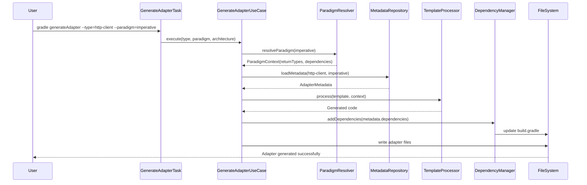
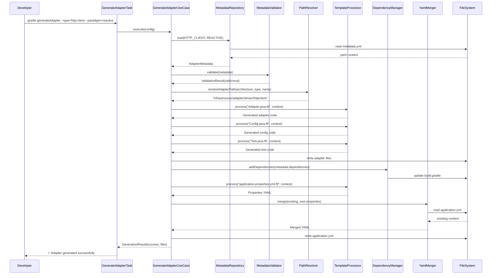
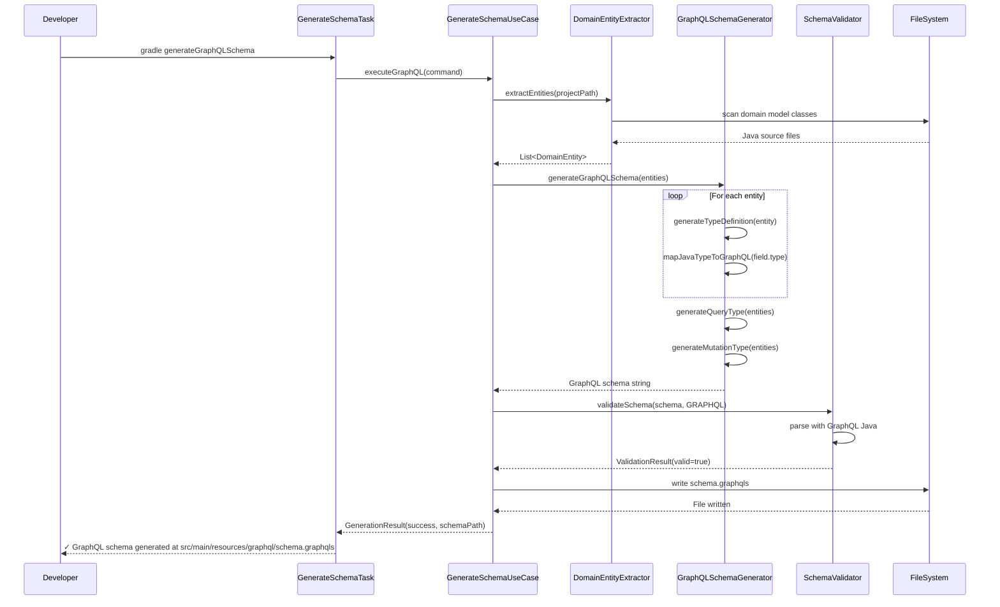
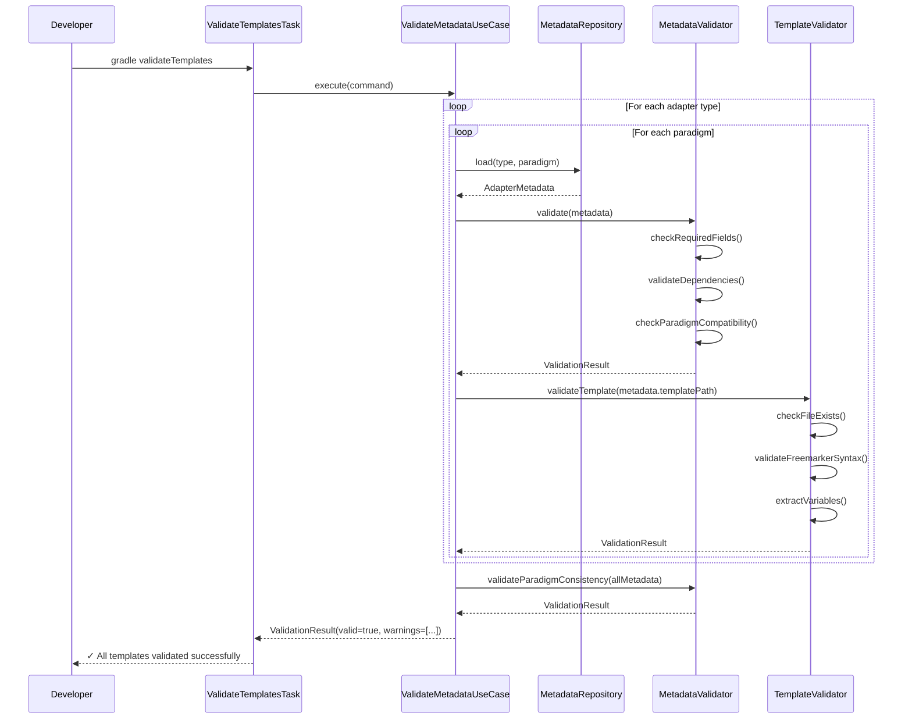
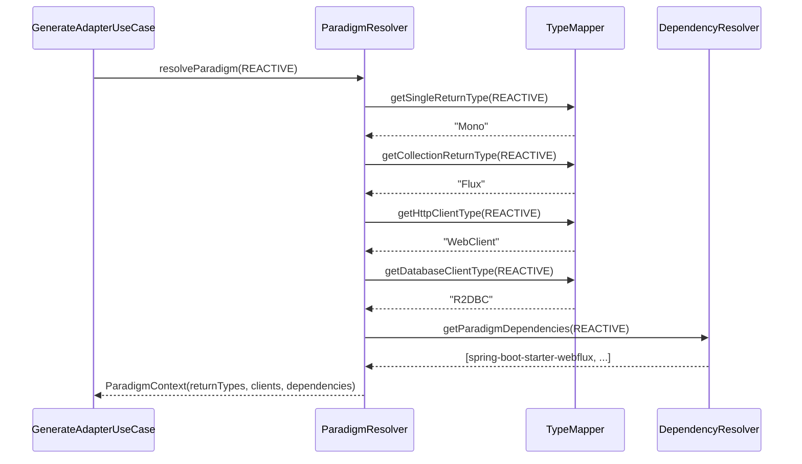

# Design Document: Complete Spring Framework Support

## Overview

This design completes Spring Framework support in the Clean Architecture Gradle Plugin by adding Spring Imperative (MVC) paradigm and implementing 14 new adapters (7 adapter types × 2 paradigms). The plugin currently supports Spring Reactive (WebFlux) with limited adapters; this feature enables developers to choose between non-blocking reactive and traditional blocking I/O approaches.

This design builds on Spec 1 (complete-architectures-and-template-system), which provides:
- Template system with local/remote modes and hot reload
- Multi-architecture support (Hexagonal, Onion) with path resolution
- YAML merging for application.yml configuration
- Enhanced metadata system (applicationProperties, configurationClasses, testDependencies)

The design addresses four major areas:

1. **Paradigm Foundation**: Add Spring Imperative paradigm with blocking I/O, synchronous types (POJO, List), RestTemplate, and JPA
2. **Adapter Completeness**: Implement 14 adapters across 7 types (HTTP Client, SQS Producer/Consumer, DynamoDB, Redis, REST, GraphQL, gRPC)
3. **Code Generation**: Generate adapter code, configuration, tests, and documentation from templates with paradigm-specific logic
4. **Developer Experience**: Provide migration guides, version compatibility matrix, and comprehensive documentation

The plugin follows hexagonal architecture internally and uses FreeMarker for templating, SnakeYAML for configuration, and AWS SDK v2 for cloud services.

## Architecture

### High-Level Architecture

The plugin extends its existing hexagonal architecture:

```
Domain Layer (Core Business Logic)
├── Model: ParadigmType, AdapterType, AdapterMetadata, TemplateContext
├── Ports: AdapterGenerator, TemplateProcessor, MetadataValidator
└── Services: ParadigmResolver, DependencyResolver, TypeMapper

Application Layer (Use Cases)
├── GenerateAdapterUseCase: Generates adapters with paradigm-specific logic
├── ValidateMetadataUseCase: Validates adapter metadata completeness
├── GenerateSchemaUseCase: Generates GraphQL schemas and Protocol Buffer definitions
└── MergeApplicationPropertiesUseCase: Merges adapter-specific properties

Infrastructure Layer (Adapters)
├── In: Gradle tasks (GenerateAdapterTask, ValidateTemplatesTask)
├── Out:
    ├── FreemarkerTemplateProcessor: Processes templates with paradigm context
    ├── MetadataRepository: Reads adapter metadata.yml files
    ├── SchemaGenerator: Generates .graphqls and .proto files
    └── DependencyManager: Manages paradigm-specific dependencies
```

### Paradigm Architecture


The plugin supports two paradigms with distinct characteristics:

**Spring Reactive (WebFlux)**:
- Non-blocking I/O with reactive streams
- Return types: Mono<T> (single), Flux<T> (collection)
- HTTP: WebClient
- Database: R2DBC
- Redis: ReactiveRedisTemplate (Lettuce)
- AWS SDK: Async clients (SqsAsyncClient, DynamoDbAsyncClient)
- Dependencies: spring-boot-starter-webflux, spring-boot-starter-data-r2dbc

**Spring Imperative (MVC)**:
- Blocking I/O with synchronous execution
- Return types: T (single), List<T> (collection)
- HTTP: RestTemplate
- Database: JPA with Hibernate
- Redis: RedisTemplate (Jedis)
- AWS SDK: Sync clients (SqsClient, DynamoDbClient)
- Dependencies: spring-boot-starter-web, spring-boot-starter-data-jpa

### Adapter Type Matrix

The plugin generates 14 adapters organized by type and paradigm:

| Adapter Type | Direction | Reactive Implementation | Imperative Implementation |
|--------------|-----------|------------------------|---------------------------|
| HTTP Client | Driven | WebClient | RestTemplate |
| SQS Producer | Driven | SqsAsyncClient | SqsClient |
| DynamoDB | Driven | DynamoDbAsyncClient | DynamoDbClient |
| Redis | Driven | ReactiveRedisTemplate | RedisTemplate (Jedis) |
| REST | Driving | @RestController + Mono/Flux | @RestController + POJO |
| GraphQL | Driving | @QueryMapping + Mono/Flux | @QueryMapping + POJO |
| gRPC | Driving | ReactorStub | BlockingStub |
| SQS Consumer | Driving | @SqsListener + Mono | @SqsListener + POJO |

### Component Interaction Flow



## Components and Interfaces

### Domain Layer

#### Models

**ParadigmType** (new enum):
```java
enum ParadigmType {
    REACTIVE("reactive", "Mono", "Flux", "WebClient", "R2DBC"),
    IMPERATIVE("imperative", "Object", "List", "RestTemplate", "JPA");
    
    String name;
    String singleReturnType;
    String collectionReturnType;
    String httpClient;
    String databaseTech;
    
    boolean isReactive();
    boolean isImperative();
}
```

**AdapterType** (enhanced enum):
```java
enum AdapterType {
    HTTP_CLIENT("http-client", Direction.DRIVEN),
    SQS_PRODUCER("sqs-producer", Direction.DRIVEN),
    SQS_CONSUMER("sqs-consumer", Direction.DRIVING),
    DYNAMODB("dynamodb", Direction.DRIVEN),
    REDIS("redis", Direction.DRIVEN),
    REST("rest", Direction.DRIVING),
    GRAPHQL("graphql", Direction.DRIVING),
    GRPC("grpc", Direction.DRIVING);
    
    String identifier;
    Direction direction;
    
    boolean isDriven();
    boolean isDriving();
    String getMetadataPath(ParadigmType paradigm);
}
```

**AdapterMetadata** (enhanced from Spec 1):
```java
class AdapterMetadata {
    String name;
    AdapterType type;
    ParadigmType paradigm;
    String description;
    List<Dependency> dependencies;
    List<Dependency> testDependencies;
    String applicationPropertiesTemplate;
    List<ConfigurationClass> configurationClasses;
    Map<String, String> examples;
    
    boolean hasApplicationProperties();
    boolean hasConfigurationClasses();
    boolean requiresTestcontainers();
    List<Dependency> getParadigmSpecificDependencies();
}
```

**TemplateContext** (new):
```java
class TemplateContext {
    ParadigmType paradigm;
    AdapterType adapterType;
    String packageName;
    String adapterName;
    TypeMappings typeMappings;
    Map<String, Object> customVariables;
    
    String getSingleReturnType();
    String getCollectionReturnType();
    String getHttpClientType();
    String getDatabaseClientType();
    boolean isReactive();
}
```

**TypeMappings** (new):
```java
class TypeMappings {
    Map<String, String> javaToGraphQL;
    Map<String, String> javaToProtobuf;
    
    String mapToGraphQL(String javaType);
    String mapToProtobuf(String javaType);
    boolean isCollection(String javaType);
}
```


**Dependency** (enhanced):
```java
class Dependency {
    String groupId;
    String artifactId;
    String version;
    DependencyScope scope;
    List<ParadigmType> paradigms;  // NEW: which paradigms need this dependency
    
    boolean isApplicableFor(ParadigmType paradigm);
    String toGradleNotation();
}
```

#### Ports

**AdapterGenerator** (port interface):
```java
interface AdapterGenerator {
    GenerationResult generate(AdapterConfig config);
    ValidationResult validate(AdapterConfig config);
    List<AdapterType> getSupportedTypes();
}
```

**TemplateProcessor** (port interface):
```java
interface TemplateProcessor {
    String process(String templatePath, TemplateContext context);
    ValidationResult validateTemplate(String templatePath);
    List<String> extractVariables(String templatePath);
}
```

**MetadataValidator** (port interface):
```java
interface MetadataValidator {
    ValidationResult validate(AdapterMetadata metadata);
    ValidationResult validateCompleteness(AdapterMetadata metadata);
    ValidationResult validateParadigmConsistency(List<AdapterMetadata> adapters);
}
```

**SchemaGenerator** (port interface):
```java
interface SchemaGenerator {
    String generateGraphQLSchema(List<DomainEntity> entities);
    String generateProtobufDefinition(List<DomainEntity> entities);
    ValidationResult validateSchema(String schema, SchemaType type);
}
```

### Application Layer

#### Use Cases

**GenerateAdapterUseCase**:
```java
class GenerateAdapterUseCase {
    private AdapterGenerator adapterGenerator;
    private MetadataRepository metadataRepository;
    private TemplateProcessor templateProcessor;
    private DependencyManager dependencyManager;
    private PathResolver pathResolver;
    
    GenerationResult execute(GenerateAdapterCommand command) {
        // 1. Load adapter metadata for paradigm
        AdapterMetadata metadata = metadataRepository.load(
            command.adapterType, 
            command.paradigm
        );
        
        // 2. Validate metadata completeness
        ValidationResult validation = validateMetadata(metadata);
        if (!validation.isValid()) {
            return GenerationResult.failure(validation.errors);
        }
        
        // 3. Resolve adapter path based on architecture
        String adapterPath = pathResolver.resolveAdapterPath(
            command.architecture,
            metadata.type,
            command.adapterName
        );
        
        // 4. Create template context
        TemplateContext context = createTemplateContext(
            metadata,
            command.paradigm,
            command.packageName,
            command.adapterName
        );
        
        // 5. Generate adapter files
        List<GeneratedFile> files = generateFiles(metadata, context, adapterPath);
        
        // 6. Add dependencies to build.gradle
        dependencyManager.addDependencies(
            metadata.getParadigmSpecificDependencies()
        );
        
        // 7. Merge application properties
        if (metadata.hasApplicationProperties()) {
            mergeApplicationProperties(metadata, context);
        }
        
        return GenerationResult.success(files);
    }
    
    private List<GeneratedFile> generateFiles(
        AdapterMetadata metadata,
        TemplateContext context,
        String basePath
    ) {
        List<GeneratedFile> files = new ArrayList<>();
        
        // Generate main adapter class
        String adapterCode = templateProcessor.process(
            metadata.getTemplatePath("Adapter.java.ftl"),
            context
        );
        files.add(new GeneratedFile(
            basePath + "/" + context.adapterName + "Adapter.java",
            adapterCode
        ));
        
        // Generate configuration class
        String configCode = templateProcessor.process(
            metadata.getTemplatePath("Config.java.ftl"),
            context
        );
        files.add(new GeneratedFile(
            basePath + "/" + context.adapterName + "Config.java",
            configCode
        ));
        
        // Generate test class
        String testCode = templateProcessor.process(
            metadata.getTemplatePath("Test.java.ftl"),
            context
        );
        files.add(new GeneratedFile(
            basePath.replace("main", "test") + "/" + context.adapterName + "AdapterTest.java",
            testCode
        ));
        
        // Generate integration test if applicable
        if (metadata.requiresTestcontainers()) {
            String integrationTestCode = templateProcessor.process(
                metadata.getTemplatePath("IntegrationTest.java.ftl"),
                context
            );
            files.add(new GeneratedFile(
                basePath.replace("main", "test") + "/" + context.adapterName + "IntegrationTest.java",
                integrationTestCode
            ));
        }
        
        return files;
    }
}
```

**ValidateMetadataUseCase**:
```java
class ValidateMetadataUseCase {
    private MetadataValidator metadataValidator;
    private MetadataRepository metadataRepository;
    
    ValidationResult execute(ValidateMetadataCommand command) {
        List<ValidationResult> results = new ArrayList<>();
        
        // Validate each adapter metadata
        for (AdapterType type : AdapterType.values()) {
            for (ParadigmType paradigm : ParadigmType.values()) {
                AdapterMetadata metadata = metadataRepository.load(type, paradigm);
                ValidationResult result = metadataValidator.validate(metadata);
                results.add(result);
            }
        }
        
        // Validate paradigm consistency
        List<AdapterMetadata> allMetadata = metadataRepository.loadAll();
        ValidationResult consistencyResult = 
            metadataValidator.validateParadigmConsistency(allMetadata);
        results.add(consistencyResult);
        
        return ValidationResult.merge(results);
    }
}
```

**GenerateSchemaUseCase**:
```java
class GenerateSchemaUseCase {
    private SchemaGenerator schemaGenerator;
    private DomainEntityExtractor entityExtractor;
    
    GenerationResult executeGraphQL(GenerateSchemaCommand command) {
        // 1. Extract domain entities from project
        List<DomainEntity> entities = entityExtractor.extractEntities(
            command.projectPath
        );
        
        // 2. Generate GraphQL schema
        String schema = schemaGenerator.generateGraphQLSchema(entities);
        
        // 3. Validate schema syntax
        ValidationResult validation = schemaGenerator.validateSchema(
            schema,
            SchemaType.GRAPHQL
        );
        
        if (!validation.isValid()) {
            return GenerationResult.failure(validation.errors);
        }
        
        // 4. Write schema file
        String schemaPath = command.resourcesPath + "/graphql/schema.graphqls";
        return GenerationResult.success(schemaPath, schema);
    }
    
    GenerationResult executeProtobuf(GenerateSchemaCommand command) {
        // Similar flow for Protocol Buffer definitions
        List<DomainEntity> entities = entityExtractor.extractEntities(
            command.projectPath
        );
        
        String proto = schemaGenerator.generateProtobufDefinition(entities);
        
        ValidationResult validation = schemaGenerator.validateSchema(
            proto,
            SchemaType.PROTOBUF
        );
        
        if (!validation.isValid()) {
            return GenerationResult.failure(validation.errors);
        }
        
        String protoPath = command.resourcesPath + "/proto/" + 
            command.serviceName + ".proto";
        return GenerationResult.success(protoPath, proto);
    }
}
```


### Infrastructure Layer

#### Adapters

**FreemarkerTemplateProcessor**:
```java
class FreemarkerTemplateProcessor implements TemplateProcessor {
    private Configuration freemarkerConfig;
    
    @Override
    public String process(String templatePath, TemplateContext context) {
        Template template = freemarkerConfig.getTemplate(templatePath);
        
        Map<String, Object> dataModel = new HashMap<>();
        dataModel.put("paradigm", context.paradigm.name);
        dataModel.put("isReactive", context.isReactive());
        dataModel.put("singleReturnType", context.getSingleReturnType());
        dataModel.put("collectionReturnType", context.getCollectionReturnType());
        dataModel.put("httpClient", context.getHttpClientType());
        dataModel.put("packageName", context.packageName);
        dataModel.put("adapterName", context.adapterName);
        dataModel.putAll(context.customVariables);
        
        StringWriter writer = new StringWriter();
        template.process(dataModel, writer);
        return writer.toString();
    }
    
    @Override
    public ValidationResult validateTemplate(String templatePath) {
        try {
            Template template = freemarkerConfig.getTemplate(templatePath);
            List<String> variables = extractVariables(templatePath);
            return ValidationResult.success();
        } catch (Exception e) {
            return ValidationResult.failure("Template validation failed: " + e.getMessage());
        }
    }
}
```

**MetadataRepositoryImpl**:
```java
class MetadataRepositoryImpl implements MetadataRepository {
    private YamlParser yamlParser;
    private TemplateSourceResolver templateSourceResolver;
    
    @Override
    public AdapterMetadata load(AdapterType type, ParadigmType paradigm) {
        String metadataPath = resolveMetadataPath(type, paradigm);
        String yamlContent = readFile(metadataPath);
        
        Map<String, Object> data = yamlParser.parse(yamlContent);
        return mapToAdapterMetadata(data, paradigm);
    }
    
    private String resolveMetadataPath(AdapterType type, ParadigmType paradigm) {
        String basePath = templateSourceResolver.getBasePath();
        return String.format(
            "%s/adapters/%s/%s/metadata.yml",
            basePath,
            paradigm.name,
            type.identifier
        );
    }
    
    private AdapterMetadata mapToAdapterMetadata(
        Map<String, Object> data,
        ParadigmType paradigm
    ) {
        AdapterMetadata metadata = new AdapterMetadata();
        metadata.name = (String) data.get("name");
        metadata.type = AdapterType.valueOf((String) data.get("type"));
        metadata.paradigm = paradigm;
        metadata.description = (String) data.get("description");
        
        // Map dependencies
        List<Map<String, String>> deps = (List) data.get("dependencies");
        metadata.dependencies = deps.stream()
            .map(this::mapToDependency)
            .collect(Collectors.toList());
        
        // Map test dependencies
        List<Map<String, String>> testDeps = (List) data.get("testDependencies");
        metadata.testDependencies = testDeps.stream()
            .map(this::mapToDependency)
            .collect(Collectors.toList());
        
        metadata.applicationPropertiesTemplate = 
            (String) data.get("applicationProperties");
        
        return metadata;
    }
}
```

**GraphQLSchemaGenerator**:
```java
class GraphQLSchemaGenerator implements SchemaGenerator {
    private TypeMappings typeMappings;
    
    @Override
    public String generateGraphQLSchema(List<DomainEntity> entities) {
        StringBuilder schema = new StringBuilder();
        
        // Generate type definitions
        for (DomainEntity entity : entities) {
            schema.append(generateTypeDefinition(entity));
            schema.append("\n\n");
        }
        
        // Generate Query type
        schema.append("type Query {\n");
        for (DomainEntity entity : entities) {
            String entityName = entity.getName();
            String lowerName = toLowerCamelCase(entityName);
            
            schema.append(String.format("  %s(id: ID!): %s\n", lowerName, entityName));
            schema.append(String.format("  %ss: [%s!]!\n", lowerName, entityName));
        }
        schema.append("}\n\n");
        
        // Generate Mutation type
        schema.append("type Mutation {\n");
        for (DomainEntity entity : entities) {
            String entityName = entity.getName();
            String lowerName = toLowerCamelCase(entityName);
            
            schema.append(String.format(
                "  create%s(input: %sInput!): %s!\n",
                entityName, entityName, entityName
            ));
            schema.append(String.format(
                "  update%s(id: ID!, input: %sInput!): %s!\n",
                entityName, entityName, entityName
            ));
            schema.append(String.format(
                "  delete%s(id: ID!): Boolean!\n",
                entityName
            ));
        }
        schema.append("}\n");
        
        return schema.toString();
    }
    
    private String generateTypeDefinition(DomainEntity entity) {
        StringBuilder type = new StringBuilder();
        
        type.append(String.format("type %s {\n", entity.getName()));
        
        for (Field field : entity.getFields()) {
            String graphqlType = typeMappings.mapToGraphQL(field.getType());
            String nullable = field.isRequired() ? "!" : "";
            
            type.append(String.format(
                "  %s: %s%s\n",
                field.getName(),
                graphqlType,
                nullable
            ));
        }
        
        type.append("}");
        
        return type.toString();
    }
    
    @Override
    public ValidationResult validateSchema(String schema, SchemaType type) {
        if (type != SchemaType.GRAPHQL) {
            return ValidationResult.failure("Invalid schema type");
        }
        
        try {
            // Use GraphQL Java parser to validate syntax
            SchemaParser parser = new SchemaParser();
            TypeDefinitionRegistry registry = parser.parse(schema);
            return ValidationResult.success();
        } catch (Exception e) {
            return ValidationResult.failure("GraphQL schema validation failed: " + e.getMessage());
        }
    }
}
```

**ProtobufDefinitionGenerator**:
```java
class ProtobufDefinitionGenerator implements SchemaGenerator {
    private TypeMappings typeMappings;
    
    @Override
    public String generateProtobufDefinition(List<DomainEntity> entities) {
        StringBuilder proto = new StringBuilder();
        
        proto.append("syntax = \"proto3\";\n\n");
        proto.append("package " + getPackageName() + ";\n\n");
        proto.append("option java_multiple_files = true;\n");
        proto.append("option java_package = \"" + getJavaPackage() + "\";\n\n");
        
        // Generate message definitions
        for (DomainEntity entity : entities) {
            proto.append(generateMessageDefinition(entity));
            proto.append("\n\n");
        }
        
        // Generate service definition
        proto.append(generateServiceDefinition(entities));
        
        return proto.toString();
    }
    
    private String generateMessageDefinition(DomainEntity entity) {
        StringBuilder message = new StringBuilder();
        
        message.append(String.format("message %s {\n", entity.getName()));
        
        int fieldNumber = 1;
        for (Field field : entity.getFields()) {
            String protoType = typeMappings.mapToProtobuf(field.getType());
            String repeated = field.isCollection() ? "repeated " : "";
            
            message.append(String.format(
                "  %s%s %s = %d;\n",
                repeated,
                protoType,
                field.getName(),
                fieldNumber++
            ));
        }
        
        message.append("}");
        
        return message.toString();
    }
    
    private String generateServiceDefinition(List<DomainEntity> entities) {
        StringBuilder service = new StringBuilder();
        
        service.append("service " + getServiceName() + " {\n");
        
        for (DomainEntity entity : entities) {
            String entityName = entity.getName();
            
            service.append(String.format(
                "  rpc Get%s(%sRequest) returns (%s);\n",
                entityName, entityName, entityName
            ));
            service.append(String.format(
                "  rpc List%ss(Empty) returns (stream %s);\n",
                entityName, entityName
            ));
            service.append(String.format(
                "  rpc Create%s(%s) returns (%s);\n",
                entityName, entityName, entityName
            ));
        }
        
        service.append("}");
        
        return service.toString();
    }
    
    @Override
    public ValidationResult validateSchema(String schema, SchemaType type) {
        if (type != SchemaType.PROTOBUF) {
            return ValidationResult.failure("Invalid schema type");
        }
        
        // Validate proto3 syntax
        if (!schema.contains("syntax = \"proto3\"")) {
            return ValidationResult.failure("Must use proto3 syntax");
        }
        
        // Additional validation can use protoc compiler
        return ValidationResult.success();
    }
}
```

## Data Models

### Adapter Metadata Schema

Each adapter has a metadata.yml file defining its properties:


#### HTTP Client Adapter - Reactive (metadata.yml)

```yaml
name: "HTTP Client"
type: "driven"
paradigm: "reactive"
description: "Non-blocking HTTP client adapter using WebClient for external API calls"

dependencies:
  - groupId: "org.springframework.boot"
    artifactId: "spring-boot-starter-webflux"
    version: null  # Managed by Spring Boot
  - groupId: "io.projectreactor.netty"
    artifactId: "reactor-netty-http"
    version: null

testDependencies:
  - groupId: "com.squareup.okhttp3"
    artifactId: "mockwebserver"
    version: "4.12.0"
  - groupId: "io.projectreactor"
    artifactId: "reactor-test"
    version: null

applicationProperties: "application-properties.yml.ftl"

configurationClasses:
  - name: "WebClientConfig"
    template: "Config.java.ftl"

examples:
  basic: |
    @Autowired
    private HttpClientAdapter httpClient;
    
    Mono<User> user = httpClient.get("/users/1", User.class);

templates:
  adapter: "Adapter.java.ftl"
  config: "Config.java.ftl"
  test: "Test.java.ftl"
  integrationTest: "IntegrationTest.java.ftl"
```

#### HTTP Client Adapter - Imperative (metadata.yml)

```yaml
name: "HTTP Client"
type: "driven"
paradigm: "imperative"
description: "Blocking HTTP client adapter using RestTemplate for external API calls"

dependencies:
  - groupId: "org.springframework.boot"
    artifactId: "spring-boot-starter-web"
    version: null
  - groupId: "org.apache.httpcomponents.client5"
    artifactId: "httpclient5"
    version: "5.2.1"

testDependencies:
  - groupId: "com.github.tomakehurst"
    artifactId: "wiremock-jre8"
    version: "2.35.0"

applicationProperties: "application-properties.yml.ftl"

configurationClasses:
  - name: "RestTemplateConfig"
    template: "Config.java.ftl"

examples:
  basic: |
    @Autowired
    private HttpClientAdapter httpClient;
    
    User user = httpClient.get("/users/1", User.class);

templates:
  adapter: "Adapter.java.ftl"
  config: "Config.java.ftl"
  test: "Test.java.ftl"
  integrationTest: "IntegrationTest.java.ftl"
```

#### DynamoDB Adapter - Reactive (metadata.yml)

```yaml
name: "DynamoDB"
type: "driven"
paradigm: "reactive"
description: "Non-blocking DynamoDB adapter using AWS SDK v2 async client"

dependencies:
  - groupId: "software.amazon.awssdk"
    artifactId: "dynamodb-enhanced"
    version: "2.20.0"
  - groupId: "software.amazon.awssdk"
    artifactId: "netty-nio-client"
    version: "2.20.0"

testDependencies:
  - groupId: "org.testcontainers"
    artifactId: "localstack"
    version: "1.19.0"
  - groupId: "org.testcontainers"
    artifactId: "junit-jupiter"
    version: "1.19.0"

applicationProperties: "application-properties.yml.ftl"

configurationClasses:
  - name: "DynamoDbConfig"
    template: "Config.java.ftl"

examples:
  basic: |
    @Autowired
    private DynamoDbAdapter dynamoDb;
    
    Mono<User> user = dynamoDb.save(new User("John", "john@example.com"));
    Mono<User> retrieved = dynamoDb.findById("user-123");

templates:
  adapter: "Adapter.java.ftl"
  config: "Config.java.ftl"
  test: "Test.java.ftl"
  integrationTest: "IntegrationTest.java.ftl"
```

#### GraphQL Adapter - Imperative (metadata.yml)

```yaml
name: "GraphQL"
type: "driving"
paradigm: "imperative"
description: "GraphQL API adapter using Spring for GraphQL with blocking resolvers"

dependencies:
  - groupId: "org.springframework.boot"
    artifactId: "spring-boot-starter-graphql"
    version: null
  - groupId: "org.springframework.boot"
    artifactId: "spring-boot-starter-web"
    version: null

testDependencies:
  - groupId: "org.springframework.graphql"
    artifactId: "spring-graphql-test"
    version: null

applicationProperties: "application-properties.yml.ftl"

configurationClasses:
  - name: "GraphQLConfig"
    template: "Config.java.ftl"

schemaGeneration:
  enabled: true
  outputPath: "src/main/resources/graphql/schema.graphqls"

examples:
  query: |
    @QueryMapping
    public User user(@Argument String id) {
        return userService.findById(id);
    }
  
  mutation: |
    @MutationMapping
    public User createUser(@Argument UserInput input) {
        return userService.create(input);
    }

templates:
  adapter: "Adapter.java.ftl"
  config: "Config.java.ftl"
  schema: "schema.graphqls.ftl"
  test: "Test.java.ftl"
```

#### gRPC Adapter - Reactive (metadata.yml)

```yaml
name: "gRPC"
type: "driving"
paradigm: "reactive"
description: "gRPC server adapter with reactive streaming using ReactorStub"

dependencies:
  - groupId: "net.devh"
    artifactId: "grpc-spring-boot-starter"
    version: "2.15.0.RELEASE"
  - groupId: "io.grpc"
    artifactId: "grpc-protobuf"
    version: "1.58.0"
  - groupId: "io.grpc"
    artifactId: "grpc-stub"
    version: "1.58.0"
  - groupId: "com.salesforce.servicelibs"
    artifactId: "reactor-grpc-stub"
    version: "1.2.4"

buildPlugins:
  - id: "com.google.protobuf"
    version: "0.9.4"

testDependencies:
  - groupId: "io.grpc"
    artifactId: "grpc-testing"
    version: "1.58.0"

applicationProperties: "application-properties.yml.ftl"

configurationClasses:
  - name: "GrpcConfig"
    template: "Config.java.ftl"

protoGeneration:
  enabled: true
  outputPath: "src/main/proto"

examples:
  service: |
    @GrpcService
    public class UserGrpcService extends ReactorUserServiceGrpc.UserServiceImplBase {
        @Override
        public Mono<UserResponse> getUser(Mono<UserRequest> request) {
            return request.flatMap(req -> userService.findById(req.getId()))
                .map(this::toProto);
        }
    }

templates:
  adapter: "Adapter.java.ftl"
  config: "Config.java.ftl"
  proto: "service.proto.ftl"
  test: "Test.java.ftl"
```

### Application Properties Template Schema

Each adapter includes an application-properties.yml.ftl template:

#### HTTP Client - application-properties.yml.ftl

```yaml
adapter:
  http-client:
    # Base URL for the external API
    base-url: ${HTTP_CLIENT_BASE_URL:http://localhost:8080}
    
    # Connection timeout in milliseconds
    timeout:
      connect: ${HTTP_CLIENT_CONNECT_TIMEOUT:5000}
      read: ${HTTP_CLIENT_READ_TIMEOUT:30000}
    
    # Connection pool settings
    pool:
      max-connections: ${HTTP_CLIENT_MAX_CONNECTIONS:100}
      max-idle-time: ${HTTP_CLIENT_MAX_IDLE_TIME:30000}
    
    # Enable request/response logging (use only in development)
    logging:
      enabled: ${HTTP_CLIENT_LOGGING_ENABLED:false}
```

#### DynamoDB - application-properties.yml.ftl

```yaml
aws:
  dynamodb:
    # AWS region for DynamoDB
    region: ${AWS_REGION:us-east-1}
    
    # DynamoDB table name
    table-name: ${DYNAMODB_TABLE_NAME:users}
    
    # Local endpoint for testing (use LocalStack)
    endpoint: ${DYNAMODB_ENDPOINT:}
    
    # WARNING: Do not store AWS credentials in this file
    # Use IAM roles, environment variables, or AWS credentials file
    # credentials:
    #   access-key-id: ${AWS_ACCESS_KEY_ID}
    #   secret-access-key: ${AWS_SECRET_ACCESS_KEY}
```

#### GraphQL - application-properties.yml.ftl

```yaml
spring:
  graphql:
    # GraphQL endpoint path
    path: /graphql
    
    # Enable GraphiQL UI for development
    graphiql:
      enabled: ${GRAPHQL_GRAPHIQL_ENABLED:true}
      path: /graphiql
    
    # Schema location
    schema:
      locations: classpath:graphql/**/*.graphqls
      printer:
        enabled: ${GRAPHQL_SCHEMA_PRINTER_ENABLED:false}
    
    # CORS configuration
    cors:
      allowed-origins: ${GRAPHQL_CORS_ORIGINS:http://localhost:3000}
      allowed-methods: GET,POST
```


## Correctness Properties

A property is a characteristic or behavior that should hold true across all valid executions of a system—essentially, a formal statement about what the system should do. Properties serve as the bridge between human-readable specifications and machine-verifiable correctness guarantees.

### Property 1: Paradigm-Specific Dependency Generation

For any adapter generation with a specified paradigm (reactive or imperative), the generated build.gradle SHALL contain only dependencies compatible with that paradigm and SHALL NOT contain dependencies from the opposite paradigm.

**Validates: Requirements 1.1, 1.2, 1.3, 1.6, 1.7, 23.1, 23.2, 23.3, 23.8**

### Property 2: Return Type Consistency

For any use case interface or adapter method generated with a specified paradigm, reactive paradigm SHALL generate return types using Mono<T> for single values and Flux<T> for collections, while imperative paradigm SHALL generate return types using T for single values and List<T> for collections.

**Validates: Requirements 1.4, 1.5, 1.10, 2.3, 3.3**

### Property 3: HTTP Client Implementation Selection

For any HTTP client adapter generation, reactive paradigm SHALL generate code using WebClient while imperative paradigm SHALL generate code using RestTemplate.

**Validates: Requirements 1.3, 2.1, 3.1**

### Property 4: HTTP Method Completeness

For any HTTP client adapter generation (reactive or imperative), the generated adapter class SHALL contain methods for GET, POST, PUT, DELETE, and PATCH operations.

**Validates: Requirements 2.2, 3.2**

### Property 5: Configuration Bean Generation

For any adapter generation with configuration requirements, the generated configuration class SHALL contain a bean definition with configurable properties from application.yml for the adapter's client (WebClient, RestTemplate, SqsClient, etc.).

**Validates: Requirements 2.4, 3.4, 4.4, 5.4, 6.4, 7.4, 8.4**

### Property 6: Error Handling Code Generation

For any adapter generation, the generated adapter class SHALL contain exception handling blocks that catch external system exceptions and map them to domain exceptions.

**Validates: Requirements 2.5, 3.5, 4.5, 5.5, 6.6, 7.6, 29.1, 29.2**

### Property 7: Application Properties Completeness

For any adapter generation with an applicationProperties template, the generated application.yml SHALL contain all required configuration properties defined in the template (base-url, timeout, region, etc.).

**Validates: Requirements 2.7, 3.7, 4.6, 5.6, 6.7, 7.7, 17.1, 17.8**

### Property 8: Environment Variable Placeholders for Sensitive Values

For any generated application properties containing sensitive values (credentials, API keys, passwords), the properties SHALL use environment variable placeholder syntax ${VAR_NAME} instead of hardcoded values.

**Validates: Requirements 4.7, 5.7, 6.8, 7.8, 17.2**

### Property 9: Security Warning Comments

For any generated application properties containing credential-related properties, the template SHALL include a security warning comment above those properties advising against storing credentials in the file.

**Validates: Requirements 4.7, 5.7, 6.8, 7.8, 14.8, 15.8, 17.4**

### Property 10: Test Dependency Inclusion

For any adapter generation with testDependencies in metadata, the generated build.gradle SHALL include those dependencies in the testImplementation configuration.

**Validates: Requirements 2.8, 3.8, 16.3, 19.7**

### Property 11: AWS SDK Client Selection

For any AWS service adapter generation (SQS, DynamoDB), reactive paradigm SHALL use async clients (SqsAsyncClient, DynamoDbAsyncClient) while imperative paradigm SHALL use sync clients (SqsClient, DynamoDbClient).

**Validates: Requirements 4.1, 5.1, 6.1, 7.1, 14.1, 15.1**

### Property 12: Metadata Field Completeness

For any adapter metadata.yml file, it SHALL contain all required fields: name, type, paradigm, description, dependencies array, and templates section.

**Validates: Requirements 16.1, 16.2, 16.10**

### Property 13: Metadata Dependency Correctness

For any adapter metadata.yml file with a specified paradigm, all dependencies SHALL be appropriate for that paradigm (async AWS SDK for reactive, sync AWS SDK for imperative, WebFlux for reactive, Web for imperative).

**Validates: Requirements 16.7, 23.8**

### Property 14: Unit Test Generation

For any adapter generation, the generated test class SHALL use JUnit 5 (@Test annotations) and Mockito (@Mock annotations) and SHALL include test methods for both successful operations and error handling.

**Validates: Requirements 18.1, 18.2, 18.3, 18.4**

### Property 15: Test Assertion Library

For any adapter test generation, the generated test class SHALL use AssertJ for assertions (assertThat syntax).

**Validates: Requirements 18.6**

### Property 16: Test Lifecycle Methods

For any adapter test generation, the generated test class SHALL include @BeforeEach or @AfterEach methods for test setup and cleanup.

**Validates: Requirements 18.7, 19.8**

### Property 17: Integration Test Container Configuration

For any adapter generation requiring external services (AWS, Redis, databases), the generated integration test SHALL include @Testcontainers annotation and @Container field with appropriate container configuration (LocalStack for AWS, Redis container for Redis).

**Validates: Requirements 19.1, 19.2, 19.3, 19.5, 19.6, 19.9**

### Property 18: Template Compilation Success

For any valid adapter configuration (type, paradigm, architecture), processing the adapter templates SHALL produce Java code that compiles successfully without syntax errors.

**Validates: Requirements 20.3, 20.9**

### Property 19: Generated Code Naming Conventions

For any generated Java code, class names SHALL follow PascalCase, method names SHALL follow camelCase, and package names SHALL follow lowercase dot-separated format.

**Validates: Requirements 20.4, 28.1, 28.2**

### Property 20: YAML Validity

For any generated application properties file, parsing the file as YAML SHALL succeed without syntax errors.

**Validates: Requirements 20.6, 20.10, 17.6**

### Property 21: GraphQL Schema Round-Trip

For any valid domain entity, generating a GraphQL schema from the entity and then parsing that schema SHALL produce an equivalent type definition with the same fields and types.

**Validates: Requirements 21.8**

### Property 22: GraphQL Type Mapping

For any domain entity field with a Java type, the generated GraphQL schema SHALL map the type correctly (String→String, Integer→Int, Long→Int, Double→Float, Boolean→Boolean, List<T>→[T]).

**Validates: Requirements 21.2, 21.4**

### Property 23: Protocol Buffer Compilation

For any valid domain entity, the generated .proto file SHALL compile successfully with protoc without syntax errors.

**Validates: Requirements 22.9**

### Property 24: Protocol Buffer Type Mapping

For any domain entity field with a Java type, the generated .proto file SHALL map the type correctly (String→string, Integer→int32, Long→int64, Double→double, Boolean→bool, List<T>→repeated T).

**Validates: Requirements 22.2, 22.4**

### Property 25: Protocol Buffer Syntax Version

For any generated .proto file, it SHALL declare syntax = "proto3" at the beginning of the file.

**Validates: Requirements 22.5**

### Property 26: Paradigm Consistency Validation

For any project with multiple adapters, if all adapters use the same paradigm, validation SHALL succeed; if adapters use mixed paradigms, validation SHALL produce a warning message.

**Validates: Requirements 23.4, 23.5**

### Property 27: Spring Boot Dependency Management

For any generated build.gradle with Spring Boot dependencies, it SHALL include the Spring Boot dependency management plugin and SHALL NOT specify versions for dependencies managed by Spring Boot.

**Validates: Requirements 23.6, 23.7**

### Property 28: Adapter Documentation Existence

For any adapter type and paradigm combination, a documentation page SHALL exist at docs/adapters/{paradigm}/{adapter-type}.md.

**Validates: Requirements 24.1**

### Property 29: Documentation Index Completeness

The adapter index page at docs/adapters/index.md SHALL list all adapter types organized by direction (driven/driving) and paradigm (reactive/imperative).

**Validates: Requirements 24.8**

### Property 30: Template File Existence

For any adapter metadata.yml file, all template files referenced in the templates section SHALL exist at the specified paths.

**Validates: Requirements 27.1, 27.2**

### Property 31: Template Variable Definition

For any FreeMarker template file, all variables used in the template (${variableName}) SHALL be defined in the TemplateContext data model.

**Validates: Requirements 27.4**

### Property 32: Code Generation Consistency - Package Naming

For any adapter generation with the same adapter type and architecture, the generated package structure SHALL be consistent (infrastructure.adapter.driven.* or infrastructure.adapter.driving.*).

**Validates: Requirements 28.1**

### Property 33: Code Generation Consistency - Class Naming

For any adapter generation, the generated class names SHALL follow consistent suffixes: Adapter for adapter classes, Config for configuration classes, Test for test classes.

**Validates: Requirements 28.2**

### Property 34: Logging Pattern Consistency

For any adapter generation, the generated adapter class SHALL include SLF4J logger declaration and SHALL use consistent logging patterns for errors (log.error), warnings (log.warn), and debug information (log.debug).

**Validates: Requirements 28.4, 29.5**

### Property 35: Configuration Property Prefix Consistency

For any adapter generation, the generated application properties SHALL use consistent prefixes: adapter.{adapter-type} for adapter-specific properties, aws.{service} for AWS services, spring.{framework} for Spring framework properties.

**Validates: Requirements 28.5**

### Property 36: Exception Context Inclusion

For any generated domain exception in adapter code, the exception SHALL include context information (error message, error code or type, and timestamp or request details).

**Validates: Requirements 29.4**

### Property 37: Performance Configuration Presence

For any adapter generation with external dependencies (HTTP, database, message queue), the generated application properties SHALL include timeout configuration and connection pool settings.

**Validates: Requirements 30.1, 30.2**


## Error Handling

### Error Handling Strategy

The plugin implements a comprehensive error handling strategy at multiple levels:

#### 1. Validation Errors

**Metadata Validation Errors**:
- Missing required fields in metadata.yml
- Invalid dependency specifications
- Missing template files
- Paradigm-dependency mismatches

**Error Response**:
```
❌ Metadata validation failed for adapter: http-client-reactive

Errors:
  - Missing required field: applicationProperties
  - Invalid dependency: spring-boot-starter-web (incompatible with reactive paradigm)
  - Template file not found: templates/Adapter.java.ftl

Please fix these issues and try again.
```

#### 2. Template Processing Errors

**FreeMarker Template Errors**:
- Undefined variables
- Syntax errors in templates
- Type mismatches

**Error Response**:
```
❌ Template processing failed: Adapter.java.ftl

Error: Undefined variable 'httpClientType' at line 23
Context: paradigm=reactive, adapterType=http-client

Available variables: paradigm, isReactive, singleReturnType, collectionReturnType, packageName, adapterName

Suggestion: Check that the template uses correct variable names from TemplateContext
```

#### 3. Code Generation Errors

**Compilation Errors**:
- Generated code doesn't compile
- Missing imports
- Type errors

**Error Response**:
```
❌ Generated code compilation failed

File: HttpClientAdapter.java
Error: Cannot find symbol: class WebClient
Line: 15

Suggestion: Verify that spring-boot-starter-webflux dependency is included in metadata.yml
```

#### 4. Schema Generation Errors

**GraphQL Schema Errors**:
- Invalid type mappings
- Syntax errors in generated schema

**Error Response**:
```
❌ GraphQL schema generation failed

Error: Invalid type mapping for field 'createdAt' of type 'LocalDateTime'
Entity: User

Suggestion: Add custom scalar type for LocalDateTime or use String type
```

**Protocol Buffer Errors**:
- Invalid field types
- Reserved field numbers
- Syntax errors

**Error Response**:
```
❌ Protocol Buffer definition generation failed

Error: Invalid field type 'LocalDateTime' for field 'createdAt'
Entity: User

Suggestion: Use int64 for timestamps or string for ISO-8601 format
```

#### 5. Dependency Conflict Errors

**Paradigm Mixing**:
```
⚠️  Warning: Mixed paradigms detected in project

Reactive adapters: http-client, dynamodb
Imperative adapters: redis, rest

This may cause dependency conflicts. Consider using a single paradigm throughout the project.
```

#### 6. Runtime Configuration Errors

**Missing Configuration**:
```
❌ Adapter configuration error: HTTP Client

Missing required property: adapter.http-client.base-url

Please set this property in application.yml or as environment variable HTTP_CLIENT_BASE_URL
```

### Exception Hierarchy

```java
// Base exception for all adapter errors
class AdapterException extends RuntimeException {
    private String adapterType;
    private String errorCode;
    private Map<String, Object> context;
    private Instant timestamp;
}

// Specific exception types
class HttpClientException extends AdapterException {
    private int statusCode;
    private String requestUrl;
}

class DynamoDbException extends AdapterException {
    private String tableName;
    private String operation;
}

class SqsException extends AdapterException {
    private String queueUrl;
    private String messageId;
}

class GraphQLException extends AdapterException {
    private String query;
    private List<GraphQLError> errors;
}

class GrpcException extends AdapterException {
    private Status grpcStatus;
    private String serviceName;
}
```

### Retry and Circuit Breaker Configuration

Generated adapters include resilience4j configuration:

```yaml
resilience4j:
  retry:
    instances:
      httpClient:
        max-attempts: 3
        wait-duration: 1000ms
        exponential-backoff-multiplier: 2
        retry-exceptions:
          - java.net.ConnectException
          - java.net.SocketTimeoutException
  
  circuitbreaker:
    instances:
      httpClient:
        failure-rate-threshold: 50
        wait-duration-in-open-state: 10000ms
        sliding-window-size: 10
        permitted-number-of-calls-in-half-open-state: 3
```

## Testing Strategy

### Dual Testing Approach

The testing strategy employs both unit tests and property-based tests for comprehensive coverage:

**Unit Tests**: Verify specific examples, edge cases, and error conditions
**Property Tests**: Verify universal properties across all inputs

Together, they provide comprehensive coverage where unit tests catch concrete bugs and property tests verify general correctness.

### Unit Testing

#### Adapter Generation Unit Tests

Test the plugin's adapter generation logic:

```java
@Test
void shouldGenerateReactiveHttpClientWithWebClient() {
    // Given
    AdapterConfig config = AdapterConfig.builder()
        .type(AdapterType.HTTP_CLIENT)
        .paradigm(ParadigmType.REACTIVE)
        .architecture(ArchitectureType.HEXAGONAL_SINGLE)
        .name("ExternalApi")
        .build();
    
    // When
    GenerationResult result = generateAdapterUseCase.execute(config);
    
    // Then
    assertThat(result.isSuccess()).isTrue();
    assertThat(result.getGeneratedFiles())
        .extracting(GeneratedFile::getPath)
        .contains(
            "infrastructure/adapter/driven/externalapi/ExternalApiAdapter.java",
            "infrastructure/adapter/driven/externalapi/ExternalApiConfig.java"
        );
    
    String adapterCode = result.getFileContent("ExternalApiAdapter.java");
    assertThat(adapterCode).contains("WebClient");
    assertThat(adapterCode).contains("Mono<");
    assertThat(adapterCode).doesNotContain("RestTemplate");
}

@Test
void shouldGenerateImperativeHttpClientWithRestTemplate() {
    // Given
    AdapterConfig config = AdapterConfig.builder()
        .type(AdapterType.HTTP_CLIENT)
        .paradigm(ParadigmType.IMPERATIVE)
        .architecture(ArchitectureType.HEXAGONAL_SINGLE)
        .name("ExternalApi")
        .build();
    
    // When
    GenerationResult result = generateAdapterUseCase.execute(config);
    
    // Then
    String adapterCode = result.getFileContent("ExternalApiAdapter.java");
    assertThat(adapterCode).contains("RestTemplate");
    assertThat(adapterCode).doesNotContain("Mono<");
    assertThat(adapterCode).doesNotContain("WebClient");
}

@Test
void shouldIncludeOnlyReactiveDependenciesForReactiveAdapter() {
    // Given
    AdapterConfig config = AdapterConfig.builder()
        .type(AdapterType.HTTP_CLIENT)
        .paradigm(ParadigmType.REACTIVE)
        .build();
    
    // When
    GenerationResult result = generateAdapterUseCase.execute(config);
    
    // Then
    String buildGradle = readFile("build.gradle");
    assertThat(buildGradle).contains("spring-boot-starter-webflux");
    assertThat(buildGradle).doesNotContain("spring-boot-starter-web");
}
```

#### Metadata Validation Unit Tests

```java
@Test
void shouldFailValidationWhenRequiredFieldsMissing() {
    // Given
    AdapterMetadata metadata = new AdapterMetadata();
    metadata.setName("HTTP Client");
    // Missing type, paradigm, dependencies
    
    // When
    ValidationResult result = metadataValidator.validate(metadata);
    
    // Then
    assertThat(result.isValid()).isFalse();
    assertThat(result.getErrors())
        .contains(
            "Missing required field: type",
            "Missing required field: paradigm",
            "Missing required field: dependencies"
        );
}

@Test
void shouldFailValidationWhenReactiveAdapterHasImperativeDependencies() {
    // Given
    AdapterMetadata metadata = AdapterMetadata.builder()
        .name("HTTP Client")
        .type(AdapterType.HTTP_CLIENT)
        .paradigm(ParadigmType.REACTIVE)
        .dependency(Dependency.of("spring-boot-starter-web"))  // Wrong!
        .build();
    
    // When
    ValidationResult result = metadataValidator.validate(metadata);
    
    // Then
    assertThat(result.isValid()).isFalse();
    assertThat(result.getErrors())
        .contains("Dependency 'spring-boot-starter-web' is incompatible with reactive paradigm");
}
```

#### Schema Generation Unit Tests

```java
@Test
void shouldGenerateGraphQLSchemaWithCorrectTypes() {
    // Given
    DomainEntity user = DomainEntity.builder()
        .name("User")
        .field("id", "String", true)
        .field("name", "String", true)
        .field("email", "String", true)
        .field("age", "Integer", false)
        .build();
    
    // When
    String schema = schemaGenerator.generateGraphQLSchema(List.of(user));
    
    // Then
    assertThat(schema).contains("type User {");
    assertThat(schema).contains("id: String!");
    assertThat(schema).contains("name: String!");
    assertThat(schema).contains("email: String!");
    assertThat(schema).contains("age: Int");
    assertThat(schema).contains("type Query {");
    assertThat(schema).contains("user(id: ID!): User");
}

@Test
void shouldGenerateProtobufWithCorrectSyntax() {
    // Given
    DomainEntity user = DomainEntity.builder()
        .name("User")
        .field("id", "String")
        .field("name", "String")
        .build();
    
    // When
    String proto = schemaGenerator.generateProtobufDefinition(List.of(user));
    
    // Then
    assertThat(proto).startsWith("syntax = \"proto3\";");
    assertThat(proto).contains("message User {");
    assertThat(proto).contains("string id = 1;");
    assertThat(proto).contains("string name = 2;");
}
```

### Property-Based Testing

Property-based tests verify that correctness properties hold across many randomly generated inputs. The plugin uses Kotest Property Testing for Kotlin or JUnit QuickCheck for Java.

#### Configuration

Each property test runs a minimum of 100 iterations with randomly generated inputs:

```kotlin
// Kotest configuration
class AdapterGenerationPropertyTest : StringSpec({
    "generated code compiles for all valid adapter configurations" {
        checkAll(100, Arb.adapterConfig()) { config ->
            val result = generateAdapterUseCase.execute(config)
            result.isSuccess shouldBe true
            
            val compilationResult = compileJavaCode(result.generatedFiles)
            compilationResult.isSuccess shouldBe true
        }
    }
})
```

#### Property Test Examples

**Property 1: Template Compilation Success**
```kotlin
"all valid adapter configurations produce compilable code" {
    checkAll(100, 
        Arb.enum<AdapterType>(),
        Arb.enum<ParadigmType>(),
        Arb.enum<ArchitectureType>(),
        Arb.string(10..20)
    ) { adapterType, paradigm, architecture, name ->
        // Feature: complete-spring-framework-support, Property 18
        val config = AdapterConfig(adapterType, paradigm, architecture, name)
        val result = generateAdapterUseCase.execute(config)
        
        val javaFiles = result.generatedFiles.filter { it.path.endsWith(".java") }
        val compilationResult = JavaCompiler.compile(javaFiles)
        
        compilationResult.isSuccess shouldBe true
    }
}
```

**Property 2: Paradigm-Specific Dependencies**
```kotlin
"reactive adapters only include reactive dependencies" {
    checkAll(100, Arb.enum<AdapterType>()) { adapterType ->
        // Feature: complete-spring-framework-support, Property 1
        val config = AdapterConfig(adapterType, ParadigmType.REACTIVE)
        val result = generateAdapterUseCase.execute(config)
        
        val buildGradle = readGeneratedFile("build.gradle")
        val dependencies = extractDependencies(buildGradle)
        
        dependencies.none { it.isImperative() } shouldBe true
        dependencies.any { it.isReactive() } shouldBe true
    }
}
```

**Property 3: Return Type Consistency**
```kotlin
"reactive methods return Mono or Flux, imperative methods return POJO or List" {
    checkAll(100, 
        Arb.enum<AdapterType>(),
        Arb.enum<ParadigmType>()
    ) { adapterType, paradigm ->
        // Feature: complete-spring-framework-support, Property 2
        val result = generateAdapterUseCase.execute(
            AdapterConfig(adapterType, paradigm)
        )
        
        val adapterCode = result.getFileContent("Adapter.java")
        val methods = JavaParser.parseMethods(adapterCode)
        
        when (paradigm) {
            ParadigmType.REACTIVE -> {
                methods.all { 
                    it.returnType.startsWith("Mono<") || 
                    it.returnType.startsWith("Flux<")
                } shouldBe true
            }
            ParadigmType.IMPERATIVE -> {
                methods.none { 
                    it.returnType.contains("Mono") || 
                    it.returnType.contains("Flux")
                } shouldBe true
            }
        }
    }
}
```

**Property 4: YAML Validity**
```kotlin
"all generated application properties are valid YAML" {
    checkAll(100, 
        Arb.enum<AdapterType>(),
        Arb.enum<ParadigmType>()
    ) { adapterType, paradigm ->
        // Feature: complete-spring-framework-support, Property 20
        val result = generateAdapterUseCase.execute(
            AdapterConfig(adapterType, paradigm)
        )
        
        val yamlContent = result.getFileContent("application.yml")
        val parseResult = YamlParser.parse(yamlContent)
        
        parseResult.isSuccess shouldBe true
    }
}
```

**Property 5: GraphQL Schema Round-Trip**
```kotlin
"generating then parsing GraphQL schema produces equivalent schema" {
    checkAll(100, Arb.domainEntity()) { entity ->
        // Feature: complete-spring-framework-support, Property 21
        val generatedSchema = schemaGenerator.generateGraphQLSchema(listOf(entity))
        val parsedSchema = GraphQLSchemaParser.parse(generatedSchema)
        
        val regeneratedSchema = schemaGenerator.generateGraphQLSchema(
            parsedSchema.entities
        )
        
        normalizeSchema(generatedSchema) shouldBe normalizeSchema(regeneratedSchema)
    }
}
```

**Property 6: Protocol Buffer Compilation**
```kotlin
"all generated proto files compile with protoc" {
    checkAll(100, Arb.domainEntity()) { entity ->
        // Feature: complete-spring-framework-support, Property 23
        val protoContent = schemaGenerator.generateProtobufDefinition(listOf(entity))
        
        val protoFile = writeToTempFile(protoContent, ".proto")
        val compilationResult = Protoc.compile(protoFile)
        
        compilationResult.exitCode shouldBe 0
    }
}
```

**Property 7: Metadata Completeness**
```kotlin
"all adapter metadata files contain required fields" {
    checkAll(100, 
        Arb.enum<AdapterType>(),
        Arb.enum<ParadigmType>()
    ) { adapterType, paradigm ->
        // Feature: complete-spring-framework-support, Property 12
        val metadata = metadataRepository.load(adapterType, paradigm)
        
        metadata.name shouldNotBe null
        metadata.type shouldNotBe null
        metadata.paradigm shouldNotBe null
        metadata.description shouldNotBe null
        metadata.dependencies.shouldNotBeEmpty()
    }
}
```

#### Custom Generators (Arbitraries)

```kotlin
object AdapterArbitraries {
    fun Arb.Companion.adapterConfig() = arbitrary {
        AdapterConfig(
            type = Arb.enum<AdapterType>().bind(),
            paradigm = Arb.enum<ParadigmType>().bind(),
            architecture = Arb.enum<ArchitectureType>().bind(),
            name = Arb.string(10..20, Codepoint.alphanumeric()).bind(),
            packageName = Arb.packageName().bind()
        )
    }
    
    fun Arb.Companion.domainEntity() = arbitrary {
        DomainEntity(
            name = Arb.className().bind(),
            fields = Arb.list(Arb.field(), 1..10).bind()
        )
    }
    
    fun Arb.Companion.field() = arbitrary {
        Field(
            name = Arb.fieldName().bind(),
            type = Arb.javaType().bind(),
            required = Arb.bool().bind()
        )
    }
    
    fun Arb.Companion.className() = 
        Arb.string(5..15, Codepoint.az()).map { it.capitalize() }
    
    fun Arb.Companion.fieldName() = 
        Arb.string(3..15, Codepoint.az())
    
    fun Arb.Companion.packageName() = 
        Arb.list(Arb.string(3..10, Codepoint.az()), 2..5)
            .map { it.joinToString(".") }
    
    fun Arb.Companion.javaType() = 
        Arb.of("String", "Integer", "Long", "Double", "Boolean", "LocalDateTime")
}
```

### Integration Testing

Integration tests verify that generated adapters work with real external systems using Testcontainers:

```java
@Testcontainers
class DynamoDbAdapterIntegrationTest {
    
    @Container
    static LocalStackContainer localstack = new LocalStackContainer(
        DockerImageName.parse("localstack/localstack:2.3")
    ).withServices(LocalStackContainer.Service.DYNAMODB);
    
    private DynamoDbAdapter adapter;
    
    @BeforeEach
    void setup() {
        DynamoDbAsyncClient client = DynamoDbAsyncClient.builder()
            .endpointOverride(localstack.getEndpointOverride(LocalStackContainer.Service.DYNAMODB))
            .region(Region.US_EAST_1)
            .build();
        
        adapter = new DynamoDbAdapter(client);
        createTable();
    }
    
    @Test
    void shouldSaveAndRetrieveEntity() {
        // Given
        User user = new User("123", "John Doe", "john@example.com");
        
        // When
        adapter.save(user).block();
        User retrieved = adapter.findById("123").block();
        
        // Then
        assertThat(retrieved).isEqualTo(user);
    }
}
```

### Test Coverage Requirements

- Unit tests: 80% code coverage for plugin code
- Property tests: Minimum 100 iterations per property
- Integration tests: Cover all adapters with external dependencies
- Each correctness property must have a corresponding property-based test


## Sequence Diagrams

### Adapter Generation Flow



### GraphQL Schema Generation Flow



### Metadata Validation Flow



### Paradigm Resolution Flow



## Migration Guide Structure

### Reactive to Imperative Migration Guide

The documentation includes a comprehensive migration guide at `docs/guides/reactive-to-imperative-migration.md`:

#### Guide Outline

1. **When to Migrate**
   - Performance considerations
   - Team expertise
   - Integration requirements
   - Debugging complexity

2. **Step-by-Step Migration Process**
   
   **Step 1: Update Dependencies**
   ```gradle
   // Remove reactive dependencies
   - implementation 'org.springframework.boot:spring-boot-starter-webflux'
   - implementation 'org.springframework.boot:spring-boot-starter-data-r2dbc'
   
   // Add imperative dependencies
   + implementation 'org.springframework.boot:spring-boot-starter-web'
   + implementation 'org.springframework.boot:spring-boot-starter-data-jpa'
   ```

   **Step 2: Update Return Types**
   ```java
   // Before (Reactive)
   public Mono<User> findById(String id) {
       return userRepository.findById(id);
   }
   
   public Flux<User> findAll() {
       return userRepository.findAll();
   }
   
   // After (Imperative)
   public User findById(String id) {
       return userRepository.findById(id)
           .orElseThrow(() -> new UserNotFoundException(id));
   }
   
   public List<User> findAll() {
       return userRepository.findAll();
   }
   ```

   **Step 3: Update HTTP Client**
   ```java
   // Before (Reactive)
   @Autowired
   private WebClient webClient;
   
   public Mono<ExternalData> fetchData(String id) {
       return webClient.get()
           .uri("/data/{id}", id)
           .retrieve()
           .bodyToMono(ExternalData.class);
   }
   
   // After (Imperative)
   @Autowired
   private RestTemplate restTemplate;
   
   public ExternalData fetchData(String id) {
       return restTemplate.getForObject("/data/{id}", ExternalData.class, id);
   }
   ```

   **Step 4: Update Database Access**
   ```java
   // Before (Reactive - R2DBC)
   public interface UserRepository extends ReactiveCrudRepository<User, String> {
       Flux<User> findByEmail(String email);
   }
   
   // After (Imperative - JPA)
   public interface UserRepository extends JpaRepository<User, String> {
       List<User> findByEmail(String email);
   }
   ```

   **Step 5: Update REST Controllers**
   ```java
   // Before (Reactive)
   @RestController
   @RequestMapping("/users")
   public class UserController {
       @GetMapping("/{id}")
       public Mono<User> getUser(@PathVariable String id) {
           return userService.findById(id);
       }
   }
   
   // After (Imperative)
   @RestController
   @RequestMapping("/users")
   public class UserController {
       @GetMapping("/{id}")
       public ResponseEntity<User> getUser(@PathVariable String id) {
           User user = userService.findById(id);
           return ResponseEntity.ok(user);
       }
   }
   ```

   **Step 6: Update Tests**
   ```java
   // Before (Reactive)
   @Test
   void shouldFindUserById() {
       StepVerifier.create(userService.findById("123"))
           .expectNextMatches(user -> user.getId().equals("123"))
           .verifyComplete();
   }
   
   // After (Imperative)
   @Test
   void shouldFindUserById() {
       User user = userService.findById("123");
       assertThat(user.getId()).isEqualTo("123");
   }
   ```

3. **Type Conversion Reference**

   | Reactive Type | Imperative Type | Notes |
   |---------------|-----------------|-------|
   | Mono<T> | T | Single value |
   | Flux<T> | List<T> | Collection |
   | Mono<Void> | void | No return value |
   | Mono<ResponseEntity<T>> | ResponseEntity<T> | HTTP response |

4. **Dependency Changes**

   | Component | Reactive | Imperative |
   |-----------|----------|------------|
   | Web Framework | spring-boot-starter-webflux | spring-boot-starter-web |
   | Database | spring-boot-starter-data-r2dbc | spring-boot-starter-data-jpa |
   | HTTP Client | WebClient | RestTemplate |
   | Redis | ReactiveRedisTemplate | RedisTemplate (Jedis) |
   | AWS SDK | Async clients | Sync clients |

5. **Testing Changes**

   | Test Type | Reactive | Imperative |
   |-----------|----------|------------|
   | Controller Tests | WebTestClient | MockMvc |
   | Reactive Assertions | StepVerifier | Standard assertions |
   | Test Dependencies | reactor-test | None (standard JUnit) |

6. **Migration Checklist**
   - [ ] Update build.gradle dependencies
   - [ ] Convert all Mono<T> to T
   - [ ] Convert all Flux<T> to List<T>
   - [ ] Replace WebClient with RestTemplate
   - [ ] Replace R2DBC repositories with JPA repositories
   - [ ] Update REST controller return types
   - [ ] Convert WebTestClient tests to MockMvc
   - [ ] Replace StepVerifier with standard assertions
   - [ ] Update application.yml configuration
   - [ ] Test all endpoints
   - [ ] Verify database operations
   - [ ] Check external API integrations

7. **Common Pitfalls**
   - Forgetting to handle Optional in JPA findById
   - Not configuring connection pools for blocking I/O
   - Missing @Transactional annotations
   - Incorrect exception handling
   - Thread pool exhaustion with blocking operations

## Version Compatibility Matrix

The documentation includes a version compatibility matrix at `docs/reference/version-compatibility.md`:

| Spring Boot | AWS SDK v2 | gRPC | GraphQL Spring | Redis Lettuce | Redis Jedis | Testcontainers |
|-------------|------------|------|----------------|---------------|-------------|----------------|
| 3.2.x | 2.20.x | 1.58.x | 1.2.x | 6.2.x | 5.0.x | 1.19.x |
| 3.1.x | 2.20.x | 1.56.x | 1.2.x | 6.2.x | 5.0.x | 1.19.x |
| 3.0.x | 2.17.x | 1.54.x | 1.1.x | 6.1.x | 4.4.x | 1.18.x |

**Notes**:
- ✓ Tested and verified
- ⚠️ Compatible but not fully tested
- ✗ Known incompatibilities

**Known Issues**:
- Spring Boot 3.0.x with AWS SDK 2.20.x: Minor logging conflicts (use 2.17.x)
- gRPC 1.58.x requires Java 11+ (not compatible with Java 8)

## Documentation Plan

### Documentation Structure

```
docs/
├── adapters/
│   ├── index.md                          # Adapter overview and index
│   ├── reactive/
│   │   ├── http-client.md
│   │   ├── sqs-producer.md
│   │   ├── sqs-consumer.md
│   │   ├── dynamodb.md
│   │   ├── redis.md
│   │   ├── rest.md
│   │   ├── graphql.md
│   │   └── grpc.md
│   └── imperative/
│       ├── http-client.md
│       ├── sqs-producer.md
│       ├── sqs-consumer.md
│       ├── dynamodb.md
│       ├── redis.md
│       ├── rest.md
│       ├── graphql.md
│       └── grpc.md
├── guides/
│   ├── reactive-to-imperative-migration.md
│   ├── choosing-a-paradigm.md
│   └── adapter-best-practices.md
└── reference/
    ├── version-compatibility.md
    ├── configuration-properties.md
    └── error-codes.md
```

### Adapter Documentation Template

Each adapter page follows this structure:

```markdown
# [Adapter Name] - [Paradigm]

## Overview

Brief description of the adapter, its purpose, and when to use it.

## Use Cases

- Use case 1
- Use case 2
- Use case 3

## Configuration

### Dependencies

```gradle
implementation 'group:artifact:version'
```

### Application Properties

```yaml
adapter:
  [adapter-name]:
    property1: value1
    property2: value2
```

### Property Reference

| Property | Type | Default | Description |
|----------|------|---------|-------------|
| property1 | String | null | Description |

## Usage Examples

### Basic Usage

```java
// Code example
```

### Advanced Usage

```java
// Advanced code example
```

## Testing

### Unit Testing

```java
// Unit test example
```

### Integration Testing

```java
// Integration test example with Testcontainers
```

## Differences from [Opposite Paradigm]

| Aspect | Reactive | Imperative |
|--------|----------|------------|
| Return Type | Mono<T> | T |
| Client | WebClient | RestTemplate |

## Troubleshooting

### Common Issues

**Issue 1: [Problem]**
- Symptom: [Description]
- Cause: [Explanation]
- Solution: [Fix]

## External Resources

- [Spring Documentation](https://spring.io/...)
- [AWS SDK Documentation](https://docs.aws.amazon.com/...)
```

### Documentation Language

All user-facing documentation is written in Spanish as specified in requirements. Technical code examples and API references remain in English for consistency with the Java ecosystem.

## Implementation Priority

The adapters are implemented in three phases based on complexity:

### Phase 1: Simple Adapters (Weeks 1-2)
1. HTTP Client (Reactive)
2. HTTP Client (Imperative)
3. SQS Producer (Reactive)
4. SQS Producer (Imperative)

**Rationale**: These adapters have straightforward implementations with minimal configuration and serve as templates for more complex adapters.

### Phase 2: Medium Complexity Adapters (Weeks 3-4)
5. DynamoDB (Reactive)
6. DynamoDB (Imperative)
7. Redis (Imperative) - Reactive already exists
8. SQS Consumer (Reactive)
9. SQS Consumer (Imperative)

**Rationale**: These adapters require more configuration, data mapping, and integration testing with Testcontainers.

### Phase 3: Complex Adapters (Weeks 5-6)
10. REST (Imperative) - Reactive already exists
11. GraphQL (Reactive)
12. GraphQL (Imperative)
13. gRPC (Reactive)
14. gRPC (Imperative)

**Rationale**: These adapters require schema generation, protocol buffer compilation, and complex configuration.

### Phase 4: Documentation and Testing (Week 7)
- Complete all adapter documentation pages
- Write migration guide
- Create version compatibility matrix
- Implement property-based tests
- Integration testing across all adapters

## Summary

This design completes Spring Framework support by adding Spring Imperative paradigm and 14 new adapters across 7 adapter types. The design leverages the template system and multi-architecture support from Spec 1, providing developers with flexible choices between reactive and imperative programming models. The comprehensive testing strategy with property-based tests ensures correctness across all adapter configurations, while detailed documentation and migration guides support developers in choosing and using the right paradigm for their needs.

