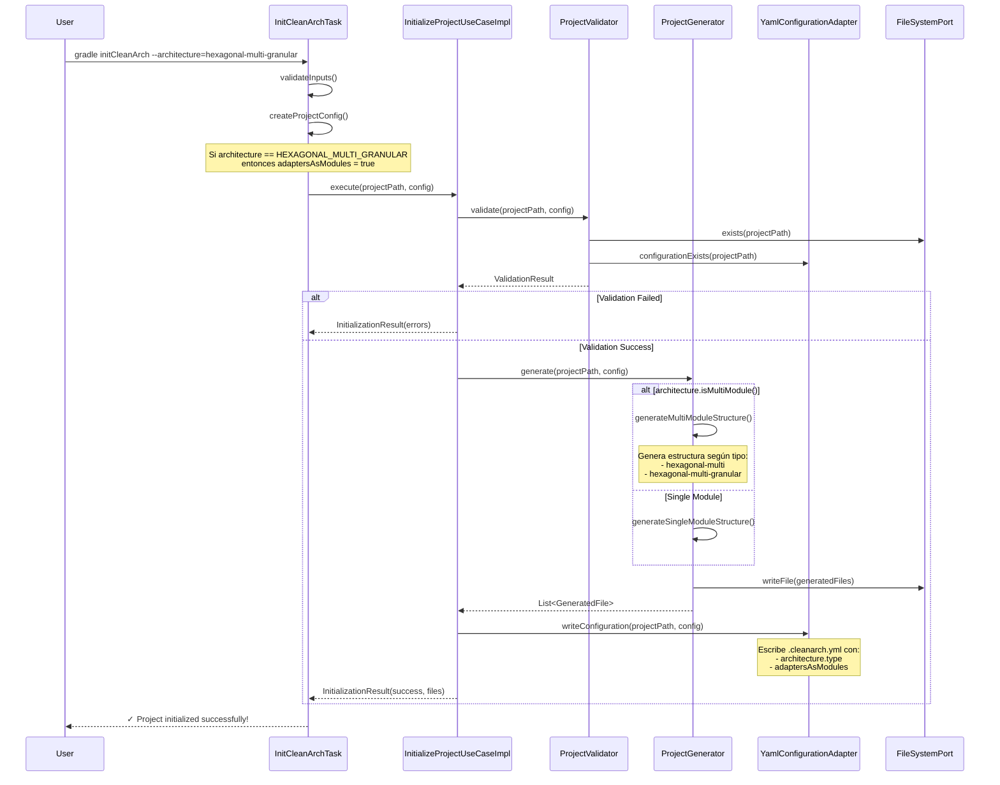
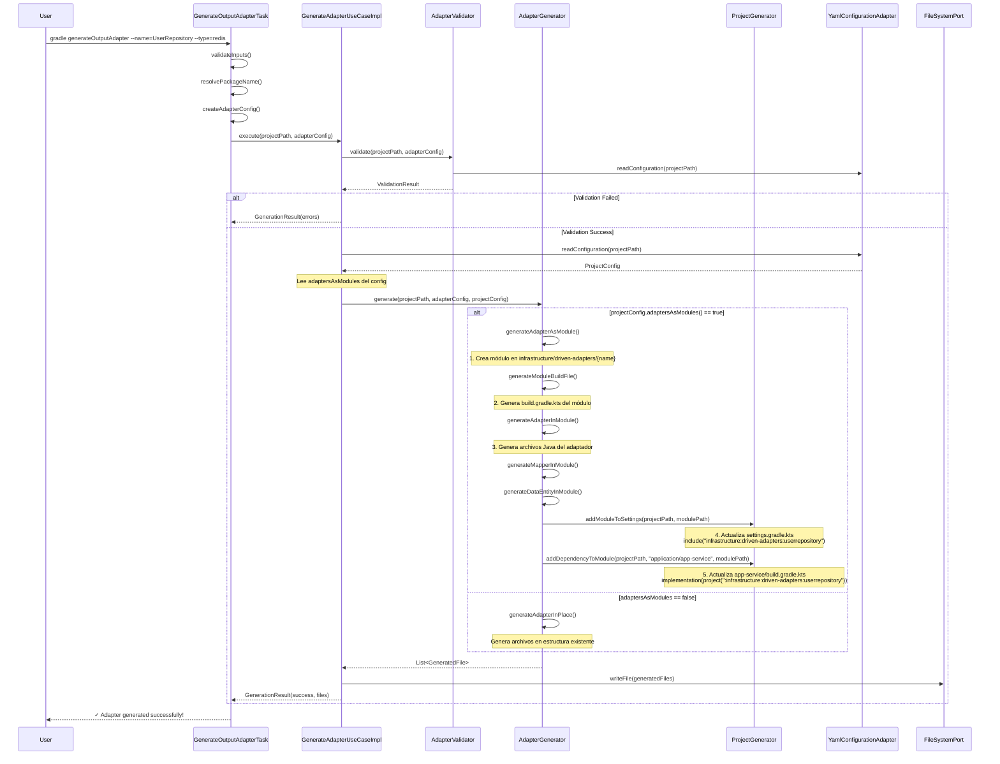
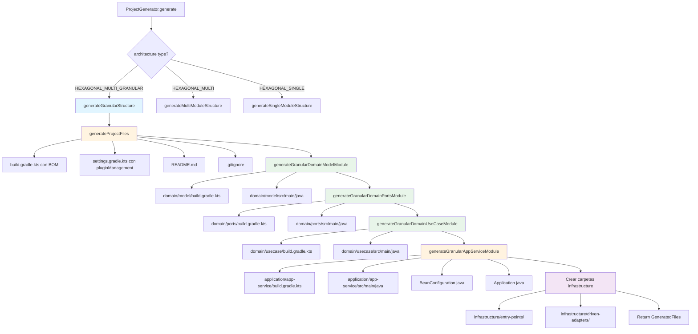
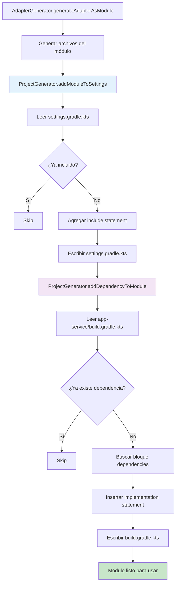
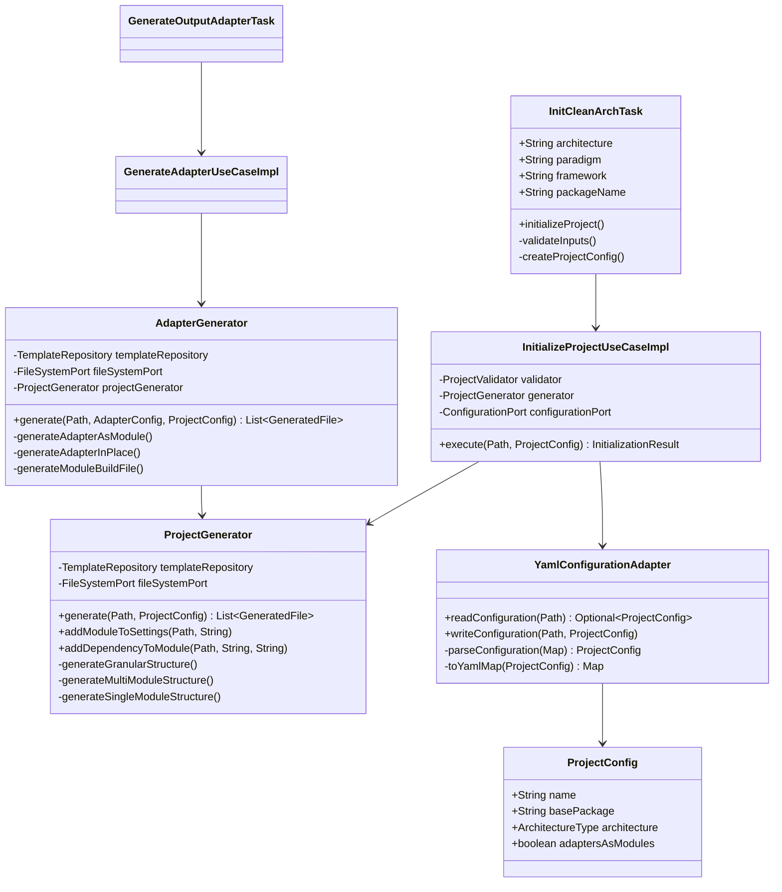
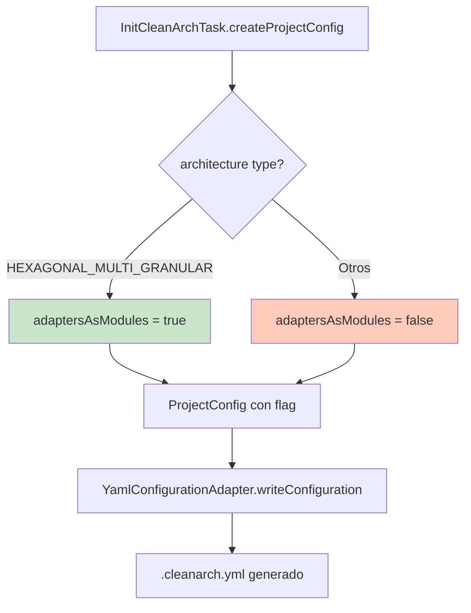
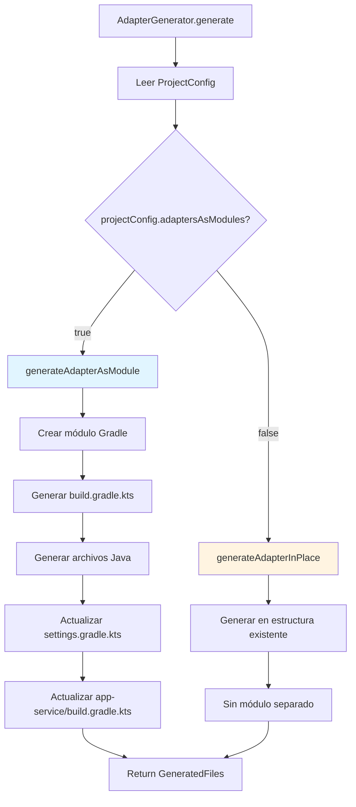

# Flujo de Funciones del Generador de Arquitectura

Este documento describe el flujo de ejecución de las principales funciones del generador de arquitectura limpia.

## 1. Flujo de Inicialización del Proyecto (initCleanArch)



## 2. Flujo de Generación de Adaptador (generateOutputAdapter)



## 3. Flujo de Generación Multi-Módulo Granular



## 4. Flujo de Actualización de Archivos de Configuración



## 5. Estructura de Clases y Responsabilidades



## 6. Decisiones Clave en el Flujo

### 6.1 ¿Cuándo se activa adaptersAsModules?



### 6.2 ¿Cómo decide el AdapterGenerator qué hacer?



## 7. Archivos Generados por Arquitectura

### Hexagonal Multi-Granular (adaptersAsModules = true)

```
test-hexagonal-granular/
├── build.gradle.kts                    # Root con plugin y BOM
├── settings.gradle.kts                 # Con pluginManagement
├── .cleanarch.yml                      # Con adaptersAsModules: true
├── domain/
│   ├── model/
│   │   └── build.gradle.kts           # Módulo independiente
│   ├── ports/
│   │   └── build.gradle.kts           # Módulo independiente
│   └── usecase/
│       └── build.gradle.kts           # Módulo independiente
├── application/
│   └── app-service/
│       └── build.gradle.kts           # Módulo con dependencias
└── infrastructure/
    ├── entry-points/                   # Carpeta (no módulo)
    └── driven-adapters/                # Carpeta (no módulo)
        └── userrepository/             # Módulo creado dinámicamente
            ├── build.gradle.kts        # Con dependencias de Spring/Redis
            └── src/main/java/...       # Código del adaptador
```

## 8. Puntos de Mejora Identificados

1. **Copia de archivos binarios**: El wrapper de Gradle no se copia automáticamente
2. **Validación de versiones**: No hay validación de compatibilidad Lombok/Java
3. **Manejo de errores**: Los errores de template no son muy descriptivos
4. **Testing**: Falta cobertura de tests para el flujo completo
5. **Documentación**: Falta documentación inline en algunos métodos complejos

---

**Nota**: Este documento describe el estado actual de la implementación. Para code review, enfocarse en:
- Separación de responsabilidades
- Manejo de errores
- Validaciones
- Claridad del código
- Tests unitarios
